# SOC Copilot Demo

> **AI-augmented Security Operations with Runtime Evolution and Compounding Intelligence**

[](https://github.com)
[](https://www.python.org/)
[](https://fastapi.tiangolo.com/)
[](https://react.dev/)
[](https://neo4j.com/)

---

## 🎯 The Thesis

> **"Splunk gets better rules. Our copilot gets SMARTER."**

Traditional SIEMs improve through manual rule tuning. Our SOC Copilot uses a **two-loop architecture** where decisions automatically feed back into agent evolution, creating a compounding intelligence moat.

**When a competitor deploys at a new customer, they start at zero. We start at 127 patterns.**

---

## 📸 Screenshots

> **Note:** Screenshots TBD - Run the demo locally to see all 4 tabs in action.

**Tab 1: SOC Analytics** - Governed Metrics with Provenance
> *Natural language queries with full data provenance and rule sprawl detection*

**Tab 2: Runtime Evolution** - THE KEY DIFFERENTIATOR ⭐
> *Decisions trigger agent evolution via TRIGGERED_EVOLUTION relationship*

**Tab 3: Alert Triage** - Closed-Loop Execution
> *Graph-based reasoning with 4-step closed-loop verification*

**Tab 4: Compounding Dashboard** - "Watch the Moat Grow"
> *Week 1 (23 patterns) → Week 4 (127 patterns). Same model, more intelligence.*

---

## 🚀 Quick Start

### Prerequisites

- **Python 3.11+** with pip
- **Node.js 18+** with npm
- **Neo4j Aura** instance (free tier works)
- **Google Cloud Project** with Vertex AI enabled
- **Git** for version control

### Setup (5 minutes)

#### 1. Clone Repository
```bash
# Note: Update with actual repository URL
git clone <YOUR_REPO_URL>
cd gen-ai-roi-demo
```

#### 2. Environment Configuration
```bash
# Copy environment template
cp .env.example .env

# Edit .env with your credentials
# Required variables:
#   - NEO4J_URI=neo4j+s://xxxxx.databases.neo4j.io
#   - NEO4J_USER=neo4j
#   - NEO4J_PASSWORD=your-password
#   - PROJECT_ID=your-gcp-project
#   - REGION=us-central1
```

#### 3. Backend Setup
```bash
cd backend

# Create virtual environment
python -m venv venv
source venv/bin/activate  # Windows: venv\Scripts\activate

# Install dependencies
pip install -r requirements.txt

# Seed Neo4j database
python seed_neo4j.py
```

#### 4. Frontend Setup
```bash
cd ../frontend

# Install dependencies
npm install
```

### Running the Demo

#### Terminal 1: Start Backend
```bash
cd backend
source venv/bin/activate  # Windows: venv\Scripts\activate
uvicorn app.main:app --reload --port 8000
```

#### Terminal 2: Start Frontend
```bash
cd frontend
npm run dev
```

#### Open Browser
Navigate to: **http://localhost:5173**

The app opens on **Tab 2 (Runtime Evolution)** - the key differentiator.

---

## 🎬 The Four Tabs

| Tab | Purpose | Key Feature | For |
|-----|---------|-------------|-----|
| **1. SOC Analytics** | Governed security metrics | Natural language queries + provenance | CISOs |
| **2. Runtime Evolution** ⭐ | Decision-triggered agent evolution | **TRIGGERED_EVOLUTION** relationship | VCs |
| **3. Alert Triage** | Graph-based alert analysis | 4-step closed-loop execution | CISOs |
| **4. Compounding** | Week-over-week intelligence growth | The moat visualization | VCs |

### Tab 1: SOC Analytics (20% Energy)

**"Instant answers with provenance showing exactly where the data came from."**

**Features:**
- 🔍 Natural language queries ("Show MTTR by severity")
- 📊 6 governed metrics with contracts (owner, version, definition)
- 🔗 Full data provenance (sources, freshness, query preview)
- ⚠️ Rule sprawl detection ($18K/month waste identified)

**Demo Query:**
```
User: "What's our false positive rate?"
→ Chart appears in <1 second
→ Provenance: Splunk SIEM + Detection Rule Registry
→ Sprawl Alert: "anomalous_login_legacy costing $18K/mo"
```

### Tab 2: Runtime Evolution ⭐ (35% Energy)

**"Splunk gets better rules. Our copilot gets SMARTER."**

**Features:**
- 📦 Deployment registry (v3.1 active 90%, v3.2 canary 10%)
- 🔒 Eval gate with 4 checks (Faithfulness, Safe Action, Playbook, SLA)
- 🔄 **TRIGGERED_EVOLUTION** - The key differentiator
- 📈 Pattern confidence increases (91% → 94%)
- ⚡ Processing stats (time, routing, event ID)

**Demo Flow:**
```
1. Click "Process Alert" (ALERT-7823)
2. Watch eval gate: 4 checks pass (green)
3. See TRIGGERED_EVOLUTION panel (purple):
   → Event: EVO-0891
   → Type: pattern_confidence_increase
   → Description: PAT-TRAVEL: 91% → 94%
   → Impact: High
4. Soundbite: "THIS is what Splunk doesn't have."
```

**The Key Relationship:**
```cypher
(:Decision)-[:TRIGGERED_EVOLUTION {
    impact: "high",
    magnitude: 0.03,
    timestamp: datetime()
}]->(:EvolutionEvent)
```

### Tab 3: Alert Triage (30% Energy)

**"A SIEM stops at detect. We close the loop."**

**Features:**
- 📋 Alert queue (5 pending alerts with severity badges)
- 🕸️ Graph traversal (47 nodes consulted)
- 🎯 Recommendation with confidence % and reasoning
- 🔄 4-step closed loop:
  - ✅ **EXECUTED** - Action sent to target system
  - ✅ **VERIFIED** - System confirms completion
  - ✅ **EVIDENCE** - Artifact captured
  - ✅ **KPI IMPACT** - MTTR improvement calculated

**Demo Flow:**
```
1. Select ALERT-7823 (anomalous login)
2. Graph animates: 47 nodes consulted
3. Recommendation: "False positive close, 92% confidence"
4. Click "Execute Action"
5. Watch 4-step animation (3.2 seconds total)
6. Result: MTTR -8.2 minutes
```

### Tab 4: Compounding Dashboard (15% Energy)

**"When they deploy, they start at zero. We start at 127 patterns."**

**Features:**
- 📊 Week 1 vs Week 4 headline comparison
- 📈 Weekly trend chart (auto-close, MTTR, FP rate)
- 🔁 Two-loop architecture visual
- 📜 Recent evolution events timeline
- 🏰 The moat message

**Key Numbers:**
| Metric | Week 1 | Week 4 | Change |
|--------|--------|--------|--------|
| Patterns | 23 | 127 | +452% |
| Auto-Close | 68% | 89% | +21 pts |
| MTTR | 12.4 min | 3.1 min | -75% |
| FP Investigations | 4,200/wk | 980/wk | -77% |

**The Moat:**
```
Same model. Same rules. More intelligence.

Week 1: 23 patterns, 68% auto-close
Week 4: 127 patterns, 89% auto-close

That's compounding. That's the moat.
```

---

## 🏗️ Architecture Overview

### The Two-Loop System


### The Key Differentiator: TRIGGERED_EVOLUTION

Traditional SIEMs accumulate logs. Our system accumulates **intelligence**.

```mermaid
sequenceDiagram
    participant User
    participant Frontend
    participant Agent
    participant Neo4j
    participant LLM

    User->>Frontend: Click "Process Alert"
    Frontend->>Agent: POST /api/alert/process

    Agent->>Neo4j: Get context (47 nodes)
    Neo4j-->>Agent: SecurityContext

    Agent->>Agent: Rule-based decision
    Note over Agent: 3-tier travel matching

    Agent->>LLM: Generate reasoning
    LLM-->>Agent: 2-3 sentence justification

    Agent->>Agent: Eval gate (4 checks)
    Note over Agent: Faithfulness, Safety, Playbook, SLA

    Agent->>Neo4j: Create Decision node

    alt Pattern threshold met
        Agent->>Neo4j: Create TRIGGERED_EVOLUTION
        Note over Neo4j: (:Decision)-[:TRIGGERED_EVOLUTION]->(:EvolutionEvent)
    end

    Agent-->>Frontend: Decision + Evolution event
    Frontend-->>User: Show purple panel ⭐
```



### Data Architecture


---

## 🛠️ Tech Stack

### Backend
- **FastAPI 0.104+** - Modern async Python web framework
- **Pydantic v2** - Data validation and settings management
- **Python 3.11+** - Latest Python features and performance

### Database
- **Neo4j Aura 5.14+** - Graph database for security relationships
- **BigQuery** - Analytics and metric storage (mocked in Tab 1)
- **Firestore** - Operational data (alerts, decisions)

### AI/LLM
- **Vertex AI** - Google Cloud AI platform
- **Gemini 1.5 Pro** - LLM for narration only (not decision-making)

### Frontend
- **React 18.2** - Modern UI library
- **TypeScript 5.2** - Type-safe JavaScript
- **Vite** - Fast build tool
- **Tailwind CSS 3.3** - Utility-first CSS
- **Recharts 2.10** - Chart library for visualizations
- **Lucide React** - Icon library

### Infrastructure
- **Google Cloud Platform** - Cloud hosting
- **Cloud Run** - Serverless container deployment
- **Secret Manager** - Credential storage

---

## 🔑 The Key Differentiator: TRIGGERED_EVOLUTION

### What Is It?

A Neo4j relationship that links agent decisions to system evolution:

```cypher
(:Decision)-[:TRIGGERED_EVOLUTION {
    impact: "high",
    magnitude: 0.03,
    timestamp: datetime()
}]->(:EvolutionEvent {
    id: "EVO-0891",
    event_type: "pattern_confidence_increase",
    description: "PAT-TRAVEL: 91% → 94%",
    before_state: "confidence: 0.91",
    after_state: "confidence: 0.94"
})
```

### Why It Matters

| Traditional SIEM | Our SOC Copilot |
|------------------|-----------------|
| Logs decisions | Learns from decisions |
| Manual tuning required | Self-tuning via graph |
| Same performance over time | Compounding performance |
| Each customer starts fresh | Patterns transfer across deployments |

### The Moat

**Competitor deploys today:**
- 0 patterns
- 0 precedents
- 0 accumulated intelligence

**We deploy today:**
- 127 patterns
- 10,000+ decisions
- 4 weeks of compounding intelligence

**This gap widens with every decision.**

---

## 🎭 15-Minute Demo Script

### Opening (1 min)

**Say:** "This is a SOC Copilot demo showing two stories: CISOs see immediate efficiency, VCs see a compounding moat. Let me show you both."

### Act 1: Immediate Value (3 min - Tab 1)

**Do:** Type "What's our MTTR by severity?"

**Result:** Chart appears in <1 second

**Say:** "Notice the provenance: Splunk SIEM + ServiceNow, 1.2 hours fresh. This is governed metrics."

**Do:** Type "What's our false positive rate?"

**Result:** Rule sprawl alert appears ($18K/month waste)

**Soundbite:** "Instant answers with provenance."

### Act 2: The Differentiator (5 min - Tab 2) ⭐

**Do:** Click "Process Alert" (ALERT-7823)

**Result:** Watch eval gate checks pass

**Say:** "Four deterministic checks: faithfulness, safety, playbook match, SLA. All green."

**Do:** Point to purple TRIGGERED_EVOLUTION panel

**Say:** "THIS is what Splunk doesn't have. That decision just triggered agent evolution."

**Result:** Show pattern confidence increase (91% → 94%)

**Soundbite:** "Splunk gets better rules. Our copilot gets SMARTER."

### Act 3: Closed Loop (4 min - Tab 3)

**Do:** Select ALERT-7823, click "Execute Action"

**Result:** 4-step animation (3.2 seconds)

**Say:** "Traditional SIEMs stop at detection. We close the loop: execute, verify, capture evidence, measure KPI impact."

**Result:** MTTR -8.2 minutes

**Soundbite:** "A SIEM stops at detect. We close the loop."

### Act 4: The Moat (2 min - Tab 4)

**Do:** Scroll to Week 1 vs Week 4 comparison

**Say:** "Week 1: 23 patterns, 68% auto-close. Week 4: 127 patterns, 89% auto-close. Same model. More intelligence."

**Do:** Point to two-loop visual

**Say:** "They get better rules. We get a better copilot. That's compounding."

**Soundbite:** "When they deploy, they start at zero. We start at 127 patterns."

### Closing (1 min)

**Ask:** "Any questions about the architecture, the eval gates, or the compounding effect?"

---

## 📚 Documentation

### Core Documentation
- **[PROJECT_STRUCTURE.md](PROJECT_STRUCTURE.md)** - Complete file-by-file code documentation
- **[PROJECT_COMPLETE.md](PROJECT_COMPLETE.md)** - Project completion summary
- **[CLAUDE.md](CLAUDE.md)** - Project context for Claude Code

### Quick Start Guides
- **[QUICKSTART_TAB1.md](QUICKSTART_TAB1.md)** - Tab 1 testing guide
- **[QUICKSTART_TAB4.md](QUICKSTART_TAB4.md)** - Tab 4 testing guide

### Support Directory
- **[support/setup/](support/setup/)** - Infrastructure setup guides
- **[support/docs/](support/docs/)** - Design specifications and demo materials
- **[support/scripts/](support/scripts/)** - Utility scripts for development

### Build Specification
- **[docs/vc_demo_build_spec_ciso_v1.md](docs/vc_demo_build_spec_ciso_v1.md)** - Detailed build specification

---

## 🧪 Testing

### Manual Testing

#### 1. Backend Health Check
```bash
curl http://localhost:8000/health
```

Expected: `{"status": "healthy"}`

#### 2. Tab 1 - SOC Analytics
```bash
curl -X POST http://localhost:8000/api/soc/query \
  -H "Content-Type: application/json" \
  -d '{"question": "Show MTTR by severity"}'
```

#### 3. Tab 2 - Runtime Evolution
```bash
curl -X POST http://localhost:8000/api/alert/process \
  -H "Content-Type: application/json" \
  -d '{"alert_id": "ALERT-7823"}'
```

#### 4. Tab 3 - Alert Triage
```bash
curl http://localhost:8000/api/triage/alerts
```

#### 5. Tab 4 - Compounding
```bash
curl http://localhost:8000/api/metrics/compounding?weeks=4
```

### Automated Testing

```bash
cd support/scripts
python validate_demo_data.py
```

Checks:
- ✅ Neo4j connection
- ✅ 5 alerts exist
- ✅ PAT-TRAVEL-001 has 127 occurrences
- ✅ Backend health
- ✅ Frontend accessible

---

## 🚧 Troubleshooting

### Issue: Neo4j Connection Failed

**Symptoms:**
```
ConnectionError: Failed to connect to Neo4j
```

**Solutions:**
1. Verify `NEO4J_URI` in `.env` is correct
2. Check Neo4j Aura instance is running
3. Ensure IP whitelist includes your IP
4. Verify username/password are correct

### Issue: Tab 2 "Process Alert" Returns 404

**Symptoms:**
```
404 Not Found: Alert not found
```

**Solutions:**
1. Seed Neo4j database: `python backend/seed_neo4j.py`
2. Verify 5 alerts exist: Open Neo4j Browser → `MATCH (a:Alert) RETURN count(a)`
3. Check alert ID is "ALERT-7823"

### Issue: Eval Gate Fails (Faithfulness 0.65)

**Symptoms:**
```
Eval gate failed: Faithfulness score 0.65 < 0.85
```

**Solutions:**
1. This was fixed in the code (context-aware scoring)
2. Verify you have the latest code
3. Check LLM reasoning includes context keywords

### Issue: Frontend Shows "Loading..." Forever

**Symptoms:**
Frontend spinner never resolves

**Solutions:**
1. Check backend is running: `curl http://localhost:8000/health`
2. Check browser console for CORS errors
3. Verify frontend is using correct API URL (`/api`)
4. Restart both backend and frontend

---

## 🏗️ Architecture Decisions

### Why Simple Rule-Based Agent?

**Decision:** Use 4 primary rules (~150 lines) instead of complex LLM orchestration.

**Rationale:**
- ✅ **Demo reliability** - Same input → same output every time
- ✅ **Auditability** - CISOs can explain decisions to auditors
- ✅ **Faster build** - ~200 lines vs ~1000+ lines
- ✅ **Clear separation** - Architecture proves thesis, not agent sophistication

**The thesis lives in the GRAPH SCHEMA, not the agent code.**

### Why LLM as Narrator Only?

**Decision:** Gemini generates justification AFTER decision is made.

**Rationale:**
- ✅ Decision already made by rules
- ✅ LLM makes rules sound like expert analysis ("intelligence theater")
- ✅ Fallback templates ensure demo never breaks
- ✅ No LLM = no demo failure risk

### Why Fixed Cypher Queries?

**Decision:** All Neo4j queries are hardcoded, no dynamic generation.

**Rationale:**
- ✅ Predictable results (47 nodes always)
- ✅ Faster execution
- ✅ Safer (no injection risks)
- ✅ Demo reliability

### Why Mock BigQuery Data for Tab 1?

**Decision:** Tab 1 uses in-memory mock data instead of real BigQuery.

**Rationale:**
- ✅ No GCP setup required
- ✅ Faster to customize for demos
- ✅ No credentials needed
- ✅ Deterministic results

---

## 📊 Project Stats

| Metric | Value |
|--------|-------|
| **Total Code** | ~5,084 lines |
| **Backend Files** | 14 Python files |
| **Frontend Files** | 7 TypeScript/TSX files |
| **API Endpoints** | 12 endpoints across 4 routers |
| **Neo4j Nodes** | 47 nodes consulted per decision |
| **Demo Duration** | 15 minutes (4 tabs) |
| **Build Time** | 2 weeks (with simple agent) |

---

## 🤝 Contributing

We welcome contributions!

### Development Setup

1. Fork the repository
2. Create a feature branch (`git checkout -b feature/amazing-feature`)
3. Make your changes
4. Run tests: `cd support/scripts && python validate_demo_data.py`
5. Commit your changes (`git commit -m 'Add amazing feature'`)
6. Push to the branch (`git push origin feature/amazing-feature`)
7. Open a Pull Request

### Code Style

- **Python:** Follow PEP 8, use Black formatter
- **TypeScript:** Follow Airbnb style guide, use Prettier
- **Commits:** Use conventional commits (feat:, fix:, docs:, etc.)

---

## 📄 License

This project is for demonstration purposes. License TBD.

---

## 🙏 Acknowledgments

- **Neo4j** - Graph database enabling semantic relationships
- **Google Cloud** - Infrastructure and AI platform
- **FastAPI** - Modern Python web framework
- **React** - UI library
- **Claude (Anthropic)** - AI assistant for development

---

## 📞 Contact & Support

> **Note:** Contact information TBD. This is a demonstration project.

---

## 🎯 Key Takeaways

1. **The Thesis:** "Splunk gets better rules. Our copilot gets SMARTER."

2. **The Differentiator:** `(:Decision)-[:TRIGGERED_EVOLUTION]->(:EvolutionEvent)`

3. **The Architecture:** Two loops (Triage + Evolution) → Compounding

4. **The Moat:** When they deploy, they start at zero. We start at 127 patterns.

5. **The Demo:** 15 minutes, 4 tabs, proves immediate value + long-term moat.

---

<div align="center">

**Built with 💜 by the SOC Copilot Team**

*Run locally to view the demo* • [Read Docs](support/docs/)

</div>
