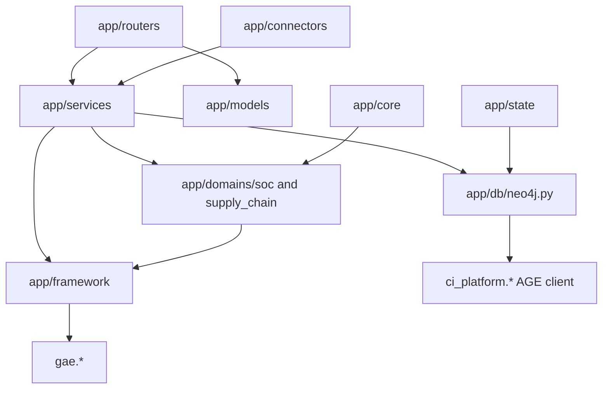

# SOC Copilot Backend Codebase Description

Generated from backend source reads only. Line references use repository-relative backend paths. Route-to-tab mappings are marked inferred because the backend does not encode tab ownership explicitly.

## Phase 1 — Structural Inventory

### 1a. Directory Tree, Backend App Only, Depth ~3

```text
app/
  __init__.py
  auth/
    __init__.py
    config.py
    dependencies.py
    jwt_utils.py
  connectors/
    __init__.py
    base.py
    crowdstrike_mock.py
    greynoise.py
    pulsedive.py
    registry.py
    sentinel_mock.py
    sentinel_real.py
  core/
    __init__.py
    domain_registry.py
    state_manager.py
  data/
    __init__.py
    alert_pool.py
    centroid_backups/
      centroid_backup_1777069884690_fdc0eeb0.json
      centroid_backup_1777069950742_fd5243ed.json
      centroid_backup_1777094153489_f0a08d45.json
      centroid_backup_1777094209683_24a839e5.json
      centroid_backup_1777094301658_8aa7102e.json
      centroid_backup_1777094355005_0ce2de29.json
      centroid_backup_1777094453385_e2725e97.json
      centroid_backup_1777094530124_7dd53b94.json
      centroid_backup_1777094616317_bcc86864.json
      centroid_backup_1777094702638_87f1634f.json
      centroid_backup_1777097009054_a1b152fa.json
      centroid_backup_1777097067678_84c8eb3b.json
      centroid_backup_1777471439317_4b676c68.json
      centroid_backup_1777471499776_c5b2f137.json
      centroid_backup_1777471597233_7dff0f16.json
      centroid_backup_1777471651584_e26aaeee.json
      centroid_backup_1777471923872_d645964e.json
      centroid_backup_1777471988063_1202dc53.json
      centroid_backup_1777472056941_10b7683d.json
      centroid_backup_1777472119354_5b3adbe0.json
      centroid_backup_1777541593345_cf181b2d.json
      centroid_backup_1777541656171_fc0a3cdd.json
      centroid_backup_1777541760601_18516982.json
      centroid_backup_1777541824345_f7dc0c39.json
      centroid_backup_1777541920859_1845b5ae.json
      centroid_backup_1777542152961_db958927.json
      centroid_backup_1777542212806_1cf6d6c6.json
      centroid_backup_1777542274342_06e4ae16.json
      centroid_backup_1777543389347_8753b7a0.json
      centroid_backup_1777543431453_bbd96df6.json
      centroid_backup_1777543500916_5020c204.json
      centroid_backup_1777543562582_232fdde9.json
      centroid_backup_1777543617285_c3c0f02f.json
      centroid_backup_1777543866623_1a38e35d.json
      centroid_backup_1777543924672_b983a9af.json
      centroid_backup_1777543987123_46f65627.json
      centroid_backup_1777603855397_919340aa.json
      centroid_backup_1777603908935_9e7d201e.json
      centroid_backup_1777603996755_1662277f.json
      centroid_backup_1777604049175_77acfc8a.json
      centroid_backup_1777604299689_3e44da03.json
      centroid_backup_1777604356153_d8803aba.json
      centroid_backup_1777604418162_5305abd2.json
      centroid_backup_1777604485107_9a3ec6c4.json
      centroid_backup_1777613856088_c387d8f1.json
      centroid_backup_1777613901413_cf6f9a6c.json
      centroid_backup_1777613972241_ddf913d5.json
      centroid_backup_1777614032960_34de1202.json
      centroid_backup_1777614085176_3a8406d1.json
      centroid_backup_1777614331257_619b492d.json
      centroid_backup_1777614387358_5d3732f1.json
      centroid_backup_1777614452445_d4d8d952.json
      centroid_backup_1777616123256_f848f4ce.json
      centroid_backup_1777630551865_eef47d29.json
      centroid_backup_1777630629082_391c87fd.json
      centroid_backup_1777630730255_15fc36b4.json
      centroid_backup_1777630833289_4f4fb4ff.json
      centroid_backup_1777630900826_5f64e55b.json
      centroid_backup_1777631172319_c532a98c.json
      centroid_backup_1777631252497_98e33475.json
      centroid_backup_1777631332552_7815b62f.json
      centroid_backup_1777631417848_d22e7546.json
      centroid_backup_latest.json
    gae_learning_state.json
    iks_bootstrap_soc.json
    industry_profiles.json
    soc_eval_scenarios.json
  db/
    __init__.py
    neo4j.py
  domains/
    __init__.py
    base.py
    soc/
      __init__.py
      campaigns.py
      config.py
      constants.py
      factors.py
      orchestrator.py
      policies.py
      situations.py
    supply_chain/
      __init__.py
      config.py
  framework/
    __init__.py
    agent.py
    audit.py
    checkpoint.py
    composite_gate.py
    convergence_math.py
    decision_history.py
    economics.py
    event_bus.py
    feedback_base.py
    feedback_store.py
    iks_base.py
    intervention_controls.py
    learning_state.py
    narrative_base.py
    ols_status.py
    override_detector.py
    provenance.py
    shadow_mode.py
    similar_cases_base.py
  graph_schema.py
  main.py
  models/
    __init__.py
    responses.py
    schemas.py
  routers/
    __init__.py
    admin.py
    audit.py
    auth.py
    eval_router.py
    evaluation.py
    evolution.py
    framework_router.py
    gae.py
    governance_router.py
    graph.py
    judgment.py
    metrics.py
    roi.py
    servicenow_router.py
    simulation.py
    soc.py
    time_machine_router.py
    triage.py
    whatif_router.py
  scripts/
    __init__.py
  services/
    __init__.py
    accuracy_trajectory.py
    agent.py
    attack_chain.py
    audit.py
    balance_sheet.py
    benchmarking_level2.py
    benchmarking_report.py
    bootstrap_neo4j.py
    centroid_support.py
    checkpoint.py
    compliance_dashboard.py
    composite_gate.py
    convergence_calendar.py
    decision_history.py
    economics.py
    enrichment_advisor.py
    eval_service.py
    event_bus.py
    evidence_room.py
    evolver.py
    executive_narrative.py
    factor_analysis.py
    feedback.py
    flywheel_comparison.py
    gae_state.py
    governance_report.py
    graph_explorer.py
    iks.py
    industry_profile.py
    intervention_controls.py
    learning_health.py
    model_swap.py
    narrative.py
    nl_templates.py
    ols_status.py
    override_detector.py
    policy.py
    provenance.py
    reasoning.py
    reconvergence_logger.py
    referral_policy.py
    referral_rules.py
    servicenow_mock.py
    shadow_mode.py
    similar_cases.py
    simulation.py
    situation.py
    snapshots.py
    state_manager.py
    threat_indicator.py
    threat_intel.py
    three_claims.py
    time_machine.py
    transparency_page.py
    triage.py
    whatif_service.py
  state/
    __init__.py
    graph_snapshot.py
```

### 1b. File Counts

- Total `.py` files in `backend/app/`: 137.
- Total test files in `backend/tests/`: 126.
- Total source LOC in `backend/app/`: 36206.
- Total test LOC in `backend/tests/`: 21695.
- Method used: PowerShell `Get-ChildItem`/`Get-Content` inventories plus Python AST parsing over the same backend files; `__pycache__` and `.pyc` files excluded.

### 1c. Entry Points

- `app/main.py` creates `FastAPI(title="SOC Copilot Demo API", version="5.0.0")` at `app/main.py:16`, installs CORS middleware at `app/main.py:28`, and installs an HTTP auth middleware at `app/main.py:38`.
- Routers mounted in `app/main.py`:
- `evaluation.router` mounted at `/api/soc` from `app/routers/evaluation.py` (`app/main.py:77`).
- `judgment.router` mounted at `/api/soc` from `app/routers/judgment.py` (`app/main.py:78`).
- `evolution.router` mounted at `/api` from `app/routers/evolution.py` (`app/main.py:79`).
- `triage.router` mounted at `/api` from `app/routers/triage.py` (`app/main.py:80`).
- `framework_router.router` mounted at `/api` from `app/routers/framework_router.py` (`app/main.py:81`).
- `soc.router` mounted at `/api` from `app/routers/soc.py` (`app/main.py:82`).
- `metrics.router` mounted at `/api` from `app/routers/metrics.py` (`app/main.py:83`).
- `roi.router` mounted at `/api` from `app/routers/roi.py` (`app/main.py:84`).
- `graph.router` mounted at `/api` from `app/routers/graph.py` (`app/main.py:85`).
- `audit.router` mounted at `/api` from `app/routers/audit.py` (`app/main.py:86`).
- `governance_router.router` mounted at `/api` from `app/routers/governance_router.py` (`app/main.py:87`).
- `gae.router` mounted at `/api` from `app/routers/gae.py` (`app/main.py:88`).
- `admin.router` mounted at `/api` from `app/routers/admin.py` (`app/main.py:89`).
- `simulation.router` mounted at `/api` from `app/routers/simulation.py` (`app/main.py:90`).
- `whatif_router.router` mounted at `/api` from `app/routers/whatif_router.py` (`app/main.py:91`).
- `eval_router.router` mounted at `/api` from `app/routers/eval_router.py` (`app/main.py:92`).
- `time_machine_router.router` mounted at `/api` from `app/routers/time_machine_router.py` (`app/main.py:93`).
- `servicenow_router` mounted at `(router-defined/root)` from `app/routers/servicenow_router.py` (`app/main.py:94`).
- `auth_router` mounted at `(router-defined/root)` from `app/routers/auth.py` (`app/main.py:96`).
- Startup hook `startup_event` begins at `app/main.py:100`; it validates SAML config, connects/verifies the graph client, syncs learning/audit state, initializes domain config, registers reset handlers with `state_manager`, seeds in-memory histories, initializes connector registry, and performs campaign recorrelation where needed.
- Shutdown hook `shutdown_event` begins at `app/main.py:389` and closes `neo4j_client` when supported.
- `conftest.py` changes CWD to `backend/` at `conftest.py:29`, registers the `neo4j` marker, skips Neo4j-marked tests when `NEO4J_URI` is absent, and defines session fixtures for persistent Decision protection and graph contract reporting.
- `conftest.py` hooks: `pytest_configure` (`conftest.py:35`), `pytest_collection_modifyitems` (`conftest.py:42`).
- `conftest.py` fixtures: `verify_persistent_data` (`conftest.py:52`), `report_graph_contract` (`conftest.py:118`).
- Backend `.env`: absent. Environment variables below were found by reading `os.getenv`/`os.environ.get` references in backend code:
  - `GRAPH_BACKEND` (`app/db/neo4j.py:28`)
  - `GRAPH_BACKEND` (`app/main.py:131`)
  - `GREYNOISE_API_KEY` (`app/connectors/greynoise.py:202`)
  - `GREYNOISE_API_KEY` (`app/connectors/greynoise.py:344`)
  - `NARRATIVE_PROVIDER` (`app/framework/narrative_base.py:118`)
  - `NARRATIVE_PROVIDER` (`app/main.py:330`)
  - `NEO4J_PASSWORD` (`app/db/neo4j.py:40`)
  - `NEO4J_URI` (`app/db/neo4j.py:38`)
  - `NEO4J_USER` (`app/db/neo4j.py:39`)
  - `PORT` (`app/main.py:119`)
  - `PROJECT_ID` (`app/services/reasoning.py:29`)
  - `PULSEDIVE_API_KEY` (`app/connectors/pulsedive.py:271`)
  - `PULSEDIVE_API_KEY` (`app/connectors/pulsedive.py:429`)
  - `SAML_IDP_ENTITY_ID` (`app/auth/config.py:50`)
  - `SAML_IDP_SSO_URL` (`app/auth/config.py:51`)
  - `SAML_IDP_X509_CERT` (`app/auth/config.py:52`)
  - `SAML_JWT_LIFETIME_HOURS` (`app/auth/config.py:49`)
  - `SAML_JWT_SECRET` (`app/auth/config.py:46`)
  - `SENTINEL_CLIENT_ID` (`app/connectors/sentinel_real.py:216`)
  - `SENTINEL_CLIENT_SECRET` (`app/connectors/sentinel_real.py:217`)
  - `SENTINEL_TENANT_ID` (`app/connectors/sentinel_real.py:215`)
  - `SENTINEL_WORKSPACE_ID` (`app/connectors/sentinel_real.py:218`)
  - `VERTEX_AI_LOCATION` (`app/services/reasoning.py:30`)

## Phase 2 — Module Map

### app/routers/
**Purpose:** FastAPI endpoint modules that expose SOC, triage, evolution, audit, admin, simulation, auth, and integration APIs.
**Files:**
- `app/routers/__init__.py` (1 lines)
- `app/routers/admin.py` (76 lines)
- `app/routers/audit.py` (194 lines)
- `app/routers/auth.py` (125 lines)
- `app/routers/eval_router.py` (134 lines)
- `app/routers/evaluation.py` (193 lines)
- `app/routers/evolution.py` (776 lines)
- `app/routers/framework_router.py` (911 lines)
- `app/routers/gae.py` (374 lines)
- `app/routers/governance_router.py` (71 lines)
- `app/routers/graph.py` (501 lines)
- `app/routers/judgment.py` (201 lines)
- `app/routers/metrics.py` (952 lines)
- `app/routers/roi.py` (282 lines)
- `app/routers/servicenow_router.py` (90 lines)
- `app/routers/simulation.py` (290 lines)
- `app/routers/soc.py` (4001 lines)
- `app/routers/time_machine_router.py` (62 lines)
- `app/routers/triage.py` (1887 lines)
- `app/routers/whatif_router.py` (76 lines)
**Key classes/functions:** `ResetRequest` (`app/routers/admin.py:17`); `admin_reset` (`app/routers/admin.py:23`); `get_audit_decisions` (`app/routers/audit.py:37`); `verify_audit_chain` (`app/routers/audit.py:109`); `get_audit_epochs` (`app/routers/audit.py:150`); `_get_saml_service` (`app/routers/auth.py:9`); `saml_metadata` (`app/routers/auth.py:24`); `saml_login` (`app/routers/auth.py:31`); `saml_acs` (`app/routers/auth.py:42`); `saml_logout` (`app/routers/auth.py:108`); `saml_status` (`app/routers/auth.py:116`); `upload_eval_csv` (`app/routers/eval_router.py:27`); `get_eval_templates` (`app/routers/eval_router.py:96`); `download_eval_template` (`app/routers/eval_router.py:111`); `load_soc_scenarios` (`app/routers/evaluation.py:36`); `run_soc_evaluation` (`app/routers/evaluation.py:68`); `run_evaluation_endpoint` (`app/routers/evaluation.py:81`); `get_evaluation_summary` (`app/routers/evaluation.py:138`); `get_deployments` (`app/routers/evolution.py:35`); `process_alert` (`app/routers/evolution.py:83`); `process_alert_blocked` (`app/routers/evolution.py:404`); `simulate_failure` (`app/routers/evolution.py:553`); `get_recent_evolution` (`app/routers/evolution.py:608`); `get_weight_history` (`app/routers/evolution.py:649`); `get_trust_scores` (`app/routers/evolution.py:699`); `get_graph_stats` (`app/routers/evolution.py:746`); `ShadowToggleRequest` (`app/routers/framework_router.py:29`); `AnalystActionRequest` (`app/routers/framework_router.py:33`); `CheckpointCreateRequest` (`app/routers/framework_router.py:38`); `RollbackRequest` (`app/routers/framework_router.py:42`); `_GraphQueryRequest` (`app/routers/framework_router.py:46`); `FreezeRequest` (`app/routers/framework_router.py:50`); `RollbackInterventionRequest` (`app/routers/framework_router.py:55`); `ThresholdRequest` (`app/routers/framework_router.py:62`); `get_centroid_evolution` (`app/routers/framework_router.py:75`); `get_convergence_calendar` (`app/routers/framework_router.py:186`); `get_ols_status_endpoint` (`app/routers/framework_router.py:255`); `get_flywheel_comparison` (`app/routers/framework_router.py:328`); `get_iks_trend_endpoint` (`app/routers/framework_router.py:402`); `shadow_toggle` (`app/routers/framework_router.py:451`); `shadow_analyst_action` (`app/routers/framework_router.py:459`); `shadow_report` (`app/routers/framework_router.py:471`); `checkpoint_create` (`app/routers/framework_router.py:482`); `checkpoint_list` (`app/routers/framework_router.py:506`); `checkpoint_rollback` (`app/routers/framework_router.py:514`); `scorer_freeze` (`app/routers/framework_router.py:540`); `scorer_unfreeze` (`app/routers/framework_router.py:555`); `auto_approve_stats` (`app/routers/framework_router.py:574`); `graph_explorer_query` (`app/routers/framework_router.py:630`); `graph_top_nodes` (`app/routers/framework_router.py:646`); `graph_node_neighbors` (`app/routers/framework_router.py:663`); `graph_summary` (`app/routers/framework_router.py:673`); `graph_prebuilt_queries_list` (`app/routers/framework_router.py:689`); `graph_run_prebuilt` (`app/routers/framework_router.py:700`); `learning_health` (`app/routers/framework_router.py:718`); `learning_balance_sheet` (`app/routers/framework_router.py:748`); `factor_analysis` (`app/routers/framework_router.py:760`); `factor_analysis_summary` (`app/routers/framework_router.py:770`); `_get_intervention_controls` (`app/routers/framework_router.py:809`); `intervention_freeze` (`app/routers/framework_router.py:827`); `intervention_unfreeze` (`app/routers/framework_router.py:837`); `intervention_rollback` (`app/routers/framework_router.py:847`); `intervention_threshold` (`app/routers/framework_router.py:862`); `intervention_state` (`app/routers/framework_router.py:874`); `intervention_history` (`app/routers/framework_router.py:884`); `frozen_roi` (`app/routers/framework_router.py:899`); `_wu_timestamp` (`app/routers/gae.py:37`); `gae_weights` (`app/routers/gae.py:50`); `gae_history` (`app/routers/gae.py:79`); `gae_convergence` (`app/routers/gae.py:136`); `gae_confidence_trajectory` (`app/routers/gae.py:187`); `gae_trust_curve` (`app/routers/gae.py:228`); `gae_before_after` (`app/routers/gae.py:289`); `gae_weight_evolution` (`app/routers/gae.py:345`); `get_governance_report` (`app/routers/governance_router.py:16`); `get_governance_report_csv` (`app/routers/governance_router.py:21`); `get_governance_summary` (`app/routers/governance_router.py:39`); `get_evidence_room` (`app/routers/governance_router.py:60`); `get_evidence_room_export` (`app/routers/governance_router.py:65`); `_consensus_severity` (`app/routers/graph.py:33`)
Additional top-level symbols omitted from this overview: 156.
**Imports from GAE:**
- `from gae.convergence import get_convergence_metrics` (`app/routers/gae.py:16`)
- `from gae.evaluation import EvaluationScenario, EvaluationReport, run_evaluation` (`app/routers/evaluation.py:17`)
- `from gae.judgment import compute_judgment` (`app/routers/judgment.py:16`)
- `from gae.scoring import score_alert` (`app/routers/evolution.py:24`)
- `from gae.scoring import score_alert` (`app/routers/triage.py:42`)
**Imports from ci_platform:**
- None found in this directory.

### app/services/
**Purpose:** Business logic, scoring orchestration, audit/evidence helpers, analytics assemblers, learning-health checks, simulation, and integration state.
**Files:**
- `app/services/__init__.py` (1 lines)
- `app/services/accuracy_trajectory.py` (164 lines)
- `app/services/agent.py` (7 lines)
- `app/services/attack_chain.py` (334 lines)
- `app/services/audit.py` (9 lines)
- `app/services/balance_sheet.py` (302 lines)
- `app/services/benchmarking_level2.py` (137 lines)
- `app/services/benchmarking_report.py` (170 lines)
- `app/services/bootstrap_neo4j.py` (222 lines)
- `app/services/centroid_support.py` (61 lines)
- `app/services/checkpoint.py` (7 lines)
- `app/services/compliance_dashboard.py` (111 lines)
- `app/services/composite_gate.py` (7 lines)
- `app/services/convergence_calendar.py` (89 lines)
- `app/services/decision_history.py` (7 lines)
- `app/services/economics.py` (7 lines)
- `app/services/enrichment_advisor.py` (119 lines)
- `app/services/eval_service.py` (464 lines)
- `app/services/event_bus.py` (7 lines)
- `app/services/evidence_room.py` (243 lines)
- `app/services/evolver.py` (485 lines)
- `app/services/executive_narrative.py` (450 lines)
- `app/services/factor_analysis.py` (180 lines)
- `app/services/feedback.py` (451 lines)
- `app/services/flywheel_comparison.py` (69 lines)
- `app/services/gae_state.py` (847 lines)
- `app/services/governance_report.py` (279 lines)
- `app/services/graph_explorer.py` (300 lines)
- `app/services/iks.py` (364 lines)
- `app/services/industry_profile.py` (111 lines)
- `app/services/intervention_controls.py` (7 lines)
- `app/services/learning_health.py` (708 lines)
- `app/services/model_swap.py` (197 lines)
- `app/services/narrative.py` (434 lines)
- `app/services/nl_templates.py` (384 lines)
- `app/services/ols_status.py` (7 lines)
- `app/services/override_detector.py` (80 lines)
- `app/services/policy.py` (312 lines)
- `app/services/provenance.py` (7 lines)
- `app/services/reasoning.py` (109 lines)
- `app/services/reconvergence_logger.py` (226 lines)
- `app/services/referral_policy.py` (144 lines)
- `app/services/referral_rules.py` (312 lines)
- `app/services/servicenow_mock.py` (121 lines)
- `app/services/shadow_mode.py` (7 lines)
- `app/services/similar_cases.py` (74 lines)
- `app/services/simulation.py` (632 lines)
- `app/services/situation.py` (280 lines)
- `app/services/snapshots.py` (69 lines)
- `app/services/state_manager.py` (292 lines)
- `app/services/threat_indicator.py` (212 lines)
- `app/services/threat_intel.py` (46 lines)
- `app/services/three_claims.py` (96 lines)
- `app/services/time_machine.py` (407 lines)
- `app/services/transparency_page.py` (176 lines)
- `app/services/triage.py` (268 lines)
- `app/services/whatif_service.py` (290 lines)
**Key classes/functions:** `_interpolate_accuracy` (`app/services/accuracy_trajectory.py:26`); `build_trajectory_for_category` (`app/services/accuracy_trajectory.py:62`); `build_accuracy_trajectory` (`app/services/accuracy_trajectory.py:112`); `Campaign` (`app/services/attack_chain.py:25`); `AttackChainService` (`app/services/attack_chain.py:38`); `CategoryBalance` (`app/services/balance_sheet.py:27`); `LearningBalanceSheet` (`app/services/balance_sheet.py:41`); `_compute_status` (`app/services/balance_sheet.py:53`); `_compute_structural_ceiling_report` (`app/services/balance_sheet.py:72`); `_safe_epistemic_state` (`app/services/balance_sheet.py:97`); `_safe_overall_iks` (`app/services/balance_sheet.py:105`); `_safe_centroid_drift` (`app/services/balance_sheet.py:113`); `_safe_learning_health` (`app/services/balance_sheet.py:138`); `_safe_auto_approve_stats` (`app/services/balance_sheet.py:145`); `_safe_timeline` (`app/services/balance_sheet.py:155`); `_category_score` (`app/services/balance_sheet.py:162`); `_build_recommendation` (`app/services/balance_sheet.py:172`); `generate_balance_sheet` (`app/services/balance_sheet.py:204`); `Level2BenchmarkingSection` (`app/services/benchmarking_level2.py:5`); `BenchmarkingReport` (`app/services/benchmarking_report.py:8`); `BenchmarkingEngine` (`app/services/benchmarking_report.py:30`); `_apply_weights` (`app/services/bootstrap_neo4j.py:33`); `build_bootstrap_decisions` (`app/services/bootstrap_neo4j.py:73`); `write_bootstrap_decisions` (`app/services/bootstrap_neo4j.py:149`); `compute_centroid_support` (`app/services/centroid_support.py:14`); `ComplianceArticle` (`app/services/compliance_dashboard.py:7`); `generate_compliance_page` (`app/services/compliance_dashboard.py:90`); `build_convergence_calendar` (`app/services/convergence_calendar.py:18`); `_build_factor_advisory` (`app/services/enrichment_advisor.py:61`); `_ioc_coverage_band` (`app/services/enrichment_advisor.py:75`); `_ioc_coverage_note` (`app/services/enrichment_advisor.py:83`); `get_enrichment_advice` (`app/services/enrichment_advisor.py:97`); `EvalResult` (`app/services/eval_service.py:35`); `_compute_structural_ceiling` (`app/services/eval_service.py:68`); `example_template_rows` (`app/services/eval_service.py:88`); `validate_csv_rows` (`app/services/eval_service.py:126`); `run_evaluation` (`app/services/eval_service.py:198`); `_now_iso` (`app/services/evidence_room.py:17`); `_safe_float` (`app/services/evidence_room.py:21`); `_safe_int` (`app/services/evidence_room.py:30`); `_clamp_rate` (`app/services/evidence_room.py:39`); `_truncate` (`app/services/evidence_room.py:43`); `_json_safe` (`app/services/evidence_room.py:48`); `_empty_audit_trail` (`app/services/evidence_room.py:60`); `_empty_hash_chain` (`app/services/evidence_room.py:64`); `_empty_conservation` (`app/services/evidence_room.py:68`); `_empty_override_analysis` (`app/services/evidence_room.py:78`); `EvidenceRoomService` (`app/services/evidence_room.py:88`); `dumps_json_safe` (`app/services/evidence_room.py:242`); `OperationalImpact` (`app/services/evolver.py:42`); `PromptEvolution` (`app/services/evolver.py:51`); `get_prompt_variant` (`app/services/evolver.py:67`); `get_prompt_stats` (`app/services/evolver.py:80`); `record_decision_outcome` (`app/services/evolver.py:90`); `check_for_promotion` (`app/services/evolver.py:138`); `generate_what_changed_narrative` (`app/services/evolver.py:206`); `calculate_operational_impact` (`app/services/evolver.py:233`); `get_evolution_summary` (`app/services/evolver.py:270`); `get_variant_comparison` (`app/services/evolver.py:347`); `reset_evolver_state` (`app/services/evolver.py:383`); `get_weight_history` (`app/services/evolver.py:412`); `seed_weight_history` (`app/services/evolver.py:437`); `ExecutiveNarrative` (`app/services/executive_narrative.py:6`); `build_executive_narrative_async` (`app/services/executive_narrative.py:237`); `_sigma_profile` (`app/services/factor_analysis.py:14`); `_kernel_weights_for_scorer` (`app/services/factor_analysis.py:20`); `_pairwise_factor_contribution` (`app/services/factor_analysis.py:31`); `_report_to_dict` (`app/services/factor_analysis.py:55`); `run_factor_analysis` (`app/services/factor_analysis.py:119`); `GraphUpdate` (`app/services/feedback.py:92`); `NextAlertsOverride` (`app/services/feedback.py:101`); `OutcomeResponse` (`app/services/feedback.py:108`); `process_outcome` (`app/services/feedback.py:122`); `get_feedback_status` (`app/services/feedback.py:292`); `get_current_pattern_state` (`app/services/feedback.py:317`); `seed_trust_history` (`app/services/feedback.py:336`); `reset_trust_state` (`app/services/feedback.py:397`); `reset_feedback_state` (`app/services/feedback.py:409`); `build_flywheel_comparison` (`app/services/flywheel_comparison.py:17`); `get_scorer_lock` (`app/services/gae_state.py:37`)
Additional top-level symbols omitted from this overview: 175.
**Imports from GAE:**
- `from gae import bootstrap_calibration, BootstrapResult` (`app/services/gae_state.py:24`)
- `from gae.calibration import check_conservation, compute_theta_min, derive_theta_min` (`app/services/whatif_service.py:16`)
- `from gae.calibration import compute_theta_min, derive_theta_min, check_conservation` (`app/services/learning_health.py:27`)
- `from gae.learning import LearningState, CalibrationProfile` (`app/services/gae_state.py:23`)
- `from gae.referral import ReferralReason` (`app/services/referral_rules.py:21`)
- `from gae.scoring import score_alert` (`app/services/simulation.py:32`)
- `from gae.snr import SNRReport, compute_snr_report` (`app/services/factor_analysis.py:8`)
- `from gae.snr import compute_snr_report` (`app/services/balance_sheet.py:11`)
- `from gae.snr import compute_snr_report` (`app/services/eval_service.py:19`)
- `from gae.snr import compute_snr_report` (`app/services/time_machine.py:14`)
- `from gae.snr import compute_snr_report` (`app/services/whatif_service.py:17`)
**Imports from ci_platform:**
- None found in this directory.

### app/domains/soc/
**Purpose:** SOC domain configuration, factor computation, policies, situations, and campaign correlation rules.
**Files:**
- `app/domains/soc/__init__.py` (1 lines)
- `app/domains/soc/campaigns.py` (816 lines)
- `app/domains/soc/config.py` (884 lines)
- `app/domains/soc/constants.py` (75 lines)
- `app/domains/soc/factors.py` (884 lines)
- `app/domains/soc/orchestrator.py` (47 lines)
- `app/domains/soc/policies.py` (169 lines)
- `app/domains/soc/situations.py` (876 lines)
**Key classes/functions:** `_S` (`app/domains/soc/campaigns.py:31`); `_to_python_dt` (`app/domains/soc/campaigns.py:44`); `Campaign` (`app/domains/soc/campaigns.py:86`); `make_campaign_id` (`app/domains/soc/campaigns.py:215`); `is_subsequence` (`app/domains/soc/campaigns.py:220`); `derive_severity` (`app/domains/soc/campaigns.py:226`); `_ts_to_seconds` (`app/domains/soc/campaigns.py:235`); `sliding_window_cluster` (`app/domains/soc/campaigns.py:250`); `build_nl_summary` (`app/domains/soc/campaigns.py:265`); `compute_confidence` (`app/domains/soc/campaigns.py:286`); `CampaignCorrelationEngine` (`app/domains/soc/campaigns.py:308`); `CampaignRepository` (`app/domains/soc/campaigns.py:514`); `CampaignMatcher` (`app/domains/soc/campaigns.py:722`); `resolve_alert_category` (`app/domains/soc/config.py:276`); `SOCDomainConfig` (`app/domains/soc/config.py:315`); `compute_theta_min` (`app/domains/soc/config.py:782`); `compute_phase3_minimum` (`app/domains/soc/config.py:802`); `GateConfig` (`app/domains/soc/config.py:820`); `get_sigma_band` (`app/domains/soc/constants.py:27`); `get_permanent_gap_pp` (`app/domains/soc/constants.py:36`); `n_half_applicable` (`app/domains/soc/constants.py:41`); `_get` (`app/domains/soc/factors.py:27`); `_S` (`app/domains/soc/factors.py:34`); `PrivilegedIdentityContextFactor` (`app/domains/soc/factors.py:50`); `TravelMatchFactor` (`app/domains/soc/factors.py:139`); `AssetCriticalityFactor` (`app/domains/soc/factors.py:200`); `ThreatIntelEnrichmentFactor` (`app/domains/soc/factors.py:259`); `PatternHistoryFactor` (`app/domains/soc/factors.py:375`); `PatternHistoryFactorComputer` (`app/domains/soc/factors.py:432`); `TimeAnomalyFactor` (`app/domains/soc/factors.py:526`); `DeviceTrustFactor` (`app/domains/soc/factors.py:559`); `_contribution` (`app/domains/soc/factors.py:805`); `compute_soc_factors` (`app/domains/soc/factors.py:817`); `compute_factor_vector` (`app/domains/soc/orchestrator.py:13`); `_policy_matches` (`app/domains/soc/policies.py:101`); `get_applicable_soc_policies` (`app/domains/soc/policies.py:152`); `get_mitre_attack` (`app/domains/soc/situations.py:184`); `classify_soc_situation` (`app/domains/soc/situations.py:206`); `get_soc_options` (`app/domains/soc/situations.py:867`)
**Imports from GAE:**
- `from gae.calibration import CalibrationProfile` (`app/domains/soc/config.py:16`)
- `from gae.contracts import SchemaContract, PropertySpec` (`app/domains/soc/factors.py:17`)
- `from gae.contracts import SchemaContract, PropertySpec` (`app/domains/soc/orchestrator.py:9`)
- `from gae.factors import FactorComputer` (`app/domains/soc/factors.py:18`)
- `from gae.factors import assemble_factor_vector` (`app/domains/soc/orchestrator.py:10`)
- `from gae.profile_scorer import ProfileScorer, build_profile_scorer, KernelType` (`app/domains/soc/config.py:15`)
**Imports from ci_platform:**
- None found in this directory.

### app/domains/supply_chain/
**Purpose:** Supply-chain domain configuration placeholder/alternative domain implementation.
**Files:**
- `app/domains/supply_chain/__init__.py` (1 lines)
- `app/domains/supply_chain/config.py` (368 lines)
**Key classes/functions:** `S2PDomainConfig` (`app/domains/supply_chain/config.py:31`)
**Imports from GAE:**
- None found in this directory.
**Imports from ci_platform:**
- None found in this directory.

### app/framework/
**Purpose:** Reusable framework abstractions for audit, learning state, event bus, composite gates, shadow mode, checkpoints, provenance, and economics.
**Files:**
- `app/framework/__init__.py` (15 lines)
- `app/framework/agent.py` (374 lines)
- `app/framework/audit.py` (427 lines)
- `app/framework/checkpoint.py` (178 lines)
- `app/framework/composite_gate.py` (195 lines)
- `app/framework/convergence_math.py` (45 lines)
- `app/framework/decision_history.py` (66 lines)
- `app/framework/economics.py` (90 lines)
- `app/framework/event_bus.py` (119 lines)
- `app/framework/feedback_base.py` (172 lines)
- `app/framework/feedback_store.py` (14 lines)
- `app/framework/iks_base.py` (120 lines)
- `app/framework/intervention_controls.py` (363 lines)
- `app/framework/learning_state.py` (166 lines)
- `app/framework/narrative_base.py` (127 lines)
- `app/framework/ols_status.py` (120 lines)
- `app/framework/override_detector.py` (98 lines)
- `app/framework/provenance.py` (355 lines)
- `app/framework/shadow_mode.py` (118 lines)
- `app/framework/similar_cases_base.py` (177 lines)
**Key classes/functions:** `DecisionResult` (`app/framework/agent.py:16`); `SOCAgent` (`app/framework/agent.py:32`); `_entry_to_dict` (`app/framework/audit.py:76`); `_outcome_to_dict` (`app/framework/audit.py:98`); `record_decision` (`app/framework/audit.py:114`); `record_outcome` (`app/framework/audit.py:149`); `get_decision_rows` (`app/framework/audit.py:175`); `reconstruct_from_memory` (`app/framework/audit.py:196`); `rebuild_chain_from_graph` (`app/framework/audit.py:235`); `rebuild_from_age` (`app/framework/audit.py:282`); `reset_audit_state` (`app/framework/audit.py:344`); `record_reset_marker` (`app/framework/audit.py:358`); `verify_chain` (`app/framework/audit.py:380`); `CheckpointService` (`app/framework/checkpoint.py:24`); `CompositeDiscriminant` (`app/framework/composite_gate.py:30`); `predict_n_half` (`app/framework/convergence_math.py:20`); `decisions_to_days` (`app/framework/convergence_math.py:39`); `DecisionHistoryService` (`app/framework/decision_history.py:18`); `FrozenROICalculator` (`app/framework/economics.py:4`); `DecisionMade` (`app/framework/event_bus.py:24`); `OutcomeVerified` (`app/framework/event_bus.py:38`); `GraphMutated` (`app/framework/event_bus.py:52`); `EventBus` (`app/framework/event_bus.py:70`); `update_trust` (`app/framework/feedback_base.py:41`); `get_trust_status` (`app/framework/feedback_base.py:95`); `get_all_trust_scores` (`app/framework/feedback_base.py:115`); `get_reward_summary` (`app/framework/feedback_base.py:147`); `_mean_centroid_drift` (`app/framework/iks_base.py:34`); `compute_iks` (`app/framework/iks_base.py:57`); `interpret` (`app/framework/iks_base.py:99`); `interpret_iks_v2` (`app/framework/iks_base.py:110`); `InterventionControls` (`app/framework/intervention_controls.py:31`); `make_state` (`app/framework/learning_state.py:41`); `load_from_file` (`app/framework/learning_state.py:59`); `read_checkpoint_metadata` (`app/framework/learning_state.py:105`); `save_state` (`app/framework/learning_state.py:112`); `NarrativeProvider` (`app/framework/narrative_base.py:34`); `register_narrative_provider` (`app/framework/narrative_base.py:51`); `create_narrative_provider` (`app/framework/narrative_base.py:67`); `get_narrative_provider` (`app/framework/narrative_base.py:108`); `set_narrative_provider` (`app/framework/narrative_base.py:123`); `get_ols_status` (`app/framework/ols_status.py:16`); `OverrideDetector` (`app/framework/override_detector.py:36`); `FactorProvenance` (`app/framework/provenance.py:27`); `DecisionProvenance` (`app/framework/provenance.py:37`); `_explain_privileged_identity_context` (`app/framework/provenance.py:49`); `_explain_asset_criticality` (`app/framework/provenance.py:73`); `_explain_threat_intel_enrichment` (`app/framework/provenance.py:101`); `_explain_pattern_history` (`app/framework/provenance.py:129`); `_explain_time_anomaly` (`app/framework/provenance.py:158`); `_explain_device_trust` (`app/framework/provenance.py:187`); `ProvenanceService` (`app/framework/provenance.py:231`); `ShadowModeService` (`app/framework/shadow_mode.py:19`); `SimilarCasesBase` (`app/framework/similar_cases_base.py:40`)
**Imports from GAE:**
- `from gae import BootstrapResult` (`app/framework/learning_state.py:32`)
- `from gae import OLSMonitor` (`app/framework/ols_status.py:12`)
- `from gae.learning import LearningState, WeightUpdate, CalibrationProfile` (`app/framework/learning_state.py:31`)
**Imports from ci_platform:**
- `from ci_platform.audit.evidence_ledger import EvidenceLedger, LedgerEntry, OutcomeEntry` (`app/framework/audit.py:24`)

### app/connectors/
**Purpose:** External/security-tool connector abstractions and mock/real connector implementations.
**Files:**
- `app/connectors/__init__.py` (1 lines)
- `app/connectors/base.py` (112 lines)
- `app/connectors/crowdstrike_mock.py` (239 lines)
- `app/connectors/greynoise.py` (368 lines)
- `app/connectors/pulsedive.py` (453 lines)
- `app/connectors/registry.py` (131 lines)
- `app/connectors/sentinel_mock.py` (117 lines)
- `app/connectors/sentinel_real.py` (398 lines)
**Key classes/functions:** `ConnectorResult` (`app/connectors/base.py:21`); `HealthStatus` (`app/connectors/base.py:42`); `UCLConnector` (`app/connectors/base.py:64`); `_S` (`app/connectors/crowdstrike_mock.py:29`); `CrowdStrikeMockConnector` (`app/connectors/crowdstrike_mock.py:79`); `_S` (`app/connectors/greynoise.py:39`); `_fetch_greynoise` (`app/connectors/greynoise.py:112`); `GreyNoiseConnector` (`app/connectors/greynoise.py:175`); `_S` (`app/connectors/pulsedive.py:35`); `_fetch_pulsedive` (`app/connectors/pulsedive.py:165`); `PulsediveConnector` (`app/connectors/pulsedive.py:240`); `ConnectorRegistry` (`app/connectors/registry.py:22`); `_iso_to_epoch_ms` (`app/connectors/sentinel_mock.py:22`); `SentinelMockConnector` (`app/connectors/sentinel_mock.py:34`); `_map_sentinel_category` (`app/connectors/sentinel_real.py:65`); `_normalize_sentinel_alert` (`app/connectors/sentinel_real.py:108`); `SentinelRealConnector` (`app/connectors/sentinel_real.py:206`); `get_sentinel_connector` (`app/connectors/sentinel_real.py:394`)
**Imports from GAE:**
- None found in this directory.
**Imports from ci_platform:**
- None found in this directory.

### app/models/
**Purpose:** Pydantic request/response schemas shared by routers.
**Files:**
- `app/models/__init__.py` (1 lines)
- `app/models/responses.py` (278 lines)
- `app/models/schemas.py` (201 lines)
**Key classes/functions:** `IksComponents` (`app/models/responses.py:23`); `LearningStateResponse` (`app/models/responses.py:30`); `SwitchingCost` (`app/models/responses.py:48`); `IksData` (`app/models/responses.py:59`); `ProfileResponse` (`app/models/responses.py:69`); `CategoryBreakdownItem` (`app/models/responses.py:82`); `EstimatedMetric` (`app/models/responses.py:87`); `AnalyticsResponse` (`app/models/responses.py:94`); `CategoryScoreItem` (`app/models/responses.py:109`); `NoiseMapItem` (`app/models/responses.py:116`); `DetectionEngineeringResponse` (`app/models/responses.py:123`); `CampaignItem` (`app/models/responses.py:135`); `CampaignsResponse` (`app/models/responses.py:148`); `AlertSummary` (`app/models/responses.py:158`); `AlertQueueResponse` (`app/models/responses.py:169`); `TopShift` (`app/models/responses.py:177`); `WhatChanged` (`app/models/responses.py:183`); `NewEntities` (`app/models/responses.py:190`); `GraphGrowth` (`app/models/responses.py:196`); `WhatDiscovered` (`app/models/responses.py:201`); `WhatKnows` (`app/models/responses.py:208`); `NarrativeMetrics` (`app/models/responses.py:216`); `ExecutiveNarrativeResponse` (`app/models/responses.py:223`); `DecisionFactor` (`app/models/responses.py:237`); `DecisionFactorsResponse` (`app/models/responses.py:245`); `SimulationProgressResponse` (`app/models/responses.py:259`); `CentroidSupportResponse` (`app/models/responses.py:272`); `Alert` (`app/models/schemas.py:14`); `ProcessAlertRequest` (`app/models/schemas.py:33`); `OutcomeRequest` (`app/models/schemas.py:40`); `SecurityContext` (`app/models/schemas.py:56`); `Decision` (`app/models/schemas.py:82`); `DecisionTrace` (`app/models/schemas.py:92`); `EvolutionEvent` (`app/models/schemas.py:109`); `TriggeredEvolution` (`app/models/schemas.py:122`); `EvalGateCheck` (`app/models/schemas.py:133`); `EvalGateResult` (`app/models/schemas.py:142`); `Deployment` (`app/models/schemas.py:153`); `AttackPattern` (`app/models/schemas.py:169`); `ProcessAlertResponse` (`app/models/schemas.py:184`); `CompoundingMetrics` (`app/models/schemas.py:194`)
**Imports from GAE:**
- None found in this directory.
**Imports from ci_platform:**
- None found in this directory.

### app/db/
**Purpose:** Graph backend switcher/client facade used by routers and services.
**Files:**
- `app/db/__init__.py` (1 lines)
- `app/db/neo4j.py` (523 lines)
**Key classes/functions:** `Neo4jClient` (`app/db/neo4j.py:34`)
**Imports from GAE:**
- None found in this directory.
**Imports from ci_platform:**
- None found in this directory.

### app/core/
**Purpose:** Domain registry and reset/state manager infrastructure.
**Files:**
- `app/core/__init__.py` (1 lines)
- `app/core/domain_registry.py` (43 lines)
- `app/core/state_manager.py` (62 lines)
**Key classes/functions:** `get_active_domain` (`app/core/domain_registry.py:29`); `get_domain_config` (`app/core/domain_registry.py:34`); `DemoStateManager` (`app/core/state_manager.py:20`)
**Imports from GAE:**
- None found in this directory.
**Imports from ci_platform:**
- None found in this directory.

### app/state/
**Purpose:** Shared process-wide graph snapshot state.
**Files:**
- `app/state/__init__.py` (1 lines)
- `app/state/graph_snapshot.py` (186 lines)
**Key classes/functions:** `GraphSnapshot` (`app/state/graph_snapshot.py:48`); `set_snapshot` (`app/state/graph_snapshot.py:169`); `get_snapshot` (`app/state/graph_snapshot.py:175`)
**Imports from GAE:**
- None found in this directory.
**Imports from ci_platform:**
- None found in this directory.

### app/data/
**Purpose:** Static/demo data and persisted JSON learning/bootstrap/centroid artifacts.
**Files:**
- `app/data/__init__.py` (0 lines)
- `app/data/alert_pool.py` (1004 lines)
- `app/data/centroid_backups/centroid_backup_1777069884690_fdc0eeb0.json` (1 lines)
- `app/data/centroid_backups/centroid_backup_1777069950742_fd5243ed.json` (1 lines)
- `app/data/centroid_backups/centroid_backup_1777094153489_f0a08d45.json` (1 lines)
- `app/data/centroid_backups/centroid_backup_1777094209683_24a839e5.json` (1 lines)
- `app/data/centroid_backups/centroid_backup_1777094301658_8aa7102e.json` (1 lines)
- `app/data/centroid_backups/centroid_backup_1777094355005_0ce2de29.json` (1 lines)
- `app/data/centroid_backups/centroid_backup_1777094453385_e2725e97.json` (1 lines)
- `app/data/centroid_backups/centroid_backup_1777094530124_7dd53b94.json` (1 lines)
- `app/data/centroid_backups/centroid_backup_1777094616317_bcc86864.json` (1 lines)
- `app/data/centroid_backups/centroid_backup_1777094702638_87f1634f.json` (1 lines)
- `app/data/centroid_backups/centroid_backup_1777097009054_a1b152fa.json` (1 lines)
- `app/data/centroid_backups/centroid_backup_1777097067678_84c8eb3b.json` (1 lines)
- `app/data/centroid_backups/centroid_backup_1777471439317_4b676c68.json` (1 lines)
- `app/data/centroid_backups/centroid_backup_1777471499776_c5b2f137.json` (1 lines)
- `app/data/centroid_backups/centroid_backup_1777471597233_7dff0f16.json` (1 lines)
- `app/data/centroid_backups/centroid_backup_1777471651584_e26aaeee.json` (1 lines)
- `app/data/centroid_backups/centroid_backup_1777471923872_d645964e.json` (1 lines)
- `app/data/centroid_backups/centroid_backup_1777471988063_1202dc53.json` (1 lines)
- `app/data/centroid_backups/centroid_backup_1777472056941_10b7683d.json` (1 lines)
- `app/data/centroid_backups/centroid_backup_1777472119354_5b3adbe0.json` (1 lines)
- `app/data/centroid_backups/centroid_backup_1777541593345_cf181b2d.json` (1 lines)
- `app/data/centroid_backups/centroid_backup_1777541656171_fc0a3cdd.json` (1 lines)
- `app/data/centroid_backups/centroid_backup_1777541760601_18516982.json` (1 lines)
- `app/data/centroid_backups/centroid_backup_1777541824345_f7dc0c39.json` (1 lines)
- `app/data/centroid_backups/centroid_backup_1777541920859_1845b5ae.json` (1 lines)
- `app/data/centroid_backups/centroid_backup_1777542152961_db958927.json` (1 lines)
- `app/data/centroid_backups/centroid_backup_1777542212806_1cf6d6c6.json` (1 lines)
- `app/data/centroid_backups/centroid_backup_1777542274342_06e4ae16.json` (1 lines)
- `app/data/centroid_backups/centroid_backup_1777543389347_8753b7a0.json` (1 lines)
- `app/data/centroid_backups/centroid_backup_1777543431453_bbd96df6.json` (1 lines)
- `app/data/centroid_backups/centroid_backup_1777543500916_5020c204.json` (1 lines)
- `app/data/centroid_backups/centroid_backup_1777543562582_232fdde9.json` (1 lines)
- `app/data/centroid_backups/centroid_backup_1777543617285_c3c0f02f.json` (1 lines)
- `app/data/centroid_backups/centroid_backup_1777543866623_1a38e35d.json` (1 lines)
- `app/data/centroid_backups/centroid_backup_1777543924672_b983a9af.json` (1 lines)
- `app/data/centroid_backups/centroid_backup_1777543987123_46f65627.json` (1 lines)
- `app/data/centroid_backups/centroid_backup_1777603855397_919340aa.json` (1 lines)
- `app/data/centroid_backups/centroid_backup_1777603908935_9e7d201e.json` (1 lines)
- `app/data/centroid_backups/centroid_backup_1777603996755_1662277f.json` (1 lines)
- `app/data/centroid_backups/centroid_backup_1777604049175_77acfc8a.json` (1 lines)
- `app/data/centroid_backups/centroid_backup_1777604299689_3e44da03.json` (1 lines)
- `app/data/centroid_backups/centroid_backup_1777604356153_d8803aba.json` (1 lines)
- `app/data/centroid_backups/centroid_backup_1777604418162_5305abd2.json` (1 lines)
- `app/data/centroid_backups/centroid_backup_1777604485107_9a3ec6c4.json` (1 lines)
- `app/data/centroid_backups/centroid_backup_1777613856088_c387d8f1.json` (1 lines)
- `app/data/centroid_backups/centroid_backup_1777613901413_cf6f9a6c.json` (1 lines)
- `app/data/centroid_backups/centroid_backup_1777613972241_ddf913d5.json` (1 lines)
- `app/data/centroid_backups/centroid_backup_1777614032960_34de1202.json` (1 lines)
- `app/data/centroid_backups/centroid_backup_1777614085176_3a8406d1.json` (1 lines)
- `app/data/centroid_backups/centroid_backup_1777614331257_619b492d.json` (1 lines)
- `app/data/centroid_backups/centroid_backup_1777614387358_5d3732f1.json` (1 lines)
- `app/data/centroid_backups/centroid_backup_1777614452445_d4d8d952.json` (1 lines)
- `app/data/centroid_backups/centroid_backup_1777616123256_f848f4ce.json` (1 lines)
- `app/data/centroid_backups/centroid_backup_1777630551865_eef47d29.json` (1 lines)
- `app/data/centroid_backups/centroid_backup_1777630629082_391c87fd.json` (1 lines)
- `app/data/centroid_backups/centroid_backup_1777630730255_15fc36b4.json` (1 lines)
- `app/data/centroid_backups/centroid_backup_1777630833289_4f4fb4ff.json` (1 lines)
- `app/data/centroid_backups/centroid_backup_1777630900826_5f64e55b.json` (1 lines)
- `app/data/centroid_backups/centroid_backup_1777631172319_c532a98c.json` (1 lines)
- `app/data/centroid_backups/centroid_backup_1777631252497_98e33475.json` (1 lines)
- `app/data/centroid_backups/centroid_backup_1777631332552_7815b62f.json` (1 lines)
- `app/data/centroid_backups/centroid_backup_1777631417848_d22e7546.json` (1 lines)
- `app/data/centroid_backups/centroid_backup_latest.json` (1 lines)
- `app/data/gae_learning_state.json` (54 lines)
- `app/data/iks_bootstrap_soc.json` (1 lines)
- `app/data/industry_profiles.json` (71 lines)
- `app/data/soc_eval_scenarios.json` (787 lines)
**Key classes/functions:** `get_alert_pool` (`app/data/alert_pool.py:378`); `seed_simulation_alerts` (`app/data/alert_pool.py:387`)
**Imports from GAE:**
- None found in this directory.
**Imports from ci_platform:**
- None found in this directory.

## Phase 3 — API Surface

### 3a. Every FastAPI Route

| Method | Path | Router File | Handler | Request Model | Response Shape |
|--------|------|-------------|---------|---------------|----------------|
| GET | `/` | `app/main.py:61` | `root` | - | dict |
| POST | `/api/action/execute` | `app/routers/triage.py:646` | `execute_action` | - | inferred dict/list/Response |
| POST | `/api/admin/reset` | `app/routers/admin.py:23` | `admin_reset` | body: ResetRequest | inferred dict/list/Response |
| POST | `/api/alert/analyze` | `app/routers/triage.py:111` | `analyze_alert` | - | inferred dict/list/Response |
| POST | `/api/alert/outcome` | `app/routers/triage.py:865` | `report_decision_outcome` | - | inferred dict/list/Response |
| GET | `/api/alert/outcome/status` | `app/routers/triage.py:1368` | `get_outcome_status` | alert_id: str | inferred dict/list/Response |
| GET | `/api/alert/policy-check` | `app/routers/triage.py:1465` | `check_policy_conflicts` | alert_id: str | inferred dict/list/Response |
| GET | `/api/alert/policy-history` | `app/routers/triage.py:1511` | `get_policy_history` | - | inferred dict/list/Response |
| POST | `/api/alert/process` | `app/routers/evolution.py:83` | `process_alert` | - | inferred dict/list/Response |
| POST | `/api/alert/process-blocked` | `app/routers/evolution.py:404` | `process_alert_blocked` | - | inferred dict/list/Response |
| GET | `/api/alerts/queue` | `app/routers/triage.py:55` | `get_alert_queue` | - | AlertQueueResponse |
| POST | `/api/alerts/reset` | `app/routers/triage.py:815` | `reset_demo_alerts` | - | inferred dict/list/Response |
| GET | `/api/audit/decisions` | `app/routers/audit.py:37` | `get_audit_decisions` | format: str | inferred dict/list/Response |
| GET | `/api/audit/epochs` | `app/routers/audit.py:150` | `get_audit_epochs` | - | inferred dict/list/Response |
| GET | `/api/audit/verify` | `app/routers/audit.py:109` | `verify_audit_chain` | - | inferred dict/list/Response |
| GET | `/api/demo/domains` | `app/routers/metrics.py:617` | `get_registered_domains` | - | inferred dict/list/Response |
| POST | `/api/demo/reseed` | `app/routers/metrics.py:396` | `reseed_demo_data` | - | inferred dict/list/Response |
| POST | `/api/demo/reset` | `app/routers/metrics.py:422` | `reset_demo_data` | - | inferred dict/list/Response |
| POST | `/api/demo/reset-all` | `app/routers/metrics.py:339` | `reset_all_demo_data` | - | inferred dict/list/Response |
| POST | `/api/demo/seed` | `app/routers/metrics.py:318` | `seed_neo4j` | - | inferred dict/list/Response |
| GET | `/api/deployments` | `app/routers/evolution.py:35` | `get_deployments` | - | inferred dict/list/Response |
| POST | `/api/eval/simulate-failure` | `app/routers/evolution.py:553` | `simulate_failure` | - | inferred dict/list/Response |
| GET | `/api/eval/templates` | `app/routers/eval_router.py:96` | `get_eval_templates` | - | inferred dict/list/Response |
| GET | `/api/eval/templates/{template_format}.csv` | `app/routers/eval_router.py:111` | `download_eval_template` | template_format: str | inferred dict/list/Response |
| POST | `/api/eval/upload` | `app/routers/eval_router.py:27` | `upload_eval_csv` | file: UploadFile | inferred dict/list/Response |
| GET | `/api/evolution/recent` | `app/routers/evolution.py:608` | `get_recent_evolution` | - | inferred dict/list/Response |
| GET | `/api/evolution/trust-scores` | `app/routers/evolution.py:699` | `get_trust_scores` | - | inferred dict/list/Response |
| GET | `/api/evolution/weight-history` | `app/routers/evolution.py:649` | `get_weight_history` | alert_type: Optional[str] | inferred dict/list/Response |
| GET | `/api/gae/before-after` | `app/routers/gae.py:289` | `gae_before_after` | - | Dict[str, Any] |
| GET | `/api/gae/confidence-trajectory` | `app/routers/gae.py:187` | `gae_confidence_trajectory` | - | Dict[str, Any] |
| GET | `/api/gae/convergence` | `app/routers/gae.py:136` | `gae_convergence` | - | Dict[str, Any] |
| GET | `/api/gae/history` | `app/routers/gae.py:79` | `gae_history` | limit: int | Dict[str, Any] |
| GET | `/api/gae/trust-curve` | `app/routers/gae.py:228` | `gae_trust_curve` | - | Dict[str, Any] |
| GET | `/api/gae/weight-evolution` | `app/routers/gae.py:345` | `gae_weight_evolution` | - | Dict[str, Any] |
| GET | `/api/gae/weights` | `app/routers/gae.py:50` | `gae_weights` | - | Dict[str, Any] |
| GET | `/api/governance/report` | `app/routers/governance_router.py:16` | `get_governance_report` | - | inferred dict/list/Response |
| GET | `/api/governance/report/csv` | `app/routers/governance_router.py:21` | `get_governance_report_csv` | - | inferred dict/list/Response |
| GET | `/api/governance/summary` | `app/routers/governance_router.py:39` | `get_governance_summary` | - | inferred dict/list/Response |
| GET | `/api/graph/connectors` | `app/routers/graph.py:240` | `list_connectors` | - | inferred dict/list/Response |
| POST | `/api/graph/connectors/refresh-all` | `app/routers/graph.py:270` | `refresh_all_connectors` | - | inferred dict/list/Response |
| GET | `/api/graph/enrichment/aggregate/{indicator}` | `app/routers/graph.py:303` | `get_enrichment_aggregate` | indicator: str | inferred dict/list/Response |
| GET | `/api/graph/enrichment/by-alert/{alert_id}` | `app/routers/graph.py:412` | `get_enrichment_by_alert` | alert_id: str | inferred dict/list/Response |
| GET | `/api/graph/enrichment/summary` | `app/routers/graph.py:351` | `get_enrichment_summary` | - | inferred dict/list/Response |
| POST | `/api/graph/threat-intel/refresh` | `app/routers/graph.py:172` | `refresh_threat_intel_endpoint` | - | inferred dict/list/Response |
| GET | `/api/metrics/compounding` | `app/routers/metrics.py:180` | `get_compounding_metrics` | weeks: int | inferred dict/list/Response |
| GET | `/api/metrics/confidence-trajectory` | `app/routers/metrics.py:915` | `get_confidence_trajectory_endpoint` | - | inferred dict/list/Response |
| GET | `/api/metrics/decision-economics` | `app/routers/metrics.py:563` | `get_decision_economics` | - | inferred dict/list/Response |
| GET | `/api/metrics/evolution-events` | `app/routers/metrics.py:460` | `get_evolution_events` | limit: int | inferred dict/list/Response |
| GET | `/api/metrics/weekly-trends` | `app/routers/metrics.py:514` | `get_weekly_trends` | - | inferred dict/list/Response |
| GET | `/api/rl/reward-summary` | `app/routers/triage.py:1661` | `rl_reward_summary` | - | inferred dict/list/Response |
| POST | `/api/roi/calculate` | `app/routers/roi.py:231` | `calculate_roi_endpoint` | - | inferred dict/list/Response |
| GET | `/api/roi/defaults` | `app/routers/roi.py:198` | `get_roi_defaults` | - | inferred dict/list/Response |
| GET | `/api/sentinel/alerts` | `app/routers/soc.py:3887` | `get_sentinel_alerts` | top: int | inferred dict/list/Response |
| POST | `/api/sentinel/writeback-test` | `app/routers/soc.py:3937` | `sentinel_writeback_test` | req: _WritebackTestRequest | inferred dict/list/Response |
| POST | `/api/servicenow/create-incident` | `app/routers/servicenow_router.py:56` | `create_incident` | - | IncidentResponse |
| GET | `/api/servicenow/incident/{decision_id}` | `app/routers/servicenow_router.py:75` | `get_incident` | decision_id: str | IncidentResponse |
| GET | `/api/servicenow/incidents` | `app/routers/servicenow_router.py:70` | `list_incidents` | - | List[IncidentResponse] |
| POST | `/api/servicenow/update-status` | `app/routers/servicenow_router.py:83` | `update_status` | - | IncidentResponse |
| GET | `/api/simulation/experiment-log/{simulation_id}` | `app/routers/simulation.py:267` | `get_experiment_log` | simulation_id: str | inferred dict/list/Response |
| GET | `/api/simulation/progress/{simulation_id}` | `app/routers/simulation.py:204` | `get_simulation_progress` | simulation_id: str | SimulationProgressResponse |
| GET | `/api/simulation/result/{simulation_id}` | `app/routers/simulation.py:238` | `get_simulation_result` | simulation_id: str | inferred dict/list/Response |
| POST | `/api/simulation/start` | `app/routers/simulation.py:155` | `start_simulation` | body: StartSimulationRequest | inferred dict/list/Response |
| GET | `/api/soc/accuracy-trajectory` | `app/routers/soc.py:1811` | `get_accuracy_trajectory` | - | inferred dict/list/Response |
| GET | `/api/soc/analyst-benchmarking` | `app/routers/soc.py:1888` | `get_analyst_benchmarking` | - | inferred dict/list/Response |
| GET | `/api/soc/analyst-eta-weights` | `app/routers/soc.py:3235` | `get_analyst_eta_weights_endpoint` | - | inferred dict/list/Response |
| GET | `/api/soc/analyst-weights` | `app/routers/soc.py:3314` | `get_analyst_weights` | - | inferred dict/list/Response |
| GET | `/api/soc/analytics` | `app/routers/soc.py:886` | `get_soc_analytics` | - | AnalyticsResponse |
| GET | `/api/soc/attack-chains` | `app/routers/soc.py:1408` | `attack_chains` | hours_back: int | inferred dict/list/Response |
| GET | `/api/soc/attack-tactic-breakdown` | `app/routers/soc.py:852` | `get_attack_tactic_breakdown` | - | inferred dict/list/Response |
| GET | `/api/soc/auto-approve-stats` | `app/routers/framework_router.py:574` | `auto_approve_stats` | - | inferred dict/list/Response |
| POST | `/api/soc/backup-centroid` | `app/routers/soc.py:2367` | `backup_centroid` | - | inferred dict/list/Response |
| GET | `/api/soc/benchmarking-level2` | `app/routers/soc.py:1634` | `benchmarking_level2` | - | inferred dict/list/Response |
| GET | `/api/soc/benchmarking-report` | `app/routers/soc.py:1480` | `benchmarking_report` | start_date: str; end_date: str; analyst_hourly_cost: float | inferred dict/list/Response |
| GET | `/api/soc/board-export` | `app/routers/metrics.py:761` | `get_board_export` | - | inferred dict/list/Response |
| GET | `/api/soc/campaigns` | `app/routers/soc.py:1745` | `get_campaigns` | limit: int; min_confidence: float; trigger_rule: Optional[str] | CampaignsResponse |
| POST | `/api/soc/campaigns/recorrelate` | `app/routers/soc.py:1854` | `recorrelate_campaigns` | - | inferred dict/list/Response |
| GET | `/api/soc/campaigns/{campaign_id}` | `app/routers/soc.py:1791` | `get_campaign_detail` | campaign_id: str | inferred dict/list/Response |
| GET | `/api/soc/centroid-backups` | `app/routers/soc.py:2413` | `list_centroid_backups_endpoint` | - | inferred dict/list/Response |
| GET | `/api/soc/centroid-evolution` | `app/routers/framework_router.py:75` | `get_centroid_evolution` | n: int; category: Optional[str] | inferred dict/list/Response |
| GET | `/api/soc/centroid-export` | `app/routers/soc.py:3507` | `get_centroid_export` | format: str | inferred dict/list/Response |
| GET | `/api/soc/centroid-heatmap` | `app/routers/soc.py:3610` | `get_centroid_heatmap` | - | inferred dict/list/Response |
| GET | `/api/soc/centroid-support` | `app/routers/soc.py:3705` | `get_centroid_support` | - | CentroidSupportResponse |
| POST | `/api/soc/checkpoint/create` | `app/routers/framework_router.py:482` | `checkpoint_create` | - | inferred dict/list/Response |
| GET | `/api/soc/checkpoint/list` | `app/routers/framework_router.py:506` | `checkpoint_list` | - | inferred dict/list/Response |
| POST | `/api/soc/checkpoint/rollback` | `app/routers/framework_router.py:514` | `checkpoint_rollback` | - | inferred dict/list/Response |
| GET | `/api/soc/compliance` | `app/routers/soc.py:1448` | `compliance_dashboard` | - | inferred dict/list/Response |
| GET | `/api/soc/convergence-calendar` | `app/routers/framework_router.py:186` | `get_convergence_calendar` | - | inferred dict/list/Response |
| GET | `/api/soc/deployment-state` | `app/routers/soc.py:3213` | `get_deployment_state` | - | inferred dict/list/Response |
| GET | `/api/soc/detection-engineering` | `app/routers/soc.py:613` | `get_detection_engineering` | - | DetectionEngineeringResponse |
| GET | `/api/soc/distance-log` | `app/routers/soc.py:3837` | `get_decision_distance_log` | limit: int | inferred dict/list/Response |
| GET | `/api/soc/economics` | `app/routers/metrics.py:816` | `get_economics` | - | inferred dict/list/Response |
| GET | `/api/soc/enrichment-advisor` | `app/routers/soc.py:2118` | `get_enrichment_advisor` | - | inferred dict/list/Response |
| GET | `/api/soc/enrichment-status` | `app/routers/soc.py:2151` | `get_enrichment_status` | - | inferred dict/list/Response |
| GET | `/api/soc/epistemic-state` | `app/routers/soc.py:3974` | `get_epistemic_state` | - | inferred dict/list/Response |
| GET | `/api/soc/evaluation/run` | `app/routers/evaluation.py:81` | `run_evaluation_endpoint` | - | inferred dict/list/Response |
| GET | `/api/soc/evaluation/summary` | `app/routers/evaluation.py:138` | `get_evaluation_summary` | - | inferred dict/list/Response |
| GET | `/api/soc/evidence-room` | `app/routers/governance_router.py:60` | `get_evidence_room` | - | inferred dict/list/Response |
| GET | `/api/soc/evidence-room/export` | `app/routers/governance_router.py:65` | `get_evidence_room_export` | - | inferred dict/list/Response |
| GET | `/api/soc/executive-narrative` | `app/routers/soc.py:1523` | `executive_narrative` | - | ExecutiveNarrativeResponse |
| GET | `/api/soc/executive-narrative/pdf` | `app/routers/soc.py:1530` | `executive_narrative_pdf` | - | inferred dict/list/Response |
| GET | `/api/soc/explain/{decision_id}` | `app/routers/soc.py:1061` | `explain_decision` | decision_id: str | inferred dict/list/Response |
| GET | `/api/soc/f9-report` | `app/routers/soc.py:2084` | `get_f9_report` | - | inferred dict/list/Response |
| GET | `/api/soc/factor-analysis` | `app/routers/framework_router.py:760` | `factor_analysis` | - | inferred dict/list/Response |
| GET | `/api/soc/factor-analysis/summary` | `app/routers/framework_router.py:770` | `factor_analysis_summary` | - | inferred dict/list/Response |
| GET | `/api/soc/flywheel-comparison` | `app/routers/framework_router.py:328` | `get_flywheel_comparison` | alert_id: str; category: str | inferred dict/list/Response |
| GET | `/api/soc/frozen-categories` | `app/routers/soc.py:3433` | `get_frozen_categories_endpoint` | - | inferred dict/list/Response |
| GET | `/api/soc/frozen-roi` | `app/routers/framework_router.py:899` | `frozen_roi` | alerts_per_day: float; analyst_hourly_cost: float; auto_approve_rate: float | inferred dict/list/Response |
| GET | `/api/soc/gate-config` | `app/routers/soc.py:2427` | `get_gate_config` | - | inferred dict/list/Response |
| GET | `/api/soc/graph-stats` | `app/routers/evolution.py:746` | `get_graph_stats` | - | inferred dict/list/Response |
| GET | `/api/soc/graph/node/{node_id}/neighbors` | `app/routers/framework_router.py:663` | `graph_node_neighbors` | node_id: str | inferred dict/list/Response |
| GET | `/api/soc/graph/prebuilt-queries` | `app/routers/framework_router.py:689` | `graph_prebuilt_queries_list` | - | inferred dict/list/Response |
| POST | `/api/soc/graph/prebuilt/{query_name}` | `app/routers/framework_router.py:700` | `graph_run_prebuilt` | query_name: str | inferred dict/list/Response |
| POST | `/api/soc/graph/query` | `app/routers/framework_router.py:630` | `graph_explorer_query` | - | inferred dict/list/Response |
| GET | `/api/soc/graph/summary` | `app/routers/framework_router.py:673` | `graph_summary` | - | inferred dict/list/Response |
| GET | `/api/soc/graph/top-nodes` | `app/routers/framework_router.py:646` | `graph_top_nodes` | type: Optional[str]; limit: int | inferred dict/list/Response |
| GET | `/api/soc/iks-trend` | `app/routers/framework_router.py:402` | `get_iks_trend_endpoint` | - | inferred dict/list/Response |
| GET | `/api/soc/industry-profile` | `app/routers/soc.py:3189` | `get_industry_profile` | industry: str | inferred dict/list/Response |
| GET | `/api/soc/industry-profiles` | `app/routers/soc.py:3171` | `list_industry_profiles` | - | inferred dict/list/Response |
| POST | `/api/soc/interventions/freeze` | `app/routers/framework_router.py:827` | `intervention_freeze` | - | inferred dict/list/Response |
| GET | `/api/soc/interventions/history` | `app/routers/framework_router.py:884` | `intervention_history` | limit: int | inferred dict/list/Response |
| POST | `/api/soc/interventions/rollback` | `app/routers/framework_router.py:847` | `intervention_rollback` | - | inferred dict/list/Response |
| GET | `/api/soc/interventions/state` | `app/routers/framework_router.py:874` | `intervention_state` | - | inferred dict/list/Response |
| POST | `/api/soc/interventions/threshold` | `app/routers/framework_router.py:862` | `intervention_threshold` | - | inferred dict/list/Response |
| POST | `/api/soc/interventions/unfreeze` | `app/routers/framework_router.py:837` | `intervention_unfreeze` | - | inferred dict/list/Response |
| POST | `/api/soc/judgment/explain` | `app/routers/judgment.py:90` | `explain_decision_post` | - | inferred dict/list/Response |
| GET | `/api/soc/judgment/explain/{alert_id}` | `app/routers/judgment.py:139` | `explain_decision_get` | alert_id: str | inferred dict/list/Response |
| GET | `/api/soc/learning-balance-sheet` | `app/routers/framework_router.py:748` | `learning_balance_sheet` | - | inferred dict/list/Response |
| GET | `/api/soc/learning-health` | `app/routers/framework_router.py:718` | `learning_health` | - | inferred dict/list/Response |
| GET | `/api/soc/learning-state` | `app/routers/soc.py:982` | `get_learning_state_endpoint` | - | LearningStateResponse |
| GET | `/api/soc/metrics` | `app/routers/soc.py:700` | `list_metrics` | - | inferred dict/list/Response |
| GET | `/api/soc/model-swap-trial` | `app/routers/soc.py:1608` | `model_swap_trial` | n_alerts: int | inferred dict/list/Response |
| GET | `/api/soc/ols-status` | `app/routers/framework_router.py:255` | `get_ols_status_endpoint` | - | inferred dict/list/Response |
| GET | `/api/soc/onboarding-calendar` | `app/routers/soc.py:1372` | `onboarding_calendar` | alerts_per_day: int; verification_rate: float; graph_level: str | inferred dict/list/Response |
| GET | `/api/soc/operational-metrics` | `app/routers/metrics.py:651` | `get_operational_metrics` | - | inferred dict/list/Response |
| GET | `/api/soc/profile` | `app/routers/triage.py:1542` | `get_profile_state` | - | ProfileResponse |
| GET | `/api/soc/provenance/{decision_id}` | `app/routers/soc.py:1288` | `get_decision_provenance` | decision_id: str | inferred dict/list/Response |
| POST | `/api/soc/query` | `app/routers/soc.py:510` | `query_soc_metrics` | - | inferred dict/list/Response |
| GET | `/api/soc/reconvergence-log` | `app/routers/soc.py:2321` | `get_reconvergence_log` | limit: int | inferred dict/list/Response |
| POST | `/api/soc/restore-centroid` | `app/routers/soc.py:2388` | `restore_centroid` | body: dict | inferred dict/list/Response |
| POST | `/api/soc/scorer/freeze` | `app/routers/framework_router.py:540` | `scorer_freeze` | - | inferred dict/list/Response |
| POST | `/api/soc/scorer/unfreeze` | `app/routers/framework_router.py:555` | `scorer_unfreeze` | - | inferred dict/list/Response |
| POST | `/api/soc/shadow/analyst-action` | `app/routers/framework_router.py:459` | `shadow_analyst_action` | - | inferred dict/list/Response |
| GET | `/api/soc/shadow/report` | `app/routers/framework_router.py:471` | `shadow_report` | - | inferred dict/list/Response |
| POST | `/api/soc/shadow/toggle` | `app/routers/framework_router.py:451` | `shadow_toggle` | - | inferred dict/list/Response |
| GET | `/api/soc/spike-cap-status` | `app/routers/soc.py:3470` | `get_spike_cap_status_endpoint` | - | inferred dict/list/Response |
| GET | `/api/soc/tab/{n}/content` | `app/routers/soc.py:3142` | `get_tab_content` | n: int | inferred dict/list/Response |
| GET | `/api/soc/threat-intel/{alert_id}` | `app/routers/soc.py:1335` | `get_threat_intel_for_alert` | alert_id: str | inferred dict/list/Response |
| GET | `/api/soc/threat-landscape` | `app/routers/soc.py:723` | `get_threat_landscape` | - | inferred dict/list/Response |
| GET | `/api/soc/three-claims` | `app/routers/soc.py:1623` | `three_claims` | - | inferred dict/list/Response |
| GET | `/api/soc/transparency` | `app/routers/soc.py:1463` | `transparency_page` | - | inferred dict/list/Response |
| GET | `/api/soc/verification-health` | `app/routers/soc.py:2349` | `get_verification_health` | - | inferred dict/list/Response |
| GET | `/api/soc/volume-baseline` | `app/routers/soc.py:3410` | `get_volume_baseline` | - | inferred dict/list/Response |
| GET | `/api/time-machine/compare` | `app/routers/time_machine_router.py:39` | `compare_snapshots_endpoint` | a: str; b: str | inferred dict/list/Response |
| GET | `/api/time-machine/compare-bootstrap` | `app/routers/time_machine_router.py:49` | `compare_bootstrap_endpoint` | snapshot_id: str | inferred dict/list/Response |
| GET | `/api/time-machine/snapshots` | `app/routers/time_machine_router.py:24` | `list_snapshots_endpoint` | - | inferred dict/list/Response |
| GET | `/api/time-machine/snapshots/{snapshot_id}` | `app/routers/time_machine_router.py:29` | `get_snapshot_endpoint` | snapshot_id: str | inferred dict/list/Response |
| GET | `/api/time-machine/timeline` | `app/routers/time_machine_router.py:61` | `get_timeline_endpoint` | - | inferred dict/list/Response |
| GET | `/api/triage/decision-factors/{alert_id}` | `app/routers/triage.py:1689` | `decision_factors` | alert_id: str | DecisionFactorsResponse |
| GET | `/api/whatif/presets` | `app/routers/whatif_router.py:64` | `list_whatif_presets` | - | inferred dict/list/Response |
| GET | `/api/whatif/presets/{preset_name}` | `app/routers/whatif_router.py:73` | `run_whatif_preset` | preset_name: str | inferred dict/list/Response |
| POST | `/api/whatif/project` | `app/routers/whatif_router.py:55` | `project_whatif` | body: WhatIfScenarioPayload | inferred dict/list/Response |
| GET | `/health` | `app/main.py:69` | `health` | - | dict |
| POST | `/saml/acs` | `app/routers/auth.py:42` | `saml_acs` | - | inferred dict/list/Response |
| GET | `/saml/login` | `app/routers/auth.py:31` | `saml_login` | - | inferred dict/list/Response |
| GET | `/saml/logout` | `app/routers/auth.py:108` | `saml_logout` | - | inferred dict/list/Response |
| GET | `/saml/metadata` | `app/routers/auth.py:24` | `saml_metadata` | - | inferred dict/list/Response |
| GET | `/saml/status` | `app/routers/auth.py:116` | `saml_status` | - | inferred dict/list/Response |

Total route rows listed: 167. Response shapes are decorator `response_model` values when present, otherwise return annotations or inferred `dict`/`list`/Response-style values from source signatures.

### 3b. Routes Grouped by Tab

#### Tab 1 - SOC Analytics
- Inferred: `GET /api/graph/connectors` -> `list_connectors` in `app/routers/graph.py`
- Inferred: `POST /api/graph/connectors/refresh-all` -> `refresh_all_connectors` in `app/routers/graph.py`
- Inferred: `GET /api/graph/enrichment/aggregate/{indicator}` -> `get_enrichment_aggregate` in `app/routers/graph.py`
- Inferred: `GET /api/graph/enrichment/by-alert/{alert_id}` -> `get_enrichment_by_alert` in `app/routers/graph.py`
- Inferred: `GET /api/graph/enrichment/summary` -> `get_enrichment_summary` in `app/routers/graph.py`
- Inferred: `POST /api/graph/threat-intel/refresh` -> `refresh_threat_intel_endpoint` in `app/routers/graph.py`
- Inferred: `POST /api/sentinel/writeback-test` -> `sentinel_writeback_test` in `app/routers/soc.py`
- Inferred: `GET /api/soc/accuracy-trajectory` -> `get_accuracy_trajectory` in `app/routers/soc.py`
- Inferred: `GET /api/soc/analyst-benchmarking` -> `get_analyst_benchmarking` in `app/routers/soc.py`
- Inferred: `GET /api/soc/analyst-eta-weights` -> `get_analyst_eta_weights_endpoint` in `app/routers/soc.py`
- Inferred: `GET /api/soc/analyst-weights` -> `get_analyst_weights` in `app/routers/soc.py`
- Inferred: `GET /api/soc/analytics` -> `get_soc_analytics` in `app/routers/soc.py`
- Inferred: `GET /api/soc/attack-chains` -> `attack_chains` in `app/routers/soc.py`
- Inferred: `GET /api/soc/attack-tactic-breakdown` -> `get_attack_tactic_breakdown` in `app/routers/soc.py`
- Inferred: `GET /api/soc/auto-approve-stats` -> `auto_approve_stats` in `app/routers/framework_router.py`
- Inferred: `GET /api/soc/benchmarking-level2` -> `benchmarking_level2` in `app/routers/soc.py`
- Inferred: `GET /api/soc/benchmarking-report` -> `benchmarking_report` in `app/routers/soc.py`
- Inferred: `GET /api/soc/campaigns` -> `get_campaigns` in `app/routers/soc.py`
- Inferred: `POST /api/soc/campaigns/recorrelate` -> `recorrelate_campaigns` in `app/routers/soc.py`
- Inferred: `GET /api/soc/campaigns/{campaign_id}` -> `get_campaign_detail` in `app/routers/soc.py`
- Inferred: `GET /api/soc/compliance` -> `compliance_dashboard` in `app/routers/soc.py`
- Inferred: `GET /api/soc/convergence-calendar` -> `get_convergence_calendar` in `app/routers/framework_router.py`
- Inferred: `GET /api/soc/deployment-state` -> `get_deployment_state` in `app/routers/soc.py`
- Inferred: `GET /api/soc/detection-engineering` -> `get_detection_engineering` in `app/routers/soc.py`
- Inferred: `GET /api/soc/distance-log` -> `get_decision_distance_log` in `app/routers/soc.py`
- Inferred: `GET /api/soc/enrichment-advisor` -> `get_enrichment_advisor` in `app/routers/soc.py`
- Inferred: `GET /api/soc/enrichment-status` -> `get_enrichment_status` in `app/routers/soc.py`
- Inferred: `GET /api/soc/epistemic-state` -> `get_epistemic_state` in `app/routers/soc.py`
- Inferred: `GET /api/soc/evaluation/run` -> `run_evaluation_endpoint` in `app/routers/evaluation.py`
- Inferred: `GET /api/soc/evaluation/summary` -> `get_evaluation_summary` in `app/routers/evaluation.py`
- Inferred: `GET /api/soc/explain/{decision_id}` -> `explain_decision` in `app/routers/soc.py`
- Inferred: `GET /api/soc/f9-report` -> `get_f9_report` in `app/routers/soc.py`
- Inferred: `GET /api/soc/factor-analysis` -> `factor_analysis` in `app/routers/framework_router.py`
- Inferred: `GET /api/soc/factor-analysis/summary` -> `factor_analysis_summary` in `app/routers/framework_router.py`
- Inferred: `GET /api/soc/flywheel-comparison` -> `get_flywheel_comparison` in `app/routers/framework_router.py`
- Inferred: `GET /api/soc/frozen-categories` -> `get_frozen_categories_endpoint` in `app/routers/soc.py`
- Inferred: `GET /api/soc/gate-config` -> `get_gate_config` in `app/routers/soc.py`
- Inferred: `GET /api/soc/graph/node/{node_id}/neighbors` -> `graph_node_neighbors` in `app/routers/framework_router.py`
- Inferred: `GET /api/soc/graph/prebuilt-queries` -> `graph_prebuilt_queries_list` in `app/routers/framework_router.py`
- Inferred: `POST /api/soc/graph/prebuilt/{query_name}` -> `graph_run_prebuilt` in `app/routers/framework_router.py`
- Inferred: `POST /api/soc/graph/query` -> `graph_explorer_query` in `app/routers/framework_router.py`
- Inferred: `GET /api/soc/graph/summary` -> `graph_summary` in `app/routers/framework_router.py`
- Inferred: `GET /api/soc/graph/top-nodes` -> `graph_top_nodes` in `app/routers/framework_router.py`
- Inferred: `GET /api/soc/iks-trend` -> `get_iks_trend_endpoint` in `app/routers/framework_router.py`
- Inferred: `GET /api/soc/industry-profile` -> `get_industry_profile` in `app/routers/soc.py`
- Inferred: `GET /api/soc/industry-profiles` -> `list_industry_profiles` in `app/routers/soc.py`
- Inferred: `POST /api/soc/interventions/freeze` -> `intervention_freeze` in `app/routers/framework_router.py`
- Inferred: `GET /api/soc/interventions/history` -> `intervention_history` in `app/routers/framework_router.py`
- Inferred: `POST /api/soc/interventions/rollback` -> `intervention_rollback` in `app/routers/framework_router.py`
- Inferred: `GET /api/soc/interventions/state` -> `intervention_state` in `app/routers/framework_router.py`
- Inferred: `POST /api/soc/interventions/threshold` -> `intervention_threshold` in `app/routers/framework_router.py`
- Inferred: `POST /api/soc/interventions/unfreeze` -> `intervention_unfreeze` in `app/routers/framework_router.py`
- Inferred: `POST /api/soc/judgment/explain` -> `explain_decision_post` in `app/routers/judgment.py`
- Inferred: `GET /api/soc/judgment/explain/{alert_id}` -> `explain_decision_get` in `app/routers/judgment.py`
- Inferred: `GET /api/soc/metrics` -> `list_metrics` in `app/routers/soc.py`
- Inferred: `GET /api/soc/model-swap-trial` -> `model_swap_trial` in `app/routers/soc.py`
- Inferred: `GET /api/soc/ols-status` -> `get_ols_status_endpoint` in `app/routers/framework_router.py`
- Inferred: `GET /api/soc/onboarding-calendar` -> `onboarding_calendar` in `app/routers/soc.py`
- Inferred: `GET /api/soc/provenance/{decision_id}` -> `get_decision_provenance` in `app/routers/soc.py`
- Inferred: `POST /api/soc/query` -> `query_soc_metrics` in `app/routers/soc.py`
- Inferred: `GET /api/soc/reconvergence-log` -> `get_reconvergence_log` in `app/routers/soc.py`
- Inferred: `POST /api/soc/scorer/freeze` -> `scorer_freeze` in `app/routers/framework_router.py`
- Inferred: `POST /api/soc/scorer/unfreeze` -> `scorer_unfreeze` in `app/routers/framework_router.py`
- Inferred: `GET /api/soc/spike-cap-status` -> `get_spike_cap_status_endpoint` in `app/routers/soc.py`
- Inferred: `GET /api/soc/tab/{n}/content` -> `get_tab_content` in `app/routers/soc.py`
- Inferred: `GET /api/soc/threat-intel/{alert_id}` -> `get_threat_intel_for_alert` in `app/routers/soc.py`
- Inferred: `GET /api/soc/threat-landscape` -> `get_threat_landscape` in `app/routers/soc.py`
- Inferred: `GET /api/soc/three-claims` -> `three_claims` in `app/routers/soc.py`
- Inferred: `GET /api/soc/transparency` -> `transparency_page` in `app/routers/soc.py`
- Inferred: `GET /api/soc/verification-health` -> `get_verification_health` in `app/routers/soc.py`
- Inferred: `GET /api/soc/volume-baseline` -> `get_volume_baseline` in `app/routers/soc.py`

#### Tab 2 - Runtime Evolution
- Inferred: `POST /api/alert/process` -> `process_alert` in `app/routers/evolution.py`
- Inferred: `POST /api/alert/process-blocked` -> `process_alert_blocked` in `app/routers/evolution.py`
- Inferred: `GET /api/deployments` -> `get_deployments` in `app/routers/evolution.py`
- Inferred: `POST /api/eval/simulate-failure` -> `simulate_failure` in `app/routers/evolution.py`
- Inferred: `GET /api/evolution/recent` -> `get_recent_evolution` in `app/routers/evolution.py`
- Inferred: `GET /api/evolution/trust-scores` -> `get_trust_scores` in `app/routers/evolution.py`
- Inferred: `GET /api/evolution/weight-history` -> `get_weight_history` in `app/routers/evolution.py`
- Inferred: `GET /api/gae/before-after` -> `gae_before_after` in `app/routers/gae.py`
- Inferred: `GET /api/gae/confidence-trajectory` -> `gae_confidence_trajectory` in `app/routers/gae.py`
- Inferred: `GET /api/gae/convergence` -> `gae_convergence` in `app/routers/gae.py`
- Inferred: `GET /api/gae/history` -> `gae_history` in `app/routers/gae.py`
- Inferred: `GET /api/gae/trust-curve` -> `gae_trust_curve` in `app/routers/gae.py`
- Inferred: `GET /api/gae/weight-evolution` -> `gae_weight_evolution` in `app/routers/gae.py`
- Inferred: `GET /api/gae/weights` -> `gae_weights` in `app/routers/gae.py`
- Inferred: `POST /api/soc/backup-centroid` -> `backup_centroid` in `app/routers/soc.py`
- Inferred: `GET /api/soc/centroid-backups` -> `list_centroid_backups_endpoint` in `app/routers/soc.py`
- Inferred: `GET /api/soc/centroid-evolution` -> `get_centroid_evolution` in `app/routers/framework_router.py`
- Inferred: `GET /api/soc/centroid-export` -> `get_centroid_export` in `app/routers/soc.py`
- Inferred: `GET /api/soc/centroid-heatmap` -> `get_centroid_heatmap` in `app/routers/soc.py`
- Inferred: `GET /api/soc/centroid-support` -> `get_centroid_support` in `app/routers/soc.py`
- Inferred: `POST /api/soc/checkpoint/create` -> `checkpoint_create` in `app/routers/framework_router.py`
- Inferred: `GET /api/soc/checkpoint/list` -> `checkpoint_list` in `app/routers/framework_router.py`
- Inferred: `POST /api/soc/checkpoint/rollback` -> `checkpoint_rollback` in `app/routers/framework_router.py`
- Inferred: `GET /api/soc/graph-stats` -> `get_graph_stats` in `app/routers/evolution.py`
- Inferred: `GET /api/soc/learning-balance-sheet` -> `learning_balance_sheet` in `app/routers/framework_router.py`
- Inferred: `GET /api/soc/learning-health` -> `learning_health` in `app/routers/framework_router.py`
- Inferred: `GET /api/soc/learning-state` -> `get_learning_state_endpoint` in `app/routers/soc.py`
- Inferred: `POST /api/soc/restore-centroid` -> `restore_centroid` in `app/routers/soc.py`
- Inferred: `POST /api/soc/shadow/analyst-action` -> `shadow_analyst_action` in `app/routers/framework_router.py`
- Inferred: `GET /api/soc/shadow/report` -> `shadow_report` in `app/routers/framework_router.py`
- Inferred: `POST /api/soc/shadow/toggle` -> `shadow_toggle` in `app/routers/framework_router.py`

#### Tab 3 - Alert Triage
- Inferred: `POST /api/action/execute` -> `execute_action` in `app/routers/triage.py`
- Inferred: `POST /api/alert/analyze` -> `analyze_alert` in `app/routers/triage.py`
- Inferred: `POST /api/alert/outcome` -> `report_decision_outcome` in `app/routers/triage.py`
- Inferred: `GET /api/alert/outcome/status` -> `get_outcome_status` in `app/routers/triage.py`
- Inferred: `GET /api/alert/policy-check` -> `check_policy_conflicts` in `app/routers/triage.py`
- Inferred: `GET /api/alert/policy-history` -> `get_policy_history` in `app/routers/triage.py`
- Inferred: `GET /api/alerts/queue` -> `get_alert_queue` in `app/routers/triage.py`
- Inferred: `POST /api/alerts/reset` -> `reset_demo_alerts` in `app/routers/triage.py`
- Inferred: `GET /api/rl/reward-summary` -> `rl_reward_summary` in `app/routers/triage.py`
- Inferred: `GET /api/sentinel/alerts` -> `get_sentinel_alerts` in `app/routers/soc.py`
- Inferred: `GET /api/soc/profile` -> `get_profile_state` in `app/routers/triage.py`
- Inferred: `GET /api/triage/decision-factors/{alert_id}` -> `decision_factors` in `app/routers/triage.py`

#### Tab 4 - Compounding
- Inferred: `GET /api/demo/domains` -> `get_registered_domains` in `app/routers/metrics.py`
- Inferred: `POST /api/demo/reseed` -> `reseed_demo_data` in `app/routers/metrics.py`
- Inferred: `POST /api/demo/reset` -> `reset_demo_data` in `app/routers/metrics.py`
- Inferred: `POST /api/demo/reset-all` -> `reset_all_demo_data` in `app/routers/metrics.py`
- Inferred: `POST /api/demo/seed` -> `seed_neo4j` in `app/routers/metrics.py`
- Inferred: `GET /api/metrics/compounding` -> `get_compounding_metrics` in `app/routers/metrics.py`
- Inferred: `GET /api/metrics/confidence-trajectory` -> `get_confidence_trajectory_endpoint` in `app/routers/metrics.py`
- Inferred: `GET /api/metrics/decision-economics` -> `get_decision_economics` in `app/routers/metrics.py`
- Inferred: `GET /api/metrics/evolution-events` -> `get_evolution_events` in `app/routers/metrics.py`
- Inferred: `GET /api/metrics/weekly-trends` -> `get_weekly_trends` in `app/routers/metrics.py`
- Inferred: `POST /api/roi/calculate` -> `calculate_roi_endpoint` in `app/routers/roi.py`
- Inferred: `GET /api/roi/defaults` -> `get_roi_defaults` in `app/routers/roi.py`
- Inferred: `GET /api/simulation/experiment-log/{simulation_id}` -> `get_experiment_log` in `app/routers/simulation.py`
- Inferred: `GET /api/simulation/progress/{simulation_id}` -> `get_simulation_progress` in `app/routers/simulation.py`
- Inferred: `GET /api/simulation/result/{simulation_id}` -> `get_simulation_result` in `app/routers/simulation.py`
- Inferred: `POST /api/simulation/start` -> `start_simulation` in `app/routers/simulation.py`
- Inferred: `GET /api/soc/board-export` -> `get_board_export` in `app/routers/metrics.py`
- Inferred: `GET /api/soc/economics` -> `get_economics` in `app/routers/metrics.py`
- Inferred: `GET /api/soc/frozen-roi` -> `frozen_roi` in `app/routers/framework_router.py`
- Inferred: `GET /api/soc/operational-metrics` -> `get_operational_metrics` in `app/routers/metrics.py`
- Inferred: `GET /api/time-machine/compare` -> `compare_snapshots_endpoint` in `app/routers/time_machine_router.py`
- Inferred: `GET /api/time-machine/compare-bootstrap` -> `compare_bootstrap_endpoint` in `app/routers/time_machine_router.py`
- Inferred: `GET /api/time-machine/snapshots` -> `list_snapshots_endpoint` in `app/routers/time_machine_router.py`
- Inferred: `GET /api/time-machine/snapshots/{snapshot_id}` -> `get_snapshot_endpoint` in `app/routers/time_machine_router.py`
- Inferred: `GET /api/time-machine/timeline` -> `get_timeline_endpoint` in `app/routers/time_machine_router.py`
- Inferred: `GET /api/whatif/presets` -> `list_whatif_presets` in `app/routers/whatif_router.py`
- Inferred: `GET /api/whatif/presets/{preset_name}` -> `run_whatif_preset` in `app/routers/whatif_router.py`
- Inferred: `POST /api/whatif/project` -> `project_whatif` in `app/routers/whatif_router.py`

#### Tab 5 - Executive Narrative
- Inferred: `GET /api/audit/decisions` -> `get_audit_decisions` in `app/routers/audit.py`
- Inferred: `GET /api/audit/epochs` -> `get_audit_epochs` in `app/routers/audit.py`
- Inferred: `GET /api/audit/verify` -> `verify_audit_chain` in `app/routers/audit.py`
- Inferred: `GET /api/governance/report` -> `get_governance_report` in `app/routers/governance_router.py`
- Inferred: `GET /api/governance/report/csv` -> `get_governance_report_csv` in `app/routers/governance_router.py`
- Inferred: `GET /api/governance/summary` -> `get_governance_summary` in `app/routers/governance_router.py`
- Inferred: `GET /api/soc/evidence-room` -> `get_evidence_room` in `app/routers/governance_router.py`
- Inferred: `GET /api/soc/evidence-room/export` -> `get_evidence_room_export` in `app/routers/governance_router.py`
- Inferred: `GET /api/soc/executive-narrative` -> `executive_narrative` in `app/routers/soc.py`
- Inferred: `GET /api/soc/executive-narrative/pdf` -> `executive_narrative_pdf` in `app/routers/soc.py`

#### Tab 6 - S2P Preview
- No `/api/s2p/preview/*` route is implemented in this backend; per prompt, this is proxied to port 8002 when absent.

#### Infrastructure
- Inferred: `GET /` -> `root` in `app/main.py`
- Inferred: `POST /api/admin/reset` -> `admin_reset` in `app/routers/admin.py`
- Inferred: `GET /api/eval/templates` -> `get_eval_templates` in `app/routers/eval_router.py`
- Inferred: `GET /api/eval/templates/{template_format}.csv` -> `download_eval_template` in `app/routers/eval_router.py`
- Inferred: `POST /api/eval/upload` -> `upload_eval_csv` in `app/routers/eval_router.py`
- Inferred: `POST /api/servicenow/create-incident` -> `create_incident` in `app/routers/servicenow_router.py`
- Inferred: `GET /api/servicenow/incident/{decision_id}` -> `get_incident` in `app/routers/servicenow_router.py`
- Inferred: `GET /api/servicenow/incidents` -> `list_incidents` in `app/routers/servicenow_router.py`
- Inferred: `POST /api/servicenow/update-status` -> `update_status` in `app/routers/servicenow_router.py`
- Inferred: `GET /health` -> `health` in `app/main.py`
- Inferred: `POST /saml/acs` -> `saml_acs` in `app/routers/auth.py`
- Inferred: `GET /saml/login` -> `saml_login` in `app/routers/auth.py`
- Inferred: `GET /saml/logout` -> `saml_logout` in `app/routers/auth.py`
- Inferred: `GET /saml/metadata` -> `saml_metadata` in `app/routers/auth.py`
- Inferred: `GET /saml/status` -> `saml_status` in `app/routers/auth.py`

## Phase 4 — Data Flow

### 4a. Triage Flow
- `app/routers/triage.py` owns the alert queue/analyze/execute/outcome API surface; request models are parsed by FastAPI from handler signatures and Pydantic models declared in the router. The route table above lists the concrete handlers and paths.
- Factor computation is split between SOC domain factor code and GAE state/scorer setup: `app/domains/soc/factors.py` defines SOC factor helpers, while `app/services/gae_state.py` initializes and exposes the process-wide `ProfileScorer`.
- The scoring path uses GAE imports found in source: `from gae.profile_scorer import ProfileScorer, build_profile_scorer, KernelType` at `app/domains/soc/config.py:15`, `from gae.calibration import CalibrationProfile` at `app/domains/soc/config.py:16`, `from gae.contracts import SchemaContract, PropertySpec` at `app/domains/soc/factors.py:17`, `from gae.factors import FactorComputer` at `app/domains/soc/factors.py:18`, `from gae.contracts import SchemaContract, PropertySpec` at `app/domains/soc/orchestrator.py:9`, `from gae.factors import assemble_factor_vector` at `app/domains/soc/orchestrator.py:10`, `from gae.learning import LearningState, WeightUpdate, CalibrationProfile` at `app/framework/learning_state.py:31`, `from gae import BootstrapResult` at `app/framework/learning_state.py:32`, `from gae import OLSMonitor` at `app/framework/ols_status.py:12`, `from gae.evaluation import EvaluationScenario, EvaluationReport, run_evaluation` at `app/routers/evaluation.py:17`, `from gae.scoring import score_alert` at `app/routers/evolution.py:24`, `from gae.convergence import get_convergence_metrics` at `app/routers/gae.py:16`.
- Referral and composite gating are implemented in local backend services/framework code; source references include `score_alert` at `app/routers/triage.py:42`; `ProfileScorer` at `app/routers/triage.py:121`; `refer` at `app/routers/triage.py:170`; `factor` at `app/routers/triage.py:18`; `factor` at `app/services/triage.py:4`; `ProfileScorer` at `app/services/gae_state.py:133`; `refer` at `app/services/gae_state.py:635`; `factor` at `app/services/gae_state.py:4`; `factor` at `app/framework/audit.py:46`.
- Inferred transformation sequence from the code structure: incoming alert payload -> alert/category normalization in triage/domain helpers -> factor vector assembly -> `ProfileScorer.score()`/GAE scoring result -> referral policy and composite gate checks -> recommendation payload returned by triage router. Later review prompts should verify exact branch-level behavior line by line in `app/routers/triage.py`.

### 4b. Outcome Flow
- Outcome routes enter through `app/routers/triage.py` handlers listed in Phase 3 and call local feedback/GAE services.
- Confirm path: outcome confirms the model/system decision, records feedback state, calls guarded learning update where conservation allows it, emits audit/evidence records, and may write triggered evolution relationships. Source anchors include `guarded_update` at `app/routers/triage.py:1067`; `update(` at `app/routers/triage.py:339`; `record_decision` at `app/routers/triage.py:19`; `record_outcome` at `app/routers/triage.py:931`; `TRIGGERED_EVOLUTION` at `app/routers/triage.py:1223`; `outcome` at `app/routers/triage.py:16`; `guarded_update` at `app/services/gae_state.py:681`; `update(` at `app/services/gae_state.py:681`; `outcome` at `app/services/gae_state.py:6`; `outcome` at `app/services/feedback.py:3`; `record_decision` at `app/framework/audit.py:12`; `record_outcome` at `app/framework/audit.py:149`; `outcome` at `app/framework/audit.py:78`; `outcome` at `app/services/evidence_room.py:155`; `update(` at `app/services/learning_health.py:77`; `outcome` at `app/services/learning_health.py:69`.
- Override path: analyst action differs from recommendation, so feedback records an override/correction signal, guarded update applies analyst-labeled learning when health gates allow, audit/evidence records preserve the analyst action, and triggered-evolution creation is conditional on outcome correctness. This is inferred from service/router responsibilities and must be checked branch-by-branch during REVIEW.md generation.
- Conservation check: `app/services/learning_health.py` provides health/evaluation logic; `app/services/gae_state.py` owns scorer state and guarded update coordination.

### 4c. Graph Interaction
- `app/db/neo4j.py` exposes graph client/facade methods: `__init__` (`app/db/neo4j.py:37`), `connect` (`app/db/neo4j.py:43`), `close` (`app/db/neo4j.py:55`), `run_query` (`app/db/neo4j.py:61`), `get_security_context` (`app/db/neo4j.py:72`), `create_decision_trace` (`app/db/neo4j.py:162`), `create_evolution_event` (`app/db/neo4j.py:234`), `count_verified_decisions` (`app/db/neo4j.py:289`), `count_correct_decisions` (`app/db/neo4j.py:309`), `count_decisions_by_category` (`app/db/neo4j.py:326`), `compute_outcome_stats` (`app/db/neo4j.py:348`), `compute_iks` (`app/db/neo4j.py:382`), `get_alert` (`app/db/neo4j.py:400`), `get_sequence_count` (`app/db/neo4j.py:410`), `get_cross_category_count` (`app/db/neo4j.py:438`), `_S` (`app/db/neo4j.py:185`), `_count_correct_decisions` (`app/db/neo4j.py:494`).
- `app/graph_schema.py` contains schema/seed/verify logic and AGE serialization helpers. Major Cypher/query-pattern anchors:
  - `MATCH` first seen at `app/graph_schema.py:155`: `"query": "MATCH (d:Decision) WHERE NOT EXISTS((d)-[:DECIDED_ON]->()) "`
  - `CREATE` first seen at `app/graph_schema.py:425`: `then CREATE everything fresh. Session decisions survive.`
  - `DETACH DELETE` first seen at `app/graph_schema.py:25`: `runs DETACH DELETE on Decision/Alert nodes (scoped to origin='zero_day_synthetic'`
  - `RETURN count` first seen at `app/graph_schema.py:156`: `"RETURN count(d) AS n",`
  - `_S(` first seen at `app/graph_schema.py:46`: `def _S(val):`
- `_S()`/serialization pattern: CLAUDE.md requires inline AGE-safe serialization instead of `$param` named parameters; `graph_schema.py` contains `_S(`/`serialize_for_age` anchors listed above. String interpolation must be treated as intentional AGE compatibility, not Neo4j-style parameterization.
- AGE anti-pattern avoidance from repo rules: no `MERGE`, no `$param`, no destructive `SET n = {props}`, no `date()`, arrays serialized as JSON strings, no `count` alias, Decision node and edge created atomically.

### 4d. Global State
| Name | File:Line | Kind | Initialization | Readers/Writers / thread-safety notes |
|------|-----------|------|----------------|---------------------------------------|
| `log` | `app/auth/config.py:6` | singleton/cached object | `logging.getLogger(__name__)` | Process-local module state; read/write sites require line-by-line review before concurrency-sensitive changes. |
| `log` | `app/auth/dependencies.py:5` | singleton/cached object | `logging.getLogger(__name__)` | Process-local module state; read/write sites require line-by-line review before concurrency-sensitive changes. |
| `log` | `app/auth/jwt_utils.py:6` | singleton/cached object | `logging.getLogger(__name__)` | Process-local module state; read/write sites require line-by-line review before concurrency-sensitive changes. |
| `logger` | `app/connectors/crowdstrike_mock.py:26` | singleton/cached object | `logging.getLogger(__name__)` | Process-local module state; read/write sites require line-by-line review before concurrency-sensitive changes. |
| `EDR_DEVICES` | `app/connectors/crowdstrike_mock.py:46` | annotated mutable/singleton | `[{'hostname': 'LAPTOP-JSMITH', 'device_id': 'CS-001', 'os': 'Windows 11', 'last_` | Process-local module state; read/write sites require line-by-line review before concurrency-sensitive changes. |
| `logger` | `app/connectors/greynoise.py:36` | singleton/cached object | `logging.getLogger(__name__)` | Process-local module state; read/write sites require line-by-line review before concurrency-sensitive changes. |
| `DEMO_IPS` | `app/connectors/greynoise.py:63` | annotated mutable/singleton | `['103.15.42.17', '185.220.101.34', '45.33.32.156']` | Process-local module state; read/write sites require line-by-line review before concurrency-sensitive changes. |
| `HARDCODED_FALLBACK` | `app/connectors/greynoise.py:74` | annotated mutable/singleton | `{'103.15.42.17': {'ip': '103.15.42.17', 'classification': 'malicious', 'noise': ` | Process-local module state; read/write sites require line-by-line review before concurrency-sensitive changes. |
| `logger` | `app/connectors/pulsedive.py:32` | singleton/cached object | `logging.getLogger(__name__)` | Process-local module state; read/write sites require line-by-line review before concurrency-sensitive changes. |
| `DEMO_IOCS` | `app/connectors/pulsedive.py:59` | annotated mutable/singleton | `[{'value': '103.15.42.17', 'context': 'Singapore IP range — ties to ALERT-7823'}` | Process-local module state; read/write sites require line-by-line review before concurrency-sensitive changes. |
| `HARDCODED_FALLBACK` | `app/connectors/pulsedive.py:72` | annotated mutable/singleton | `{'103.15.42.17': {'value': '103.15.42.17', 'type': 'ip', 'severity': 'high', 'so` | Process-local module state; read/write sites require line-by-line review before concurrency-sensitive changes. |
| `_RISK_TO_SEVERITY` | `app/connectors/pulsedive.py:146` | annotated mutable/singleton | `{'none': 'low', 'low': 'low', 'medium': 'medium', 'high': 'high', 'critical': 'c` | Process-local module state; read/write sites require line-by-line review before concurrency-sensitive changes. |
| `ALERT_IOC_MAP` | `app/connectors/pulsedive.py:156` | annotated mutable/singleton | `{'ALERT-7823': ['103.15.42.17']}` | Process-local module state; read/write sites require line-by-line review before concurrency-sensitive changes. |
| `registry` | `app/connectors/registry.py:131` | singleton/cached object | `ConnectorRegistry()` | Process-local module state; read/write sites require line-by-line review before concurrency-sensitive changes. |
| `logger` | `app/connectors/sentinel_real.py:26` | singleton/cached object | `logging.getLogger(__name__)` | Process-local module state; read/write sites require line-by-line review before concurrency-sensitive changes. |
| `VALID_CATEGORIES` | `app/connectors/sentinel_real.py:32` | mutable literal | `{'credential_access', 'malware_execution', 'lateral_movement', 'data_exfiltratio` | Process-local module state; read/write sites require line-by-line review before concurrency-sensitive changes. |
| `SENTINEL_CATEGORY_MAP` | `app/connectors/sentinel_real.py:37` | mutable literal | `{'CredentialAccess': 'credential_access', 'credential-access': 'credential_acces` | Process-local module state; read/write sites require line-by-line review before concurrency-sensitive changes. |
| `_SEVERITY_MAP` | `app/connectors/sentinel_real.py:94` | mutable literal | `{'High': 'HIGH', 'high': 'HIGH', 'Medium': 'MEDIUM', 'medium': 'MEDIUM', 'Low': ` | Process-local module state; read/write sites require line-by-line review before concurrency-sensitive changes. |
| `_DOMAIN_CONFIGS` | `app/core/domain_registry.py:23` | mutable literal | `{'soc': soc_config, 'supply_chain': s2p_config}` | Process-local module state; read/write sites require line-by-line review before concurrency-sensitive changes. |
| `state_manager` | `app/core/state_manager.py:62` | singleton/cached object | `DemoStateManager()` | Process-local module state; read/write sites require line-by-line review before concurrency-sensitive changes. |
| `ALERT_CATEGORIES` | `app/data/alert_pool.py:21` | annotated mutable/singleton | `{'credential_access': {'display': 'Credential Access / Travel Login', 'oracle_su` | Process-local module state; read/write sites require line-by-line review before concurrency-sensitive changes. |
| `_CA` | `app/data/alert_pool.py:86` | annotated mutable/singleton | `[{'alert_id': 'SIM-CA-001', 'id': 'SIM-CA-001', 'alert_type': 'anomalous_login',` | Process-local module state; read/write sites require line-by-line review before concurrency-sensitive changes. |
| `_TI` | `app/data/alert_pool.py:134` | annotated mutable/singleton | `[{'alert_id': 'SIM-TI-001', 'id': 'SIM-TI-001', 'alert_type': 'threat_intel_matc` | Process-local module state; read/write sites require line-by-line review before concurrency-sensitive changes. |
| `_LM` | `app/data/alert_pool.py:170` | annotated mutable/singleton | `[{'alert_id': 'SIM-LM-001', 'id': 'SIM-LM-001', 'alert_type': 'privilege_escalat` | Process-local module state; read/write sites require line-by-line review before concurrency-sensitive changes. |
| `_DE` | `app/data/alert_pool.py:218` | annotated mutable/singleton | `[{'alert_id': 'SIM-DE-001', 'id': 'SIM-DE-001', 'alert_type': 'data_exfil', 'cat` | Process-local module state; read/write sites require line-by-line review before concurrency-sensitive changes. |
| `_IT` | `app/data/alert_pool.py:254` | annotated mutable/singleton | `[{'alert_id': 'SIM-IT-001', 'id': 'SIM-IT-001', 'alert_type': 'insider_threat', ` | Process-local module state; read/write sites require line-by-line review before concurrency-sensitive changes. |
| `_CI` | `app/data/alert_pool.py:290` | annotated mutable/singleton | `[{'alert_id': 'SIM-CI-001', 'id': 'SIM-CI-001', 'alert_type': 'cloud_iam_privile` | Process-local module state; read/write sites require line-by-line review before concurrency-sensitive changes. |
| `_CATEGORY_ORDER` | `app/data/alert_pool.py:354` | mutable literal | `[('credential_access', _CA), ('malware_execution', _TI), ('lateral_movement', _L` | Process-local module state; read/write sites require line-by-line review before concurrency-sensitive changes. |
| `ALERT_POOL` | `app/data/alert_pool.py:362` | annotated mutable/singleton | `[]` | Process-local module state; read/write sites require line-by-line review before concurrency-sensitive changes. |
| `_max_rounds` | `app/data/alert_pool.py:363` | singleton/cached object | `max((len(_cat_list) for _, _cat_list in _CATEGORY_ORDER))` | Process-local module state; read/write sites require line-by-line review before concurrency-sensitive changes. |
| `logger` | `app/db/neo4j.py:31` | singleton/cached object | `logging.getLogger(__name__)` | Process-local module state; read/write sites require line-by-line review before concurrency-sensitive changes. |
| `log` | `app/domains/soc/campaigns.py:28` | singleton/cached object | `logging.getLogger(__name__)` | Process-local module state; read/write sites require line-by-line review before concurrency-sensitive changes. |
| `KILL_CHAINS` | `app/domains/soc/campaigns.py:59` | mutable literal | `{'credential_then_lateral': [('credential_access', 'lateral_movement')], 'creden` | Process-local module state; read/write sites require line-by-line review before concurrency-sensitive changes. |
| `SOC_ACTIONS` | `app/domains/soc/config.py:45` | mutable literal | `['escalate', 'investigate', 'suppress', 'monitor', 'refer_to_analyst']` | Process-local module state; read/write sites require line-by-line review before concurrency-sensitive changes. |
| `SCORER_ACTIONS` | `app/domains/soc/config.py:50` | mutable literal | `['escalate', 'investigate', 'suppress', 'monitor']` | Process-local module state; read/write sites require line-by-line review before concurrency-sensitive changes. |
| `SOC_CATEGORIES` | `app/domains/soc/config.py:63` | mutable literal | `['credential_access', 'malware_execution', 'lateral_movement', 'data_exfiltratio` | Process-local module state; read/write sites require line-by-line review before concurrency-sensitive changes. |
| `BOOTSTRAP_CATEGORY_WEIGHTS` | `app/domains/soc/config.py:76` | mutable literal | `{'credential_access': 0.3, 'lateral_movement': 0.2, 'data_exfiltration': 0.15, '` | Process-local module state; read/write sites require line-by-line review before concurrency-sensitive changes. |
| `SOC_FACTORS` | `app/domains/soc/config.py:89` | mutable literal | `['privileged_identity_context', 'asset_criticality', 'threat_intel_enrichment', ` | Process-local module state; read/write sites require line-by-line review before concurrency-sensitive changes. |
| `SOC_FACTOR_SIGMA` | `app/domains/soc/config.py:104` | mutable literal | `{'privileged_identity_context': 0.1, 'asset_criticality': 0.12, 'threat_intel_en` | Process-local module state; read/write sites require line-by-line review before concurrency-sensitive changes. |
| `SCORER_PROFILE_CENTROIDS` | `app/domains/soc/config.py:205` | singleton/cached object | `SOC_PROFILE_CENTROIDS` | Process-local module state; read/write sites require line-by-line review before concurrency-sensitive changes. |
| `SOC_AUTO_APPROVE_THRESHOLDS` | `app/domains/soc/config.py:213` | mutable literal | `{'escalate': 0.9, 'investigate': 0.9, 'suppress': 0.9, 'monitor': None, 'refer_t` | Process-local module state; read/write sites require line-by-line review before concurrency-sensitive changes. |
| `SOC_CATEGORY_CONFIDENCE_FLOORS` | `app/domains/soc/config.py:222` | mutable literal | `{'credential_access': 0.95}` | Process-local module state; read/write sites require line-by-line review before concurrency-sensitive changes. |
| `SOC_AGENT_ZONE_ELEVATED` | `app/domains/soc/config.py:227` | mutable literal | `{'malware_execution': True, 'cloud_infrastructure': True}` | Process-local module state; read/write sites require line-by-line review before concurrency-sensitive changes. |
| `ALERT_TYPE_CATEGORY_MAP` | `app/domains/soc/config.py:235` | annotated mutable/singleton | `{'anomalous_login': 'credential_access', 'ambiguous_login_location': 'credential` | Process-local module state; read/write sites require line-by-line review before concurrency-sensitive changes. |
| `CATEGORY_PATTERN_MAP` | `app/domains/soc/config.py:303` | mutable literal | `{'credential_access': 'PAT-CRED-001', 'malware_execution': 'PAT-THREAT-001', 'la` | Process-local module state; read/write sites require line-by-line review before concurrency-sensitive changes. |
| `soc_config` | `app/domains/soc/config.py:765` | singleton/cached object | `SOCDomainConfig()` | Process-local module state; read/write sites require line-by-line review before concurrency-sensitive changes. |
| `COLD_START_PLATEAU_BY_SIGMA` | `app/domains/soc/constants.py:12` | mutable literal | `{'low': 0.884, 'medium': 0.85, 'high': 0.834}` | Process-local module state; read/write sites require line-by-line review before concurrency-sensitive changes. |
| `PERMANENT_GAP_BY_SIGMA` | `app/domains/soc/constants.py:20` | mutable literal | `{'low': 0.034, 'medium': 0.068, 'high': 0.084}` | Process-local module state; read/write sites require line-by-line review before concurrency-sensitive changes. |
| `COLD_START_REFERENCE_TRAJECTORY` | `app/domains/soc/constants.py:52` | mutable literal | `{50: 0.275, 100: 0.313, 200: 0.393, 500: 0.558, 1000: 0.653, 1500: 0.72, 2000: 0` | Process-local module state; read/write sites require line-by-line review before concurrency-sensitive changes. |
| `S2P_COLD_START_REFERENCE` | `app/domains/soc/constants.py:68` | mutable literal | `{50: 0.275, 100: 0.319, 200: 0.401, 500: 0.571, 1000: 0.661, 3000: 0.701}` | Process-local module state; read/write sites require line-by-line review before concurrency-sensitive changes. |
| `log` | `app/domains/soc/factors.py:20` | singleton/cached object | `logging.getLogger(__name__)` | Process-local module state; read/write sites require line-by-line review before concurrency-sensitive changes. |
| `SOC_FACTOR_TEMPLATES` | `app/domains/soc/factors.py:601` | annotated mutable/singleton | `{'ALERT-7823': {'recommended_action': 'false_positive_close', 'confidence': 0.94` | Process-local module state; read/write sites require line-by-line review before concurrency-sensitive changes. |
| `SOC_POLICIES` | `app/domains/soc/policies.py:31` | annotated mutable/singleton | `[{'id': 'POL-AUTO-CLOSE-TRAVEL', 'name': 'Auto-Close Travel Anomalies', 'descrip` | Process-local module state; read/write sites require line-by-line review before concurrency-sensitive changes. |
| `logger` | `app/domains/soc/situations.py:19` | singleton/cached object | `logging.getLogger(__name__)` | Process-local module state; read/write sites require line-by-line review before concurrency-sensitive changes. |
| `SOC_SITUATION_TYPES` | `app/domains/soc/situations.py:29` | annotated mutable/singleton | `{'travel_login_anomaly': {'label': 'Travel Login Anomaly', 'description': 'Anoma` | Process-local module state; read/write sites require line-by-line review before concurrency-sensitive changes. |
| `MITRE_ATTACK_MAP` | `app/domains/soc/situations.py:154` | annotated mutable/singleton | `{'travel_login_anomaly': {'technique': 'T1078', 'tactic': 'Initial Access'}, 'kn` | Process-local module state; read/write sites require line-by-line review before concurrency-sensitive changes. |
| `SOC_OPTIONS` | `app/domains/soc/situations.py:462` | annotated mutable/singleton | `{'travel_login_anomaly': [{'action': 'false_positive_close', 'score': 0.92, 'fac` | Process-local module state; read/write sites require line-by-line review before concurrency-sensitive changes. |
| `s2p_config` | `app/domains/supply_chain/config.py:368` | singleton/cached object | `S2PDomainConfig()` | Process-local module state; read/write sites require line-by-line review before concurrency-sensitive changes. |
| `agent` | `app/framework/agent.py:374` | singleton/cached object | `SOCAgent()` | Process-local module state; read/write sites require line-by-line review before concurrency-sensitive changes. |
| `log` | `app/framework/audit.py:22` | singleton/cached object | `logging.getLogger(__name__)` | Process-local module state; read/write sites require line-by-line review before concurrency-sensitive changes. |
| `_LEDGER` | `app/framework/audit.py:29` | annotated mutable/singleton | `EvidenceLedger()` | Process-local module state; read/write sites require line-by-line review before concurrency-sensitive changes. |
| `_ledger_lock` | `app/framework/audit.py:30` | singleton/cached object | `asyncio.Lock()` | Process-local module state; read/write sites require line-by-line review before concurrency-sensitive changes. |
| `_SITUATION_TYPES` | `app/framework/audit.py:33` | annotated mutable/singleton | `{}` | Process-local module state; read/write sites require line-by-line review before concurrency-sensitive changes. |
| `_ARCHIVED_EPOCHS` | `app/framework/audit.py:37` | annotated mutable/singleton | `[]` | Process-local module state; read/write sites require line-by-line review before concurrency-sensitive changes. |
| `_ALERT_DEFAULTS` | `app/framework/audit.py:42` | annotated mutable/singleton | `{'ALERT-7823': {'situation_type': 'travel_login_anomaly', 'action_taken': 'false` | Process-local module state; read/write sites require line-by-line review before concurrency-sensitive changes. |
| `_DEFAULT_CTX` | `app/framework/audit.py:66` | annotated mutable/singleton | `{'situation_type': 'unknown', 'action_taken': 'escalate_tier2', 'factors': ['man` | Process-local module state; read/write sites require line-by-line review before concurrency-sensitive changes. |
| `log` | `app/framework/checkpoint.py:21` | singleton/cached object | `logging.getLogger(__name__)` | Process-local module state; read/write sites require line-by-line review before concurrency-sensitive changes. |
| `checkpoint_svc` | `app/framework/checkpoint.py:178` | singleton/cached object | `CheckpointService()` | Process-local module state; read/write sites require line-by-line review before concurrency-sensitive changes. |
| `log` | `app/framework/composite_gate.py:27` | singleton/cached object | `logging.getLogger(__name__)` | Process-local module state; read/write sites require line-by-line review before concurrency-sensitive changes. |
| `log` | `app/framework/decision_history.py:15` | singleton/cached object | `logging.getLogger(__name__)` | Process-local module state; read/write sites require line-by-line review before concurrency-sensitive changes. |
| `log` | `app/framework/event_bus.py:16` | singleton/cached object | `logging.getLogger(__name__)` | Process-local module state; read/write sites require line-by-line review before concurrency-sensitive changes. |
| `event_bus` | `app/framework/event_bus.py:119` | singleton/cached object | `EventBus()` | Process-local module state; read/write sites require line-by-line review before concurrency-sensitive changes. |
| `log` | `app/framework/feedback_base.py:24` | singleton/cached object | `logging.getLogger(__name__)` | Process-local module state; read/write sites require line-by-line review before concurrency-sensitive changes. |
| `TRUST_SCORES` | `app/framework/feedback_base.py:32` | annotated mutable/singleton | `{}` | Process-local module state; read/write sites require line-by-line review before concurrency-sensitive changes. |
| `TRUST_HISTORY` | `app/framework/feedback_base.py:33` | annotated mutable/singleton | `[]` | Process-local module state; read/write sites require line-by-line review before concurrency-sensitive changes. |
| `LOW_TRUST_FLAGS` | `app/framework/feedback_base.py:34` | annotated mutable/singleton | `{}` | Process-local module state; read/write sites require line-by-line review before concurrency-sensitive changes. |
| `FEEDBACK_GIVEN` | `app/framework/feedback_store.py:14` | annotated mutable/singleton | `{}` | Process-local module state; read/write sites require line-by-line review before concurrency-sensitive changes. |
| `log` | `app/framework/iks_base.py:27` | singleton/cached object | `logging.getLogger(__name__)` | Process-local module state; read/write sites require line-by-line review before concurrency-sensitive changes. |
| `log` | `app/framework/intervention_controls.py:28` | singleton/cached object | `logging.getLogger(__name__)` | Process-local module state; read/write sites require line-by-line review before concurrency-sensitive changes. |
| `log` | `app/framework/learning_state.py:34` | singleton/cached object | `logging.getLogger(__name__)` | Process-local module state; read/write sites require line-by-line review before concurrency-sensitive changes. |
| `logger` | `app/framework/narrative_base.py:26` | singleton/cached object | `logging.getLogger(__name__)` | Process-local module state; read/write sites require line-by-line review before concurrency-sensitive changes. |
| `_PROVIDER_REGISTRY` | `app/framework/narrative_base.py:48` | annotated mutable/singleton | `{}` | Process-local module state; read/write sites require line-by-line review before concurrency-sensitive changes. |
| `log` | `app/framework/override_detector.py:31` | singleton/cached object | `logging.getLogger(__name__)` | Process-local module state; read/write sites require line-by-line review before concurrency-sensitive changes. |
| `log` | `app/framework/provenance.py:19` | singleton/cached object | `logging.getLogger(__name__)` | Process-local module state; read/write sites require line-by-line review before concurrency-sensitive changes. |
| `_FACTOR_EXPLAINERS` | `app/framework/provenance.py:216` | mutable literal | `{'privileged_identity_context': _explain_privileged_identity_context, 'travel_ma` | Process-local module state; read/write sites require line-by-line review before concurrency-sensitive changes. |
| `log` | `app/framework/shadow_mode.py:16` | singleton/cached object | `logging.getLogger(__name__)` | Process-local module state; read/write sites require line-by-line review before concurrency-sensitive changes. |
| `shadow_svc` | `app/framework/shadow_mode.py:118` | singleton/cached object | `ShadowModeService()` | Process-local module state; read/write sites require line-by-line review before concurrency-sensitive changes. |
| `log` | `app/framework/similar_cases_base.py:29` | singleton/cached object | `logging.getLogger(__name__)` | Process-local module state; read/write sites require line-by-line review before concurrency-sensitive changes. |
| `log` | `app/graph_schema.py:35` | singleton/cached object | `logging.getLogger(__name__)` | Process-local module state; read/write sites require line-by-line review before concurrency-sensitive changes. |
| `GRAPH_CONTRACT` | `app/graph_schema.py:76` | mutable literal | `{'nodes': {'Alert': {'min_count': 570, 'required_fields': ['alert_id', 'category` | Process-local module state; read/write sites require line-by-line review before concurrency-sensitive changes. |
| `_BACKBONE_LABELS` | `app/graph_schema.py:200` | mutable literal | `['User', 'Asset', 'Campaign', 'ThreatIndicator', 'AttackPattern']` | Process-local module state; read/write sites require line-by-line review before concurrency-sensitive changes. |
| `_DATA_LABELS` | `app/graph_schema.py:202` | mutable literal | `['Decision', 'Alert']` | Process-local module state; read/write sites require line-by-line review before concurrency-sensitive changes. |
| `_DATA_ORIGINS` | `app/graph_schema.py:203` | mutable literal | `[SYNTHETIC_ORIGIN, DEMO_ORIGIN]` | Process-local module state; read/write sites require line-by-line review before concurrency-sensitive changes. |
| `logger` | `app/main.py:12` | singleton/cached object | `logging.getLogger(__name__)` | Process-local module state; read/write sites require line-by-line review before concurrency-sensitive changes. |
| `app` | `app/main.py:18` | singleton/cached object | `FastAPI(title='SOC Copilot Demo API', description='AI-augmented Security Operati` | Process-local module state; read/write sites require line-by-line review before concurrency-sensitive changes. |
| `_allowed_origins` | `app/main.py:25` | singleton/cached object | `_cors_os.getenv('ALLOWED_ORIGINS', 'http://localhost:5173,http://localhost:8001'` | Process-local module state; read/write sites require line-by-line review before concurrency-sensitive changes. |
| `router` | `app/routers/admin.py:12` | singleton/cached object | `APIRouter()` | Process-local module state; read/write sites require line-by-line review before concurrency-sensitive changes. |
| `_VALID_MODES` | `app/routers/admin.py:14` | mutable literal | `{'soft', 'hard'}` | Process-local module state; read/write sites require line-by-line review before concurrency-sensitive changes. |
| `router` | `app/routers/audit.py:21` | singleton/cached object | `APIRouter()` | Process-local module state; read/write sites require line-by-line review before concurrency-sensitive changes. |
| `_CSV_COLUMNS` | `app/routers/audit.py:23` | mutable literal | `['id', 'alert_id', 'timestamp', 'situation_type', 'action_taken', 'factors', 'co` | Process-local module state; read/write sites require line-by-line review before concurrency-sensitive changes. |
| `log` | `app/routers/auth.py:5` | singleton/cached object | `logging.getLogger(__name__)` | Process-local module state; read/write sites require line-by-line review before concurrency-sensitive changes. |
| `router` | `app/routers/auth.py:6` | singleton/cached object | `APIRouter(prefix='/saml', tags=['auth'])` | Process-local module state; read/write sites require line-by-line review before concurrency-sensitive changes. |
| `router` | `app/routers/eval_router.py:23` | singleton/cached object | `APIRouter()` | Process-local module state; read/write sites require line-by-line review before concurrency-sensitive changes. |
| `_LEGACY_FACTOR_NAMES` | `app/routers/evaluation.py:21` | annotated mutable/singleton | `{'privileged_identity_context': 'travel_match'}` | Process-local module state; read/write sites require line-by-line review before concurrency-sensitive changes. |
| `router` | `app/routers/evaluation.py:25` | singleton/cached object | `APIRouter()` | Process-local module state; read/write sites require line-by-line review before concurrency-sensitive changes. |
| `router` | `app/routers/evolution.py:27` | singleton/cached object | `APIRouter()` | Process-local module state; read/write sites require line-by-line review before concurrency-sensitive changes. |
| `router` | `app/routers/framework_router.py:22` | singleton/cached object | `APIRouter()` | Process-local module state; read/write sites require line-by-line review before concurrency-sensitive changes. |
| `router` | `app/routers/gae.py:20` | singleton/cached object | `APIRouter()` | Process-local module state; read/write sites require line-by-line review before concurrency-sensitive changes. |
| `router` | `app/routers/governance_router.py:12` | singleton/cached object | `APIRouter(tags=['Governance Evidence'])` | Process-local module state; read/write sites require line-by-line review before concurrency-sensitive changes. |
| `router` | `app/routers/graph.py:26` | singleton/cached object | `APIRouter()` | Process-local module state; read/write sites require line-by-line review before concurrency-sensitive changes. |
| `router` | `app/routers/judgment.py:20` | singleton/cached object | `APIRouter()` | Process-local module state; read/write sites require line-by-line review before concurrency-sensitive changes. |
| `_LEGACY_FACTOR_NAMES` | `app/routers/judgment.py:29` | annotated mutable/singleton | `{'privileged_identity_context': 'travel_match'}` | Process-local module state; read/write sites require line-by-line review before concurrency-sensitive changes. |
| `router` | `app/routers/metrics.py:14` | singleton/cached object | `APIRouter()` | Process-local module state; read/write sites require line-by-line review before concurrency-sensitive changes. |
| `router` | `app/routers/roi.py:10` | singleton/cached object | `APIRouter()` | Process-local module state; read/write sites require line-by-line review before concurrency-sensitive changes. |
| `router` | `app/routers/servicenow_router.py:11` | singleton/cached object | `APIRouter(prefix='/api/servicenow', tags=['servicenow'])` | Process-local module state; read/write sites require line-by-line review before concurrency-sensitive changes. |
| `router` | `app/routers/simulation.py:20` | singleton/cached object | `APIRouter()` | Process-local module state; read/write sites require line-by-line review before concurrency-sensitive changes. |
| `_simulations` | `app/routers/simulation.py:26` | annotated mutable/singleton | `{}` | Process-local module state; read/write sites require line-by-line review before concurrency-sensitive changes. |
| `router` | `app/routers/soc.py:32` | singleton/cached object | `APIRouter()` | Process-local module state; read/write sites require line-by-line review before concurrency-sensitive changes. |
| `METRIC_REGISTRY` | `app/routers/soc.py:81` | mutable literal | `{'mttr_by_severity': {'id': 'mttr_by_severity', 'name': 'MTTR by Severity', 'own` | Process-local module state; read/write sites require line-by-line review before concurrency-sensitive changes. |
| `CROSS_CONTEXT_METRIC_IDS` | `app/routers/soc.py:333` | mutable literal | `{'cross_context_travel_risk', 'device_trust_gaps', 'policy_conflict_landscape', ` | Process-local module state; read/write sites require line-by-line review before concurrency-sensitive changes. |
| `_TAB_NAMES` | `app/routers/soc.py:2452` | mutable literal | `{1: 'Alert Triage', 2: 'Institutional Intelligence', 3: 'Alert Detail', 4: 'Deci` | Process-local module state; read/write sites require line-by-line review before concurrency-sensitive changes. |
| `SENTINEL_TO_INTERNAL` | `app/routers/soc.py:2461` | mutable literal | `{'anomalous_login': 'credential_access', 'unusual_login': 'credential_access', '` | Process-local module state; read/write sites require line-by-line review before concurrency-sensitive changes. |
| `VALID_CATEGORIES` | `app/routers/soc.py:2496` | mutable literal | `{'credential_access', 'malware_execution', 'lateral_movement', 'data_exfiltratio` | Process-local module state; read/write sites require line-by-line review before concurrency-sensitive changes. |
| `_TAB_HANDLERS` | `app/routers/soc.py:3132` | mutable literal | `{1: _tab1_content, 2: _tab2_content, 3: _tab3_content, 4: _tab4_content, 5: _tab` | Process-local module state; read/write sites require line-by-line review before concurrency-sensitive changes. |
| `router` | `app/routers/time_machine_router.py:20` | singleton/cached object | `APIRouter()` | Process-local module state; read/write sites require line-by-line review before concurrency-sensitive changes. |
| `logger` | `app/routers/triage.py:44` | singleton/cached object | `logging.getLogger(__name__)` | Process-local module state; read/write sites require line-by-line review before concurrency-sensitive changes. |
| `router` | `app/routers/triage.py:47` | singleton/cached object | `APIRouter()` | Process-local module state; read/write sites require line-by-line review before concurrency-sensitive changes. |
| `_LEGACY_POLICY_CONTEXTS` | `app/routers/triage.py:1398` | mutable literal | `{'ALERT-7823': {'user_risk_score': 0.85, 'user_traveling': True, 'vpn_matches_lo` | Process-local module state; read/write sites require line-by-line review before concurrency-sensitive changes. |
| `router` | `app/routers/whatif_router.py:11` | singleton/cached object | `APIRouter()` | Process-local module state; read/write sites require line-by-line review before concurrency-sensitive changes. |
| `log` | `app/services/attack_chain.py:21` | singleton/cached object | `logging.getLogger(__name__)` | Process-local module state; read/write sites require line-by-line review before concurrency-sensitive changes. |
| `_log` | `app/services/balance_sheet.py:7` | singleton/cached object | `logging.getLogger(__name__)` | Process-local module state; read/write sites require line-by-line review before concurrency-sensitive changes. |
| `log` | `app/services/bootstrap_neo4j.py:27` | singleton/cached object | `logging.getLogger(__name__)` | Process-local module state; read/write sites require line-by-line review before concurrency-sensitive changes. |
| `COMPLIANCE_MAP` | `app/services/compliance_dashboard.py:15` | mutable literal | `[ComplianceArticle(article_number=9, title='Risk Management System', product_evi` | Process-local module state; read/write sites require line-by-line review before concurrency-sensitive changes. |
| `FACTOR_SIGMA` | `app/services/enrichment_advisor.py:35` | annotated mutable/singleton | `{'threat_intel_enrichment': 0.28, 'pattern_history': 0.18, 'time_anomaly': 0.15,` | Process-local module state; read/write sites require line-by-line review before concurrency-sensitive changes. |
| `_RECS` | `app/services/enrichment_advisor.py:45` | annotated mutable/singleton | `{'high': 'High-sigma factor — structured enrichment reduces variance most here. ` | Process-local module state; read/write sites require line-by-line review before concurrency-sensitive changes. |
| `log` | `app/services/evidence_room.py:8` | singleton/cached object | `logging.getLogger(__name__)` | Process-local module state; read/write sites require line-by-line review before concurrency-sensitive changes. |
| `KNOWN_STATUSES` | `app/services/evidence_room.py:14` | mutable literal | `{'GREEN', 'AMBER', 'RED', 'CALIBRATING', 'UNKNOWN'}` | Process-local module state; read/write sites require line-by-line review before concurrency-sensitive changes. |
| `PROMPT_STATS` | `app/services/evolver.py:18` | annotated mutable/singleton | `{'TRAVEL_CONTEXT_v1': {'success': 24, 'total': 34, 'success_rate': 0.71}, 'TRAVE` | Process-local module state; read/write sites require line-by-line review before concurrency-sensitive changes. |
| `ACTIVE_PROMPTS` | `app/services/evolver.py:26` | annotated mutable/singleton | `{'anomalous_login': 'TRAVEL_CONTEXT_v2', 'phishing': 'PHISHING_RESPONSE_v1'}` | Process-local module state; read/write sites require line-by-line review before concurrency-sensitive changes. |
| `RECENT_PROMOTIONS` | `app/services/evolver.py:32` | annotated mutable/singleton | `{}` | Process-local module state; read/write sites require line-by-line review before concurrency-sensitive changes. |
| `WEIGHT_HISTORY` | `app/services/evolver.py:35` | annotated mutable/singleton | `[]` | Process-local module state; read/write sites require line-by-line review before concurrency-sensitive changes. |
| `logger` | `app/services/feedback.py:23` | singleton/cached object | `logging.getLogger(__name__)` | Process-local module state; read/write sites require line-by-line review before concurrency-sensitive changes. |
| `_soc_cfg` | `app/services/feedback.py:24` | singleton/cached object | `SOCDomainConfig()` | Process-local module state; read/write sites require line-by-line review before concurrency-sensitive changes. |
| `PATTERN_CONFIDENCE` | `app/services/feedback.py:36` | mutable literal | `{'PAT-TRAVEL-001': 0.94, 'PAT-PHISH-001': 0.89, 'PAT-CRED-001': 0.85, 'PAT-THREA` | Process-local module state; read/write sites require line-by-line review before concurrency-sensitive changes. |
| `EDGE_WEIGHTS` | `app/services/feedback.py:50` | mutable literal | `{'User->TravelContext': 0.91, 'User->PhishingCampaign': 0.87, 'User->CredentialS` | Process-local module state; read/write sites require line-by-line review before concurrency-sensitive changes. |
| `PRECEDENT_COUNTS` | `app/services/feedback.py:64` | mutable literal | `{'PAT-TRAVEL-001': 127, 'PAT-PHISH-001': 89, 'PAT-CRED-001': 54, 'PAT-THREAT-001` | Process-local module state; read/write sites require line-by-line review before concurrency-sensitive changes. |
| `_CATEGORY_EDGE_MAP` | `app/services/feedback.py:77` | annotated mutable/singleton | `{'credential_access': 'User->CredentialStore', 'malware_execution': 'Alert->Thre` | Process-local module state; read/write sites require line-by-line review before concurrency-sensitive changes. |
| `log` | `app/services/gae_state.py:32` | singleton/cached object | `logging.getLogger(__name__)` | Process-local module state; read/write sites require line-by-line review before concurrency-sensitive changes. |
| `_scorer_lock` | `app/services/gae_state.py:34` | singleton/cached object | `asyncio.Lock()` | Process-local module state; read/write sites require line-by-line review before concurrency-sensitive changes. |
| `_STATE_PATH` | `app/services/gae_state.py:55` | singleton/cached object | `Path(__file__).parent.parent / 'data' / 'gae_learning_state.json'` | Process-local module state; read/write sites require line-by-line review before concurrency-sensitive changes. |
| `_learning_state` | `app/services/gae_state.py:56` | annotated mutable/singleton | `None` | Process-local module state; read/write sites require line-by-line review before concurrency-sensitive changes. |
| `_analyst_eta_weights` | `app/services/gae_state.py:62` | annotated mutable/singleton | `{}` | Process-local module state; read/write sites require line-by-line review before concurrency-sensitive changes. |
| `_frozen_categories` | `app/services/gae_state.py:70` | annotated mutable/singleton | `set()` | Process-local module state; read/write sites require line-by-line review before concurrency-sensitive changes. |
| `SNAPSHOT_INTERVAL` | `app/services/gae_state.py:360` | annotated mutable/singleton | `10` | Process-local module state; read/write sites require line-by-line review before concurrency-sensitive changes. |
| `_snapshot_decision_count` | `app/services/gae_state.py:362` | annotated mutable/singleton | `0` | Process-local module state; read/write sites require line-by-line review before concurrency-sensitive changes. |
| `READ_DEPLOYMENT_STATE` | `app/services/gae_state.py:443` | singleton/cached object | `'\nMATCH (ds:DeploymentState {id: "current"})\nRETURN ds.bootstrap_mu        AS ` | Process-local module state; read/write sites require line-by-line review before concurrency-sensitive changes. |
| `_EXPORT_CATEGORIES` | `app/services/gae_state.py:533` | mutable literal | `['credential_access', 'lateral_movement', 'data_exfiltration', 'malware_executio` | Process-local module state; read/write sites require line-by-line review before concurrency-sensitive changes. |
| `log` | `app/services/graph_explorer.py:22` | singleton/cached object | `logging.getLogger(__name__)` | Process-local module state; read/write sites require line-by-line review before concurrency-sensitive changes. |
| `PREBUILT_QUERIES` | `app/services/graph_explorer.py:29` | mutable literal | `{'top_risk_users': {'name': 'Top Risk Users', 'description': 'Users with highest` | Process-local module state; read/write sites require line-by-line review before concurrency-sensitive changes. |
| `log` | `app/services/iks.py:40` | singleton/cached object | `logging.getLogger(__name__)` | Process-local module state; read/write sites require line-by-line review before concurrency-sensitive changes. |
| `_mu_zero_cache` | `app/services/iks.py:46` | annotated mutable/singleton | `None` | Process-local module state; read/write sites require line-by-line review before concurrency-sensitive changes. |
| `log` | `app/services/industry_profile.py:16` | singleton/cached object | `logging.getLogger(__name__)` | Process-local module state; read/write sites require line-by-line review before concurrency-sensitive changes. |
| `log` | `app/services/learning_health.py:31` | singleton/cached object | `logging.getLogger(__name__)` | Process-local module state; read/write sites require line-by-line review before concurrency-sensitive changes. |
| `logger` | `app/services/narrative.py:35` | singleton/cached object | `logging.getLogger(__name__)` | Process-local module state; read/write sites require line-by-line review before concurrency-sensitive changes. |
| `_FACTOR_LABELS` | `app/services/narrative.py:42` | annotated mutable/singleton | `{'active_travel_record': 'active travel record in employee calendar', 'destinati` | Process-local module state; read/write sites require line-by-line review before concurrency-sensitive changes. |
| `_ACTION_LABELS` | `app/services/narrative.py:94` | annotated mutable/singleton | `{'false_positive_close': 'Close as false positive', 'auto_remediate': 'Auto-reme` | Process-local module state; read/write sites require line-by-line review before concurrency-sensitive changes. |
| `nl_engine` | `app/services/nl_templates.py:384` | singleton/cached object | `NLTemplateEngine()` | Process-local module state; read/write sites require line-by-line review before concurrency-sensitive changes. |
| `log` | `app/services/override_detector.py:24` | singleton/cached object | `logging.getLogger(__name__)` | Process-local module state; read/write sites require line-by-line review before concurrency-sensitive changes. |
| `override_detector` | `app/services/override_detector.py:27` | singleton/cached object | `OverrideDetector()` | Process-local module state; read/write sites require line-by-line review before concurrency-sensitive changes. |
| `CONFLICTS_RESOLVED` | `app/services/policy.py:53` | annotated mutable/singleton | `{}` | Process-local module state; read/write sites require line-by-line review before concurrency-sensitive changes. |
| `narrator` | `app/services/reasoning.py:109` | singleton/cached object | `ReasoningNarrator()` | Process-local module state; read/write sites require line-by-line review before concurrency-sensitive changes. |
| `log` | `app/services/reconvergence_logger.py:21` | singleton/cached object | `logging.getLogger(__name__)` | Process-local module state; read/write sites require line-by-line review before concurrency-sensitive changes. |
| `CATEGORY_OVERRIDES` | `app/services/referral_policy.py:37` | mutable literal | `{'malware_execution': {'condition': 'threat_intel_enrichment > threshold', 'fact` | Process-local module state; read/write sites require line-by-line review before concurrency-sensitive changes. |
| `log` | `app/services/similar_cases.py:31` | singleton/cached object | `logging.getLogger(__name__)` | Process-local module state; read/write sites require line-by-line review before concurrency-sensitive changes. |
| `SIMILAR_CASES_THETA` | `app/services/similar_cases.py:37` | annotated mutable/singleton | `{'credential_access': 0.787, 'malware_execution': 0.745, 'lateral_movement': 0.8` | Process-local module state; read/write sites require line-by-line review before concurrency-sensitive changes. |
| `similar_cases_svc` | `app/services/similar_cases.py:74` | singleton/cached object | `SimilarCasesService()` | Process-local module state; read/write sites require line-by-line review before concurrency-sensitive changes. |
| `_ORACLE_SUCCESS_RATES` | `app/services/simulation.py:39` | annotated mutable/singleton | `{'credential_access': 0.75, 'malware_execution': 0.85, 'lateral_movement': 0.65,` | Process-local module state; read/write sites require line-by-line review before concurrency-sensitive changes. |
| `_ATTACK_TECHNIQUES` | `app/services/simulation.py:62` | annotated mutable/singleton | `{'credential_access': 'T1078 - Valid Accounts', 'malware_execution': 'T1588 - Ob` | Process-local module state; read/write sites require line-by-line review before concurrency-sensitive changes. |
| `_FALLBACK_POOL` | `app/services/simulation.py:94` | annotated mutable/singleton | `[{'alert_id': 'FB-CA-001', 'id': 'FB-CA-001', 'alert_type': 'anomalous_login', '` | Process-local module state; read/write sites require line-by-line review before concurrency-sensitive changes. |
| `log` | `app/services/snapshots.py:14` | singleton/cached object | `logging.getLogger(__name__)` | Process-local module state; read/write sites require line-by-line review before concurrency-sensitive changes. |
| `_SNAPSHOT_INTERVAL` | `app/services/snapshots.py:16` | singleton/cached object | `50` | Process-local module state; read/write sites require line-by-line review before concurrency-sensitive changes. |
| `log` | `app/services/state_manager.py:20` | singleton/cached object | `logging.getLogger(__name__)` | Process-local module state; read/write sites require line-by-line review before concurrency-sensitive changes. |
| `log` | `app/services/threat_indicator.py:23` | singleton/cached object | `logging.getLogger(__name__)` | Process-local module state; read/write sites require line-by-line review before concurrency-sensitive changes. |
| `log` | `app/services/time_machine.py:31` | singleton/cached object | `logging.getLogger(__name__)` | Process-local module state; read/write sites require line-by-line review before concurrency-sensitive changes. |
| `_SEVERITY_VALUE` | `app/services/triage.py:30` | annotated mutable/singleton | `{'critical': 1.0, 'high': 0.8, 'medium': 0.5, 'low': 0.2, 'none': 0.0}` | Process-local module state; read/write sites require line-by-line review before concurrency-sensitive changes. |
| `CONFIDENCE_HISTORY` | `app/services/triage.py:45` | annotated mutable/singleton | `[]` | Process-local module state; read/write sites require line-by-line review before concurrency-sensitive changes. |
| `PRESETS` | `app/services/whatif_service.py:232` | annotated mutable/singleton | `{'healthy_deployment': WhatIfScenario(name='healthy_deployment', description='St` | Process-local module state; read/write sites require line-by-line review before concurrency-sensitive changes. |
| `logger` | `app/state/graph_snapshot.py:44` | singleton/cached object | `logging.getLogger(__name__)` | Process-local module state; read/write sites require line-by-line review before concurrency-sensitive changes. |
| `_snapshot` | `app/state/graph_snapshot.py:166` | annotated mutable/singleton | `None` | Process-local module state; read/write sites require line-by-line review before concurrency-sensitive changes. |

## Phase 5 — Test Map

Pytest collection command: `cd gen-ai-roi-demo-v4-v50/backend; python -m pytest --collect-only -q`. Result during this pass: `940 tests collected` with deprecation warnings, no collection failure.

| Test File | Count | What it tests | Mocks used |
|-----------|-------|---------------|------------|
| `tests/integration/__init__.py` | 0 | pytest module setup/import checks | - |
| `tests/integration/test_w2_read_path.py` | 4 | w2 case1 fallback when no edges; w2 case2 read path live when edges exist; w2 case3 recency weighting; +1 more | Mock, AsyncMock |
| `tests/test_accuracy_trajectory.py` | 4 | accuracy trajectory cold start structure; accuracy trajectory live data reflected; accuracy trajectory accuracy in valid range; +1 more | Mock, AsyncMock, patch(, TestClient |
| `tests/test_age_contracts.py` | 15 | campaign categories is list not string; campaign categories already list not double parsed; campaign json string input parsed to list; +12 more | TestClient |
| `tests/test_alert_pool.py` | 8 | no healthcare alerts in pool; all pool alerts have valid category; pool has at least 15 alerts; +5 more | - |
| `tests/test_alert_type_routing.py` | 10 | all pool alert types route correctly; all seed alert types route to valid category; unknown alert type logs error; +7 more | - |
| `tests/test_analyst_benchmarking_f9.py` | 6 | analyst benchmarking has lead finding; analyst benchmarking lateral movement finding; f9 report endpoint; +3 more | TestClient |
| `tests/test_analyst_eta.py` | 5 | compute precision returns dict; precision excludes analysts below 10 decisions; eta weights computed correctly; +2 more | Mock, AsyncMock, patch(, TestClient |
| `tests/test_attack_chain.py` | 6 | entity correlation groups; no campaign below minimum; ioc correlation; +3 more | Mock, AsyncMock, TestClient |
| `tests/test_audit_chain_contract.py` | 12 | record decision returns chain index; record decision returns hash; record outcome appends outcome entry; +9 more | - |
| `tests/test_audit_chain_wiring.py` | 13 | record outcome returns none when decision missing; reconstruct appends outcome entry once; reconstruct skips existing outcome; +10 more | Mock, AsyncMock, patch(, TestClient |
| `tests/test_audit_chain_wiring_extended.py` | 13 | audit record outcome returns none when decision missing; audit reconstruct from memory appends outcome entry once; audit reconstruct from memory skips existing outcome entry; +10 more | Mock, AsyncMock, patch(, TestClient |
| `tests/test_audit_ci_platform.py` | 2 | soc audit uses ci platform ledger; epistemic fields never none in normal path | - |
| `tests/test_audit_concurrency.py` | 3 | concurrent record decision no race; concurrent record outcome no corruption; interleaved record decision and outcome concurrent | - |
| `tests/test_balance_sheet.py` | 11 | generate balance sheet has six categories; generate balance sheet overall iks non negative; balance sheet ceiling populated; +8 more | monkeypatch, TestClient |
| `tests/test_benchmarking_level2.py` | 6 | four subsections; ab comparison metrics; promotion recorded; +3 more | - |
| `tests/test_benchmarking_report.py` | 6 | accuracy both correct; system wins disagreement; consistency math; +3 more | Mock |
| `tests/test_bootstrap_decisions.py` | 7 | bootstrap creates decision records; factor vector native storage; bootstrap decision has required fields; +4 more | - |
| `tests/test_bootstrap_persistence.py` | 5 | write bootstrap state calls run query; write bootstrap state returns payload; get bootstrap centroids returns data; +2 more | Mock, AsyncMock |
| `tests/test_campaign_api.py` | 5 | get campaigns returns list; get campaign detail 404 on missing; recorrelate returns counts; +2 more | TestClient |
| `tests/test_campaign_engine.py` | 8 | rule2 technique sequence detects kill chain; rule2 three stage kill chain; rule1 shared entity groups alerts; +5 more | - |
| `tests/test_campaign_frontend.py` | 3 | campaigns endpoint returns required fields; campaign list items have required fields; campaign detail returns attack progression | TestClient |
| `tests/test_campaign_matcher.py` | 4 | check alert returns none on exception; check alert joins existing campaign; check alert returns none when no campaign; +1 more | Mock, AsyncMock |
| `tests/test_campaign_schema.py` | 7 | make campaign id deterministic; is subsequence true; is subsequence false; +4 more | - |
| `tests/test_category_freeze.py` | 5 | no freeze when no spike; overrepresented category frozen; normal category not frozen; +2 more | Mock, AsyncMock, patch(, TestClient |
| `tests/test_centroid_export.py` | 10 | export has 10 fields; sha256 computed correctly; drift computed when bootstrap present; +7 more | Mock, AsyncMock, patch(, TestClient |
| `tests/test_centroid_heatmap.py` | 5 | centroid heatmap returns 200; centroid heatmap has six factors; centroid heatmap noise fingerprint present; +2 more | TestClient |
| `tests/test_centroid_pitr.py` | 5 | serialize produces sha256; backup writes file; restore from backup; +2 more | patch(, tmp_path |
| `tests/test_centroid_snapshot.py` | 5 | snapshot written at interval; snapshot not written before interval; snapshot contains metadata; +2 more | Mock, tmp_path |
| `tests/test_centroid_support.py` | 5 | centroid support returns 200; centroid support has six categories; centroid support overall health valid; +2 more | TestClient |
| `tests/test_checkpoint_contract.py` | 5 | checkpoint create uses centroids not mu; checkpoint rollback restores exact values; checkpoint rollback rejects nan payload; +2 more | Mock |
| `tests/test_cold_start_guards.py` | 9 | analyze 503 when scorer none; process 503 when scorer none; checkpoint create 503 when scorer none; +6 more | Mock, AsyncMock, patch(, TestClient |
| `tests/test_compliance_dashboard.py` | 6 | all five articles; all fully addressed; article 9 mentions conservation; +3 more | - |
| `tests/test_composite_gate.py` | 8 | composite evaluate low confidence; composite evaluate low cat count; composite evaluate all pass; +5 more | Mock, AsyncMock, patch(, TestClient |
| `tests/test_compounding_gate.py` | 0 | pytest module setup/import checks | - |
| `tests/test_concurrent_safety.py` | 2 | scorer lock exists; scorer lock is singleton | - |
| `tests/test_conservation_enforcement.py` | 8 | conservation red blocks centroid update; conservation green allows centroid update; conservation auto pause freezes on red days; +5 more | - |
| `tests/test_conservation_extended.py` | 18 | extract components empty history; extract components all correct; extract components mixed outcomes; +15 more | Mock, AsyncMock, patch(, TestClient |
| `tests/test_convergence_calendar.py` | 6 | predict n half range; diagonal faster than l2; decisions to days correct; +3 more | TestClient |
| `tests/test_cross_repo_contracts.py` | 9 | scoring result has entropy; scoring result has confidence gap; centroids setter validates nan; +6 more | TestClient |
| `tests/test_data_integrity.py` | 4 | no orphan decisions; correct outcome coverage; correct decisions nonzero; +1 more | - |
| `tests/test_decision_distance_log.py` | 4 | distance log endpoint returns 200; distance log has required fields; centroid distance formula correct; +1 more | Mock, AsyncMock, patch(, TestClient |
| `tests/test_econ1.py` | 7 | economics endpoint registered; economics zero decisions safe; economics cost calculation; +4 more | Mock, AsyncMock, patch( |
| `tests/test_economics.py` | 6 | frozen roi positive; frozen roi hours saved; frozen roi scales with volume; +3 more | - |
| `tests/test_enrichment_advisor.py` | 6 | ranked factors has expected permanent gap pp; ranked factors gap pp is float; top opportunity has expected permanent gap pp; +3 more | - |
| `tests/test_enrichment_status.py` | 5 | enrichment status returns 200; enrichment status has sources; enrichment status health field; +2 more | TestClient |
| `tests/test_eta_cap.py` | 4 | large update is capped; small update passes through; cap applies to override path; +1 more | - |
| `tests/test_eval1_soc.py` | 8 | scenarios file exists; scenarios count; all categories represented; +5 more | - |
| `tests/test_eval2_soc.py` | 8 | evaluation run endpoint registered; evaluation summary endpoint registered; scenarios load correctly; +5 more | - |
| `tests/test_eval_upload.py` | 30 | validate missing required column detected by router; validate invalid category; validate invalid action; +27 more | monkeypatch, TestClient |
| `tests/test_evidence_room.py` | 8 | evidence summary returns all sections; audit trail has entries or empty; conservation has status; +5 more | TestClient |
| `tests/test_executive_narrative.py` | 15 | three sections; headline present; what changed structure; +12 more | Mock, TestClient |
| `tests/test_f2_design.py` | 7 | detection engineering endpoint registered; quality score stable at baseline; quality score drifting; +4 more | Mock, AsyncMock, patch( |
| `tests/test_f4_overlay.py` | 7 | operational metrics endpoint registered; board export endpoint registered; mttd estimated when no timestamps; +4 more | Mock, AsyncMock, patch( |
| `tests/test_factor_analysis.py` | 11 | run factor analysis returns six categories; run factor analysis proposal exists for low snr category; run factor analysis overall snr positive; +8 more | monkeypatch, patch(, TestClient |
| `tests/test_fix_05_06_07.py` | 3 | simulation does not mutate production state; simulation empty pool returns gracefully; evaluate handles none history | Mock, AsyncMock, patch( |
| `tests/test_flywheel_comparison.py` | 5 | fallback factor 4 when no edges; day1 snapshot shows fallback; action changed true when edges exist; +2 more | - |
| `tests/test_framework_discipline.py` | 3 | framework has no domain imports; framework modules importable; reexport stubs transparent | - |
| `tests/test_gae_persistence.py` | 3 | history survives save and reload; empty history checkpoint backward compatible; chart endpoints return data after reload | tmp_path |
| `tests/test_gate_config.py` | 6 | conservative before nmin; calibrated after nmin; eta cap conservative; +3 more | - |
| `tests/test_gate_r_routing.py` | 6 | gate r resolve correctness; gate r map coverage; gate r category index consistency; +3 more | - |
| `tests/test_governance_report.py` | 5 | governance report structure; governance report evidence presence; governance csv export; +2 more | monkeypatch, TestClient |
| `tests/test_graph_backend_switcher.py` | 3 | default backend is neo4j; age backend import error without ci platform; interface parity neo4j vs age | - |
| `tests/test_graph_contract_stress.py` | 19 | preserves persistent decisions; preserves alerts; preserves users; +16 more | - |
| `tests/test_graph_explorer.py` | 6 | validate safe query; validate blocks mutation; top nodes endpoint; +3 more | patch(, TestClient |
| `tests/test_graph_snapshot.py` | 17 | from graph reads correct values; restart idempotent; on verified decision increments count; +14 more | Mock, AsyncMock |
| `tests/test_h7_fix1.py` | 6 | category pattern map complete; get pattern for known categories; get pattern for unknown category; +3 more | - |
| `tests/test_h7_fix2.py` | 5 | graph stats endpoint registered; graph stats response has required fields; graph stats source is neo4j on success; +2 more | Mock, AsyncMock, patch( |
| `tests/test_h7_fix3.py` | 7 | no random generators in soc router; metrics endpoint registered; metrics response has no random floats; +4 more | Mock, AsyncMock, patch( |
| `tests/test_h7_fix4.py` | 6 | no static trend arrays in router; evolution events endpoint registered; economics endpoint shape; +3 more | Mock, AsyncMock, patch( |
| `tests/test_iks_bootstrap.py` | 2 | iks bootstrap shape matches config; iks bootstrap values match config | - |
| `tests/test_iks_consistency.py` | 4 | iks startup matches tab2; iks stable after single decision; iks snapshot matches tab2 after update; +1 more | Mock, AsyncMock, patch( |
| `tests/test_iks_stability.py` | 7 | alerts reset preserves profile scorer; alerts reset does not collapse iks; state manager reset except skips named handler; +4 more | Mock, AsyncMock, patch(, TestClient |
| `tests/test_iks_v2.py` | 8 | compute iks v2 cold start; compute iks v2 components bounded; compute iks v2 grows with decisions; +5 more | Mock, AsyncMock, patch(, TestClient |
| `tests/test_industry_profile.py` | 5 | list industries returns all archetypes; load all profiles have required fields; generic derived metrics; +2 more | TestClient |
| `tests/test_intervention_controls.py` | 10 | freeze logged; unfreeze logged; rollback preview; +7 more | Mock, AsyncMock |
| `tests/test_judg1_soc.py` | 8 | judgment explain post endpoint registered; judgment explain get endpoint registered; judgment response shape; +5 more | - |
| `tests/test_known_issues.py` | 1 | backlog documented | - |
| `tests/test_learning_health.py` | 10 | extract components empty; extract components q uses wider window; extract components q ignores confidence; +7 more | Mock, AsyncMock, patch( |
| `tests/test_learning_toggle.py` | 4 | learning disabled scorer unchanged; learning enabled scorer updates; learning passes gt action index; +1 more | Mock |
| `tests/test_model_swap.py` | 5 | model swap trial has required fields and zero llm calls; model swap trial is deterministic; narrative does not affect scoring; +2 more | monkeypatch, TestClient |
| `tests/test_narrative_fixes.py` | 3 | tab2 subtitle present; tab3 subtitle present; alert id not hardcoded | - |
| `tests/test_nl_templates.py` | 6 | render l1 all categories; render l1 refer; render l1 generic fallback; +3 more | Mock, AsyncMock |
| `tests/test_no_destructive_decision_queries.py` | 1 | no destructive decision queries outside state manager | - |
| `tests/test_ols_status.py` | 5 | warm start blocks monitoring; insufficient history returns warming up; plateau reached monitoring status; +2 more | TestClient |
| `tests/test_onboarding_calendar.py` | 5 | calendar returns six categories; calendar has weeks; calendar higher volume faster; +2 more | TestClient |
| `tests/test_override_detector.py` | 4 | override detector not activated at 49; override detector activated at 50; load from neo4j activates with 50 results; +1 more | Mock, AsyncMock |
| `tests/test_pattern_history_w2.py` | 4 | pattern history fallback when no edges; pattern history uses triggered evolution edges; pattern history recency weighting; +1 more | Mock, AsyncMock |
| `tests/test_per_analyst_eta.py` | 3 | high precision analyst has higher weight; analyst below threshold uses default weight; analyst weights endpoint returns 200 | TestClient |
| `tests/test_phase3_minimum.py` | 3 | reference point; low volume floor; high volume | - |
| `tests/test_policy_alert_type.py` | 2 | policy check resolves known alert type; policy check unknown only for missing type | Mock, AsyncMock, patch(, TestClient |
| `tests/test_policy_endpoints.py` | 4 | policy check; policy check no conflict; policy history; +1 more | TestClient |
| `tests/test_privileged_identity_factor.py` | 7 | privileged identity factor admin high score; privileged identity factor standard user low score; privileged identity factor no context returns default; +4 more | - |
| `tests/test_progressive_learning.py` | 5 | correct decisions move centroid toward action; override decisions use asymmetric eta; eta cap limits single update; +2 more | - |
| `tests/test_provenance.py` | 6 | provenance builds 6 factors; provenance factor names; provenance privileged identity context high; +3 more | Mock, AsyncMock, patch(, TestClient |
| `tests/test_reconvergence_logger.py` | 3 | reconvergence log endpoint returns 200; reconvergence log has required fields; reconvergence event has all eight fields | TestClient |
| `tests/test_refer_to_analyst.py` | 12 | refer all conditions pass; refer blocked condition1 low prob; refer blocked confidence too high; +9 more | - |
| `tests/test_referral_rules.py` | 34 | r1 fires on executive; r1 does not fire on standard; r1 custom tiers; +31 more | Mock, AsyncMock |
| `tests/test_s2p_sdk_validation.py` | 5 | s2p scorer independent shape; s2p centroids setter rejects nan; sdk protocol scorer importable; +2 more | - |
| `tests/test_saml_auth.py` | 16 | jwt create and verify roundtrip; jwt expired rejected; jwt wrong secret rejected; +13 more | TestClient |
| `tests/test_saml_auth_extended.py` | 22 | jwt none email verify returns none; jwt empty email verify returns none; jwt negative lifetime is expired; +19 more | TestClient |
| `tests/test_sentinel_mock.py` | 3 | normalize maps sentinel fields; stream yields alerts; dry run no post | Mock |
| `tests/test_sentinel_real.py` | 7 | sentinel alerts endpoint returns 200; sentinel alerts not configured graceful; sentinel category mapping credential; +4 more | TestClient |
| `tests/test_sentinel_writeback.py` | 5 | writeback returns 200; writeback required top level fields; writeback result has required keys; +2 more | TestClient |
| `tests/test_servicenow_mock.py` | 12 | create incident returns valid; create incident idempotent; different decisions different numbers; +9 more | Mock |
| `tests/test_servicenow_router.py` | 7 | create incident endpoint; list incidents endpoint; get incident endpoint; +4 more | TestClient |
| `tests/test_servicenow_triage_integration.py` | 4 | confirmed escalation creates servicenow incident; confirmed escalation is idempotent; non escalate does not create servicenow incident; +1 more | Mock, AsyncMock, patch( |
| `tests/test_shadow_checkpoint.py` | 8 | shadow toggle; shadow report empty; checkpoint create and list; +5 more | Mock, AsyncMock, patch(, TestClient |
| `tests/test_soc_constants.py` | 4 | get sigma band boundaries; permanent gap pp returns float; n half applicable; +1 more | - |
| `tests/test_spike_cap.py` | 5 | no cap when no spike; cap set from baseline; updates allowed below cap; +2 more | Mock, AsyncMock |
| `tests/test_spike_detector.py` | 5 | baseline computed from history; spike detected when above threshold; no spike when normal volume; +2 more | Mock, AsyncMock, patch(, TestClient |
| `tests/test_startup_sync.py` | 2 | decision count synced from neo4j; decision count not downgraded | Mock, AsyncMock |
| `tests/test_switching_cost.py` | 4 | switching cost decisions match decision count; competitor iks always zero; switching cost new fields present; +1 more | TestClient |
| `tests/test_tab_content.py` | 60 | tab1 returns content; tab5 returns narrative fields; invalid tab returns 404; +57 more | Mock, AsyncMock, patch(, TestClient |
| `tests/test_theta_min.py` | 8 | reference point; impossible deployment; zero volume returns inf; +5 more | - |
| `tests/test_threat_indicator.py` | 6 | upsert creates indicator; upsert idempotent; get indicators for alert; +3 more | Mock, AsyncMock, patch(, TestClient |
| `tests/test_threat_intel_pass3.py` | 4 | high severity campaign returns low value; medium severity campaign returns medium value; no campaign returns neutral; +1 more | Mock, AsyncMock |
| `tests/test_three_claims.py` | 6 | three claims present; all unconditional; claim 31 consistency; +3 more | - |
| `tests/test_time_machine.py` | 20 | list snapshots sorted; list snapshots empty dir; get snapshot returns tensor and frobenius drifts; +17 more | monkeypatch, Mock, AsyncMock, patch(, TestClient, tmp_path |
| `tests/test_transparency_page.py` | 6 | three levels; limitations always present; analyst level no equations; +3 more | - |
| `tests/test_triage_routing_actions.py` | 3 | refer to analyst increments decision count; refer to analyst does not update centroids; fv none still increments decision count | Mock, AsyncMock, patch( |
| `tests/test_triggered_evolution.py` | 5 | correct outcome creates triggered evolution edge; incorrect outcome does not create evolution edge; routing action does not create evolution edge; +2 more | Mock, AsyncMock, patch( |
| `tests/test_verification_health.py` | 5 | green when all conditions met; amber when coverage low; amber when drift detected; +2 more | Mock, AsyncMock, patch( |
| `tests/test_visual_smoke.py` | 0 | pytest module setup/import checks | - |
| `tests/test_whatif_simulator.py` | 23 | healthy deployment stays green; gradual degradation transitions; sudden disruption triggers red; +20 more | monkeypatch, TestClient |
| `tests/test_write_roundtrips.py` | 15 | response model alert queue; response model analytics; response model learning state; +12 more | TestClient |

Special attention files: `tests/test_tab_content.py` covers tab content/live snapshot/ROI consistency; `tests/test_composite_gate.py` covers gate pass/suppress/stats and analyze integration; `tests/test_referral_rules.py` covers referral policy behavior; `tests/test_audit_chain_wiring_extended.py` covers audit chain persistence and non-blocking audit failure behavior.

## Phase 6 — Dependency Graph

### 6a. Internal Dependency Graph



### 6b. External Dependencies

| Dependency | Version constraint | Likely use |
|------------|--------------------|------------|
| `-e ../ci-platform[graph]` | `editable/local` | AGE graph client and audit components |
| `-e ../graph-attention-engine-v50` | `editable/local` | GAE scoring and learning library |
| `fastapi==0.115.0` | `==0.115.0` | HTTP API framework |
| `uvicorn[standard]==0.31.0` | `==0.31.0` | ASGI server |
| `pydantic==2.9.0` | `==2.9.0` | request/response validation |
| `pydantic-settings==2.5.0` | `==2.5.0` | settings models |
| `python-dotenv==1.0.0` | `==1.0.0` | environment loading |
| `google-cloud-bigquery==3.25.0` | `==3.25.0` | Google Cloud integrations / LLM narration |
| `google-cloud-firestore==2.18.0` | `==2.18.0` | Google Cloud integrations / LLM narration |
| `google-cloud-aiplatform==1.68.0` | `==1.68.0` | Google Cloud integrations / LLM narration |
| `neo4j==5.24.0` | `==5.24.0` | graph database client when GRAPH_BACKEND=neo4j |
| `httpx==0.27.0` | `==0.27.0` | async HTTP client/tests |
| `aiofiles==24.1.0` | `==24.1.0` | async file I/O |
| `msal>=1.24.0` | `>=1.24.0` | Microsoft auth |
| `python-multipart==0.0.9` | `==0.0.9` | form upload parsing |
| `PyJWT>=2.8.0` | `>=2.8.0` | JWT auth cookies |
| `python3-saml>=1.16.0` | `>=1.16.0` | SAML authentication |

## Phase 7 — Standing Rules
- Numbered grounding rules from `CLAUDE.md`: docs are aspirational until proven in code; cite file and line for behavioral claims; code/tests beat docs; DRIFT means stop and report; check downstream consumers before format changes; verify after every change via the ladder; AGE has no `$param` named parameters; after every session run `check_drift.py` and `query_graph4_final.py`.
- AGE anti-patterns: no `MERGE`; no `$param` named parameters; no destructive `SET n = {props}`; no `date()`; no array properties; avoid `count` alias; create Decision and edge atomically.
- Verification procedure: `grep -> curl -> validate_contracts.py -> targeted Playwright -> full Playwright`; for backend-only documentation, source reads plus pytest collection were used and no runtime behavior is claimed without source anchors.
- Port assignments: backend `8001`, frontend `5173`, AGE/PostgreSQL `5433`; do not hardcode, read from root `.env` where applicable.
- Import conventions: GAE imports come from `gae.scoring`, `gae.learning`, `gae.factors`, `gae.contracts`, `gae.store`, and `gae.convergence`; ci_platform imports provide graph/audit platform services; local app imports should prefer existing `app.*` modules.
- PowerShell/Codex caveats for this task: do not use git; chain `cd` and command because shell calls do not persist CWD; use PowerShell-safe commands; source remains read-only; only `backend/CODEBASE.md` may be written.

### Explicit GAE Imports Found
- `from gae import BootstrapResult` (`app/framework/learning_state.py:32`)
- `from gae import OLSMonitor` (`app/framework/ols_status.py:12`)
- `from gae import bootstrap_calibration, BootstrapResult` (`app/services/gae_state.py:24`)
- `from gae.calibration import CalibrationProfile` (`app/domains/soc/config.py:16`)
- `from gae.calibration import check_conservation, compute_theta_min, derive_theta_min` (`app/services/whatif_service.py:16`)
- `from gae.calibration import compute_theta_min, derive_theta_min, check_conservation` (`app/services/learning_health.py:27`)
- `from gae.contracts import SchemaContract, PropertySpec` (`app/domains/soc/factors.py:17`)
- `from gae.contracts import SchemaContract, PropertySpec` (`app/domains/soc/orchestrator.py:9`)
- `from gae.convergence import get_convergence_metrics` (`app/routers/gae.py:16`)
- `from gae.evaluation import EvaluationScenario, EvaluationReport, run_evaluation` (`app/routers/evaluation.py:17`)
- `from gae.factors import FactorComputer` (`app/domains/soc/factors.py:18`)
- `from gae.factors import assemble_factor_vector` (`app/domains/soc/orchestrator.py:10`)
- `from gae.judgment import compute_judgment` (`app/routers/judgment.py:16`)
- `from gae.learning import LearningState, CalibrationProfile` (`app/services/gae_state.py:23`)
- `from gae.learning import LearningState, WeightUpdate, CalibrationProfile` (`app/framework/learning_state.py:31`)
- `from gae.profile_scorer import ProfileScorer, build_profile_scorer, KernelType` (`app/domains/soc/config.py:15`)
- `from gae.referral import ReferralReason` (`app/services/referral_rules.py:21`)
- `from gae.scoring import score_alert` (`app/routers/evolution.py:24`)
- `from gae.scoring import score_alert` (`app/routers/triage.py:42`)
- `from gae.scoring import score_alert` (`app/services/simulation.py:32`)
- `from gae.snr import SNRReport, compute_snr_report` (`app/services/factor_analysis.py:8`)
- `from gae.snr import compute_snr_report` (`app/services/balance_sheet.py:11`)
- `from gae.snr import compute_snr_report` (`app/services/eval_service.py:19`)
- `from gae.snr import compute_snr_report` (`app/services/time_machine.py:14`)
- `from gae.snr import compute_snr_report` (`app/services/whatif_service.py:17`)

### Explicit ci_platform Imports Found
- `from ci_platform.audit.evidence_ledger import EvidenceLedger, LedgerEntry, OutcomeEntry` (`app/framework/audit.py:24`)
