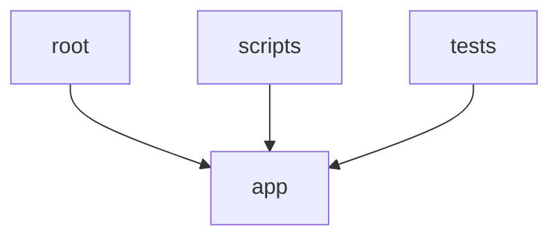

# Code Graph Review — backend

**Generated by:** code_graph_review.py
**Root:** C:\Users\baner\CopyFolder\IoT_thoughts\python-projects\kaggle_experiments\claude_projects\gen-ai-roi-demo-v4-v50\backend

## Summary

| Metric | Value |
|--------|-------|
| Total modules | 404 |
| Source modules | 276 |
| Test modules | 128 |
| Total lines | 89,414 |
| Source lines | 67,536 |
| Test lines | 21,878 |
| Classes | 226 |
| Top-level functions | 1710 |
| External dependencies | 50 |
| Circular dependencies | 0 |
| Dead export candidates | 627 |

## Module Inventory

| Module | Lines | Classes | Functions | Internal Imports | External |
|--------|-------|---------|-----------|-----------------|----------|
| age_experiments.py | 218 | 0 | 0 | 1 | 4 |
| analyze_cypher_compat.py | 279 | 0 | 7 | 0 | 7 |
| app\__init__.py | 1 | 0 | 0 | 0 | 0 |
| app\auth\__init__.py | 0 | 0 | 0 | 0 | 0 |
| app\auth\config.py | 58 | 1 | 1 | 0 | 4 |
| app\auth\dependencies.py | 80 | 0 | 1 | 2 | 4 |
| app\auth\jwt_utils.py | 53 | 0 | 3 | 0 | 4 |
| app\connectors\__init__.py | 1 | 0 | 0 | 0 | 0 |
| app\connectors\base.py | 112 | 3 | 0 | 0 | 4 |
| app\connectors\crowdstrike_mock.py | 239 | 1 | 1 | 2 | 5 |
| app\connectors\greynoise.py | 368 | 1 | 1 | 2 | 8 |
| app\connectors\pulsedive.py | 453 | 1 | 1 | 2 | 8 |
| app\connectors\registry.py | 131 | 1 | 0 | 1 | 2 |
| app\connectors\sentinel_mock.py | 117 | 1 | 1 | 0 | 4 |
| app\connectors\sentinel_real.py | 398 | 1 | 3 | 0 | 7 |
| app\core\__init__.py | 1 | 0 | 0 | 0 | 0 |
| app\core\domain_registry.py | 43 | 0 | 2 | 3 | 1 |
| app\core\state_manager.py | 62 | 1 | 0 | 0 | 2 |
| app\data\__init__.py | 0 | 0 | 0 | 0 | 0 |
| app\data\alert_pool.py | 1004 | 0 | 1 | 1 | 2 |
| app\db\__init__.py | 1 | 0 | 0 | 0 | 0 |
| app\db\neo4j.py | 523 | 1 | 0 | 4 | 10 |
| app\domains\__init__.py | 1 | 0 | 0 | 0 | 0 |
| app\domains\base.py | 121 | 6 | 0 | 0 | 3 |
| app\domains\soc\__init__.py | 1 | 0 | 0 | 0 | 0 |
| app\domains\soc\campaigns.py | 816 | 4 | 9 | 0 | 7 |
| app\domains\soc\config.py | 884 | 2 | 3 | 4 | 4 |
| app\domains\soc\constants.py | 75 | 0 | 3 | 0 | 0 |
| app\domains\soc\factors.py | 884 | 8 | 4 | 2 | 4 |
| app\domains\soc\orchestrator.py | 47 | 0 | 0 | 2 | 0 |
| app\domains\soc\policies.py | 169 | 0 | 2 | 0 | 1 |
| app\domains\soc\situations.py | 876 | 0 | 3 | 0 | 2 |
| app\domains\supply_chain\__init__.py | 1 | 0 | 0 | 0 | 0 |
| app\domains\supply_chain\config.py | 368 | 1 | 0 | 1 | 1 |
| app\framework\__init__.py | 15 | 0 | 0 | 0 | 0 |
| app\framework\agent.py | 374 | 2 | 0 | 0 | 3 |
| app\framework\audit.py | 427 | 0 | 4 | 3 | 5 |
| app\framework\checkpoint.py | 178 | 1 | 0 | 0 | 7 |
| app\framework\composite_gate.py | 195 | 1 | 0 | 1 | 4 |
| app\framework\convergence_math.py | 45 | 0 | 2 | 0 | 1 |
| app\framework\decision_history.py | 66 | 1 | 0 | 0 | 3 |
| app\framework\economics.py | 90 | 1 | 0 | 0 | 1 |
| app\framework\event_bus.py | 119 | 4 | 0 | 0 | 4 |
| app\framework\feedback_base.py | 172 | 0 | 4 | 1 | 4 |
| app\framework\feedback_store.py | 14 | 0 | 0 | 0 | 1 |
| app\framework\iks_base.py | 120 | 0 | 4 | 0 | 4 |
| app\framework\intervention_controls.py | 363 | 1 | 0 | 1 | 6 |
| app\framework\learning_state.py | 166 | 0 | 4 | 1 | 9 |
| app\framework\narrative_base.py | 127 | 1 | 4 | 0 | 4 |
| app\framework\ols_status.py | 120 | 0 | 1 | 0 | 2 |
| app\framework\override_detector.py | 98 | 1 | 0 | 0 | 3 |
| app\framework\provenance.py | 355 | 3 | 6 | 0 | 4 |
| app\framework\shadow_mode.py | 118 | 1 | 0 | 0 | 3 |
| app\framework\similar_cases_base.py | 177 | 1 | 0 | 0 | 6 |
| app\graph_schema.py | 819 | 0 | 2 | 1 | 6 |
| app\main.py | 394 | 0 | 0 | 23 | 6 |
| app\models\__init__.py | 1 | 0 | 0 | 0 | 0 |
| app\models\responses.py | 278 | 27 | 0 | 0 | 3 |
| app\models\schemas.py | 201 | 14 | 0 | 0 | 3 |
| app\routers\__init__.py | 1 | 0 | 0 | 0 | 0 |
| app\routers\admin.py | 76 | 1 | 0 | 4 | 2 |
| app\routers\audit.py | 194 | 0 | 0 | 2 | 3 |
| app\routers\auth.py | 125 | 0 | 1 | 3 | 2 |
| app\routers\eval_router.py | 134 | 0 | 0 | 1 | 5 |
| app\routers\evaluation.py | 193 | 0 | 2 | 3 | 5 |
| app\routers\evolution.py | 776 | 0 | 0 | 15 | 6 |
| app\routers\framework_router.py | 911 | 8 | 1 | 16 | 7 |
| app\routers\gae.py | 374 | 0 | 1 | 3 | 4 |
| app\routers\governance_router.py | 71 | 0 | 0 | 2 | 4 |
| app\routers\graph.py | 501 | 0 | 2 | 4 | 2 |
| app\routers\judgment.py | 201 | 1 | 2 | 4 | 4 |
| app\routers\metrics.py | 952 | 4 | 1 | 7 | 5 |
| app\routers\roi.py | 282 | 2 | 2 | 0 | 4 |
| app\routers\servicenow_router.py | 90 | 3 | 1 | 1 | 4 |
| app\routers\simulation.py | 290 | 1 | 0 | 7 | 5 |
| app\routers\soc.py | 4001 | 6 | 20 | 28 | 13 |
| app\routers\time_machine_router.py | 62 | 0 | 0 | 2 | 2 |
| app\routers\triage.py | 1887 | 0 | 1 | 33 | 10 |
| app\routers\whatif_router.py | 76 | 1 | 1 | 1 | 4 |
| app\scripts\__init__.py | 1 | 0 | 0 | 0 | 0 |
| app\services\__init__.py | 1 | 0 | 0 | 0 | 0 |
| app\services\accuracy_trajectory.py | 164 | 0 | 3 | 1 | 1 |
| app\services\agent.py | 7 | 0 | 0 | 1 | 0 |
| app\services\attack_chain.py | 334 | 2 | 0 | 0 | 4 |
| app\services\audit.py | 9 | 0 | 0 | 1 | 0 |
| app\services\balance_sheet.py | 302 | 2 | 5 | 8 | 6 |
| app\services\benchmarking_level2.py | 137 | 1 | 0 | 0 | 2 |
| app\services\benchmarking_report.py | 170 | 2 | 0 | 0 | 4 |
| app\services\bootstrap_neo4j.py | 222 | 0 | 2 | 0 | 5 |
| app\services\centroid_support.py | 61 | 0 | 1 | 0 | 1 |
| app\services\checkpoint.py | 7 | 0 | 0 | 1 | 0 |
| app\services\compliance_dashboard.py | 111 | 1 | 1 | 0 | 3 |
| app\services\composite_gate.py | 7 | 0 | 0 | 1 | 0 |
| app\services\convergence_calendar.py | 89 | 0 | 1 | 2 | 0 |
| app\services\decision_history.py | 7 | 0 | 0 | 1 | 0 |
| app\services\economics.py | 7 | 0 | 0 | 1 | 0 |
| app\services\enrichment_advisor.py | 119 | 0 | 4 | 1 | 1 |
| app\services\eval_service.py | 464 | 1 | 4 | 3 | 8 |
| app\services\event_bus.py | 7 | 0 | 0 | 1 | 0 |
| app\services\evidence_room.py | 243 | 1 | 11 | 5 | 5 |
| app\services\evolver.py | 485 | 2 | 11 | 0 | 3 |
| app\services\executive_narrative.py | 450 | 1 | 0 | 2 | 3 |
| app\services\factor_analysis.py | 180 | 0 | 4 | 4 | 4 |
| app\services\feedback.py | 451 | 3 | 6 | 3 | 4 |
| app\services\flywheel_comparison.py | 69 | 0 | 1 | 0 | 1 |
| app\services\gae_state.py | 847 | 0 | 32 | 3 | 10 |
| app\services\governance_report.py | 279 | 2 | 5 | 8 | 5 |
| app\services\graph_explorer.py | 300 | 1 | 0 | 0 | 4 |
| app\services\iks.py | 364 | 0 | 2 | 4 | 7 |
| app\services\industry_profile.py | 111 | 0 | 4 | 1 | 4 |
| app\services\intervention_controls.py | 7 | 0 | 0 | 1 | 0 |
| app\services\learning_health.py | 708 | 1 | 1 | 3 | 6 |
| app\services\model_swap.py | 197 | 1 | 1 | 5 | 6 |
| app\services\narrative.py | 434 | 2 | 8 | 2 | 4 |
| app\services\nl_templates.py | 384 | 2 | 0 | 1 | 1 |
| app\services\ols_status.py | 7 | 0 | 0 | 1 | 0 |
| app\services\override_detector.py | 80 | 0 | 0 | 1 | 3 |
| app\services\policy.py | 312 | 3 | 6 | 1 | 4 |
| app\services\provenance.py | 7 | 0 | 0 | 1 | 0 |
| app\services\reasoning.py | 109 | 1 | 0 | 0 | 3 |
| app\services\reconvergence_logger.py | 226 | 0 | 0 | 0 | 6 |
| app\services\referral_policy.py | 144 | 0 | 2 | 0 | 2 |
| app\services\referral_rules.py | 312 | 7 | 1 | 1 | 1 |
| app\services\servicenow_mock.py | 121 | 2 | 1 | 0 | 4 |
| app\services\shadow_mode.py | 7 | 0 | 0 | 1 | 0 |
| app\services\similar_cases.py | 74 | 1 | 0 | 1 | 3 |
| app\services\simulation.py | 632 | 2 | 0 | 9 | 10 |
| app\services\situation.py | 280 | 4 | 5 | 1 | 3 |
| app\services\snapshots.py | 69 | 0 | 0 | 2 | 3 |
| app\services\state_manager.py | 292 | 3 | 0 | 0 | 1 |
| app\services\threat_indicator.py | 212 | 1 | 2 | 0 | 5 |
| app\services\threat_intel.py | 46 | 0 | 0 | 2 | 1 |
| app\services\three_claims.py | 96 | 0 | 1 | 1 | 1 |
| app\services\time_machine.py | 407 | 2 | 16 | 4 | 6 |
| app\services\transparency_page.py | 176 | 0 | 1 | 1 | 1 |
| app\services\triage.py | 268 | 0 | 4 | 2 | 3 |
| app\services\whatif_service.py | 290 | 3 | 8 | 5 | 4 |
| app\state\__init__.py | 1 | 0 | 0 | 0 | 0 |
| app\state\graph_snapshot.py | 186 | 1 | 2 | 2 | 4 |
| backfill_correct.py | 39 | 0 | 0 | 1 | 3 |
| check_age.py | 112 | 0 | 0 | 1 | 4 |
| check_and_clean.py | 50 | 0 | 0 | 1 | 3 |
| check_correct.py | 32 | 0 | 0 | 1 | 3 |
| check_edge_types.py | 30 | 0 | 0 | 1 | 3 |
| check_env.py | 8 | 0 | 0 | 0 | 3 |
| check_syn_props.py | 20 | 0 | 0 | 1 | 3 |
| clean_orphans.py | 29 | 0 | 0 | 1 | 3 |
| cleanup_orphans.py | 25 | 0 | 0 | 1 | 3 |
| conftest.py | 163 | 0 | 4 | 2 | 5 |
| exp7_merge.py | 48 | 0 | 0 | 1 | 3 |
| ingest_shadow_decisions.py | 101 | 0 | 0 | 1 | 6 |
| property_audit.py | 121 | 0 | 1 | 1 | 6 |
| repro_orphan.py | 86 | 0 | 0 | 1 | 4 |
| scripts\centroid_diagnostics.py | 115 | 0 | 0 | 1 | 6 |
| scripts\exp10_drivers.py | 153 | 0 | 2 | 0 | 2 |
| scripts\exp11_different_n.py | 108 | 0 | 2 | 0 | 2 |
| scripts\exp12_different_prior.py | 110 | 0 | 2 | 0 | 2 |
| scripts\exp13_ablation.py | 225 | 0 | 2 | 0 | 3 |
| scripts\exp14_internal.py | 164 | 0 | 2 | 0 | 3 |
| scripts\exp15_no_update.py | 181 | 0 | 3 | 0 | 2 |
| scripts\exp16_kendall.py | 125 | 0 | 2 | 0 | 3 |
| scripts\exp17_staged.py | 166 | 0 | 2 | 0 | 2 |
| scripts\exp18_override.py | 137 | 0 | 3 | 0 | 2 |
| scripts\exp19_transfer_raw.py | 122 | 0 | 1 | 0 | 2 |
| scripts\exp1_prior_gap.py | 154 | 0 | 3 | 0 | 2 |
| scripts\exp20_larger_shifts.py | 126 | 0 | 2 | 0 | 2 |
| scripts\exp21_volume_batch.py | 200 | 1 | 3 | 0 | 3 |
| scripts\exp22_calibration_value.py | 176 | 0 | 2 | 0 | 2 |
| scripts\exp23_eta_schedule.py | 232 | 0 | 3 | 0 | 2 |
| scripts\exp24_second_deriv.py | 160 | 0 | 3 | 0 | 2 |
| scripts\exp25_effective_params.py | 195 | 0 | 2 | 0 | 2 |
| scripts\exp26_coupling.py | 190 | 0 | 3 | 0 | 2 |
| scripts\exp27_fixed_point.py | 187 | 0 | 2 | 0 | 2 |
| scripts\exp28_coupling.py | 237 | 0 | 3 | 0 | 3 |
| scripts\exp29_state_prediction.py | 249 | 0 | 3 | 0 | 2 |
| scripts\exp2_confidence_cal.py | 200 | 0 | 4 | 0 | 3 |
| scripts\exp30_phase_portrait.py | 190 | 0 | 2 | 0 | 2 |
| scripts\exp31_frequency.py | 177 | 0 | 3 | 0 | 2 |
| scripts\exp32_gain_margin.py | 134 | 0 | 2 | 0 | 2 |
| scripts\exp33_lyapunov.py | 202 | 0 | 2 | 0 | 2 |
| scripts\exp34_dead_zone.py | 159 | 0 | 2 | 0 | 2 |
| scripts\exp3_confidence_lockout.py | 170 | 0 | 3 | 0 | 2 |
| scripts\exp4_distribution_shift.py | 156 | 0 | 2 | 0 | 2 |
| scripts\exp5_sensitivity.py | 201 | 0 | 2 | 0 | 2 |
| scripts\exp6_transfer.py | 130 | 0 | 1 | 0 | 2 |
| scripts\exp7_regime_transitions.py | 295 | 0 | 3 | 0 | 2 |
| scripts\exp8_no_events.py | 150 | 0 | 2 | 0 | 2 |
| scripts\exp9_per_seed.py | 127 | 0 | 2 | 0 | 2 |
| scripts\exp_approx1_biasvar.py | 222 | 0 | 4 | 0 | 3 |
| scripts\exp_approx2_curvature.py | 252 | 0 | 5 | 0 | 3 |
| scripts\exp_c1_clean_ece.py | 237 | 0 | 3 | 0 | 2 |
| scripts\exp_c2_pareto.py | 269 | 0 | 4 | 0 | 2 |
| scripts\exp_c3_cold_start.py | 157 | 0 | 2 | 0 | 2 |
| scripts\exp_c4_transfer_ctrl.py | 164 | 0 | 2 | 0 | 2 |
| scripts\exp_c5_feedback.py | 219 | 0 | 3 | 0 | 3 |
| scripts\exp_c6_per_cat_drift.py | 161 | 0 | 2 | 0 | 2 |
| scripts\exp_c7_landscape.py | 176 | 0 | 2 | 0 | 2 |
| scripts\exp_centroid_char.py | 362 | 0 | 7 | 0 | 3 |
| scripts\exp_critical_three.py | 449 | 0 | 10 | 0 | 3 |
| scripts\exp_d1_candidates.py | 528 | 8 | 3 | 0 | 3 |
| scripts\exp_d2_signals.py | 208 | 0 | 3 | 0 | 3 |
| scripts\exp_d3_gains.py | 180 | 0 | 3 | 0 | 2 |
| scripts\exp_d4_switching.py | 192 | 0 | 2 | 0 | 3 |
| scripts\exp_d5_scope.py | 224 | 0 | 3 | 0 | 3 |
| scripts\exp_d6_combination.py | 318 | 1 | 3 | 0 | 3 |
| scripts\exp_d7_bootstrap.py | 204 | 0 | 3 | 0 | 3 |
| scripts\exp_d8_sensitivity.py | 202 | 0 | 3 | 0 | 3 |
| scripts\exp_d9_update_rules.py | 199 | 0 | 3 | 0 | 3 |
| scripts\exp_e1_error_space.py | 444 | 0 | 2 | 0 | 3 |
| scripts\exp_e2_error_dynamics.py | 317 | 0 | 2 | 0 | 2 |
| scripts\exp_f12_signal_proj.py | 292 | 0 | 4 | 0 | 2 |
| scripts\exp_f13_snr_estimation.py | 212 | 0 | 2 | 0 | 2 |
| scripts\exp_f14_bounded.py | 175 | 0 | 1 | 0 | 3 |
| scripts\exp_f15_dk_wiener.py | 263 | 0 | 5 | 0 | 2 |
| scripts\exp_f1_alignment.py | 229 | 0 | 1 | 0 | 2 |
| scripts\exp_f2_stability.py | 133 | 0 | 1 | 0 | 2 |
| scripts\exp_f3_orthogonality.py | 196 | 0 | 3 | 0 | 3 |
| scripts\exp_f4_order.py | 148 | 0 | 3 | 0 | 3 |
| scripts\exp_f5_observability.py | 174 | 0 | 3 | 0 | 2 |
| scripts\exp_f6f7_stack.py | 210 | 0 | 5 | 0 | 3 |
| scripts\exp_f8_conservation.py | 162 | 0 | 2 | 0 | 2 |
| scripts\exp_f9_signal.py | 260 | 0 | 2 | 0 | 2 |
| scripts\exp_g7_boosting.py | 230 | 0 | 1 | 0 | 3 |
| scripts\exp_g8_proper_dk.py | 293 | 0 | 4 | 0 | 3 |
| scripts\exp_g9_instability.py | 343 | 0 | 2 | 0 | 2 |
| scripts\exp_gap_closing.py | 503 | 0 | 4 | 0 | 3 |
| scripts\exp_h1_subspace.py | 213 | 0 | 5 | 0 | 2 |
| scripts\exp_h2_boundary.py | 198 | 0 | 3 | 0 | 2 |
| scripts\exp_h3_translation.py | 228 | 0 | 4 | 0 | 2 |
| scripts\exp_h4_opportunity.py | 241 | 0 | 4 | 0 | 3 |
| scripts\exp_h5_combined.py | 269 | 0 | 5 | 0 | 3 |
| scripts\exp_order1_dk_dynamics.py | 226 | 0 | 4 | 0 | 2 |
| scripts\exp_order2_interaction.py | 172 | 0 | 5 | 0 | 3 |
| scripts\exp_order3_gaps.py | 371 | 0 | 5 | 0 | 3 |
| scripts\exp_p1_temperature.py | 275 | 2 | 4 | 0 | 2 |
| scripts\exp_p2_dimensionality.py | 266 | 0 | 9 | 0 | 1 |
| scripts\exp_p3_metric.py | 214 | 0 | 5 | 0 | 2 |
| scripts\exp_p4_separation.py | 222 | 0 | 5 | 0 | 2 |
| scripts\exp_p5_interaction.py | 297 | 1 | 3 | 0 | 3 |
| scripts\exp_p6_decomposition.py | 420 | 0 | 4 | 0 | 2 |
| scripts\exp_p7_voronoi.py | 253 | 0 | 1 | 0 | 2 |
| scripts\exp_r1_boundary_linearity.py | 166 | 0 | 1 | 0 | 3 |
| scripts\exp_r2_multimodality.py | 145 | 0 | 2 | 0 | 3 |
| scripts\exp_r3_interaction.py | 141 | 0 | 1 | 0 | 3 |
| scripts\exp_r4_variance.py | 135 | 0 | 1 | 0 | 3 |
| scripts\exp_r5_alternatives.py | 219 | 0 | 2 | 0 | 3 |
| scripts\exp_r6_unmeasured.py | 153 | 0 | 1 | 0 | 2 |
| scripts\exp_rate1_fast.py | 229 | 0 | 7 | 0 | 3 |
| scripts\exp_rate1_longrun.py | 288 | 0 | 6 | 0 | 2 |
| scripts\exp_rate25_fast.py | 221 | 0 | 3 | 0 | 4 |
| scripts\exp_rate25_overlap.py | 258 | 0 | 4 | 0 | 3 |
| scripts\exp_rate67_fast.py | 273 | 0 | 7 | 0 | 3 |
| scripts\exp_rate67_novelty.py | 390 | 0 | 9 | 0 | 2 |
| scripts\exp_rate9_fast.py | 266 | 0 | 7 | 0 | 3 |
| scripts\exp_rate9_strengthen.py | 395 | 0 | 9 | 0 | 2 |
| scripts\exp_reparam1_boundary.py | 257 | 1 | 2 | 0 | 2 |
| scripts\exp_reparam2_split.py | 258 | 0 | 4 | 0 | 2 |
| scripts\exp_roadmap_remaining.py | 413 | 0 | 9 | 0 | 3 |
| scripts\exp_roadmap_rerun.py | 337 | 0 | 9 | 0 | 3 |
| scripts\exp_shared.py | 230 | 1 | 7 | 2 | 4 |
| scripts\exp_smooth_mono.py | 166 | 0 | 6 | 0 | 3 |
| scripts\ingest_synthetic_decisions.py | 121 | 0 | 0 | 1 | 6 |
| scripts\migrate_datetime_to_epoch.py | 341 | 0 | 11 | 1 | 5 |
| scripts\run_sentinel_mock.py | 135 | 0 | 1 | 2 | 6 |
| scripts\seed_verified_decisions.py | 227 | 0 | 3 | 1 | 6 |
| scripts\smoke_test_policy.py (test) | 123 | 0 | 4 | 0 | 2 |
| scripts\write_mu_zero_sidecar.py | 84 | 0 | 1 | 1 | 4 |
| seed_neo4j.py | 1619 | 0 | 0 | 3 | 4 |
| support\setup\bootstrap_learning_loop.py | 245 | 0 | 1 | 1 | 8 |
| support\setup\cleanup_orphaned_decisions.py | 187 | 0 | 1 | 1 | 5 |
| support\setup\enrich_zero_day_v5.py | 560 | 0 | 2 | 0 | 6 |
| support\setup\fix_null_category_decisions.py | 210 | 0 | 1 | 1 | 5 |
| support\setup\inject_errors.py | 36 | 0 | 0 | 1 | 4 |
| support\setup\migrate_aura_to_age.py | 513 | 0 | 4 | 2 | 10 |
| support\setup\rebuild_age_graph.py | 699 | 0 | 1 | 1 | 5 |
| support\setup\seed_shadow_decisions.py | 177 | 0 | 1 | 1 | 6 |
| support\setup\seed_zero_day.py | 500 | 0 | 1 | 1 | 8 |
| test_age_set.py (test) | 60 | 0 | 0 | 1 | 3 |
| tests\integration\__init__.py (test) | 0 | 0 | 0 | 0 | 0 |
| tests\integration\test_w2_read_path.py (test) | 201 | 0 | 7 | 2 | 5 |
| tests\test_accuracy_trajectory.py (test) | 147 | 0 | 5 | 4 | 5 |
| tests\test_age_contracts.py (test) | 347 | 0 | 15 | 3 | 7 |
| tests\test_alert_pool.py (test) | 73 | 0 | 8 | 2 | 0 |
| tests\test_alert_type_routing.py (test) | 191 | 0 | 10 | 4 | 3 |
| tests\test_analyst_benchmarking_f9.py (test) | 120 | 0 | 8 | 1 | 4 |
| tests\test_analyst_eta.py (test) | 158 | 0 | 7 | 4 | 6 |
| tests\test_attack_chain.py (test) | 115 | 0 | 7 | 2 | 3 |
| tests\test_audit_chain_contract.py (test) | 175 | 0 | 15 | 3 | 2 |
| tests\test_audit_chain_wiring.py (test) | 216 | 0 | 17 | 5 | 5 |
| tests\test_audit_chain_wiring_extended.py (test) | 390 | 0 | 16 | 6 | 4 |
| tests\test_audit_ci_platform.py (test) | 98 | 0 | 3 | 2 | 1 |
| tests\test_audit_concurrency.py (test) | 140 | 0 | 3 | 1 | 1 |
| tests\test_balance_sheet.py (test) | 251 | 2 | 14 | 3 | 4 |
| tests\test_benchmarking_level2.py (test) | 61 | 0 | 6 | 1 | 0 |
| tests\test_benchmarking_report.py (test) | 86 | 1 | 6 | 1 | 0 |
| tests\test_bootstrap_decisions.py (test) | 252 | 0 | 9 | 2 | 2 |
| tests\test_bootstrap_persistence.py (test) | 127 | 0 | 6 | 1 | 6 |
| tests\test_campaign_api.py (test) | 136 | 0 | 5 | 1 | 3 |
| tests\test_campaign_engine.py (test) | 255 | 0 | 9 | 1 | 3 |
| tests\test_campaign_frontend.py (test) | 116 | 0 | 3 | 1 | 4 |
| tests\test_campaign_matcher.py (test) | 144 | 0 | 5 | 1 | 5 |
| tests\test_campaign_schema.py (test) | 156 | 0 | 7 | 1 | 3 |
| tests\test_category_freeze.py (test) | 193 | 0 | 7 | 3 | 7 |
| tests\test_centroid_export.py (test) | 266 | 0 | 14 | 2 | 9 |
| tests\test_centroid_heatmap.py (test) | 87 | 0 | 7 | 2 | 3 |
| tests\test_centroid_pitr.py (test) | 173 | 0 | 6 | 1 | 10 |
| tests\test_centroid_snapshot.py (test) | 150 | 0 | 7 | 1 | 9 |
| tests\test_centroid_support.py (test) | 79 | 0 | 5 | 2 | 5 |
| tests\test_checkpoint_contract.py (test) | 219 | 2 | 6 | 1 | 3 |
| tests\test_cold_start_guards.py (test) | 190 | 0 | 10 | 2 | 5 |
| tests\test_compliance_dashboard.py (test) | 40 | 0 | 6 | 1 | 0 |
| tests\test_composite_gate.py (test) | 312 | 5 | 11 | 4 | 6 |
| tests\test_compounding_gate.py (test) | 335 | 0 | 5 | 0 | 3 |
| tests\test_concurrent_safety.py (test) | 20 | 0 | 2 | 1 | 1 |
| tests\test_conservation_enforcement.py (test) | 315 | 0 | 11 | 1 | 5 |
| tests\test_conservation_extended.py (test) | 337 | 0 | 15 | 2 | 7 |
| tests\test_convergence_calendar.py (test) | 190 | 0 | 6 | 2 | 5 |
| tests\test_cross_repo_contracts.py (test) | 117 | 0 | 9 | 6 | 5 |
| tests\test_data_integrity.py (test) | 59 | 0 | 1 | 1 | 3 |
| tests\test_decision_distance_log.py (test) | 107 | 0 | 4 | 3 | 6 |
| tests\test_econ1.py (test) | 220 | 0 | 9 | 2 | 4 |
| tests\test_economics.py (test) | 39 | 0 | 6 | 1 | 0 |
| tests\test_enrichment_advisor.py (test) | 133 | 0 | 6 | 2 | 0 |
| tests\test_enrichment_status.py (test) | 68 | 0 | 5 | 1 | 4 |
| tests\test_eta_cap.py (test) | 143 | 0 | 6 | 2 | 5 |
| tests\test_eval1_soc.py (test) | 151 | 0 | 9 | 1 | 4 |
| tests\test_eval2_soc.py (test) | 190 | 0 | 8 | 3 | 4 |
| tests\test_eval_upload.py (test) | 710 | 6 | 35 | 4 | 9 |
| tests\test_evidence_room.py (test) | 85 | 0 | 9 | 1 | 4 |
| tests\test_executive_narrative.py (test) | 210 | 2 | 16 | 4 | 5 |
| tests\test_f2_design.py (test) | 218 | 0 | 7 | 3 | 5 |
| tests\test_f4_overlay.py (test) | 186 | 0 | 7 | 2 | 4 |
| tests\test_factor_analysis.py (test) | 155 | 2 | 14 | 2 | 4 |
| tests\test_fix_05_06_07.py (test) | 124 | 0 | 0 | 2 | 5 |
| tests\test_flywheel_comparison.py (test) | 139 | 0 | 5 | 1 | 2 |
| tests\test_framework_discipline.py (test) | 93 | 0 | 3 | 2 | 5 |
| tests\test_gae_persistence.py (test) | 194 | 0 | 4 | 2 | 7 |
| tests\test_gate_config.py (test) | 71 | 0 | 8 | 1 | 2 |
| tests\test_gate_r_routing.py (test) | 287 | 0 | 6 | 2 | 2 |
| tests\test_governance_report.py (test) | 211 | 0 | 7 | 2 | 6 |
| tests\test_graph_backend_switcher.py (test) | 75 | 0 | 3 | 2 | 3 |
| tests\test_graph_contract_stress.py (test) | 258 | 5 | 3 | 6 | 4 |
| tests\test_graph_explorer.py (test) | 208 | 2 | 8 | 2 | 3 |
| tests\test_graph_snapshot.py (test) | 151 | 0 | 16 | 1 | 2 |
| tests\test_h7_fix1.py (test) | 76 | 0 | 6 | 2 | 2 |
| tests\test_h7_fix2.py (test) | 103 | 0 | 5 | 1 | 4 |
| tests\test_h7_fix3.py (test) | 186 | 0 | 7 | 2 | 5 |
| tests\test_h7_fix4.py (test) | 134 | 0 | 6 | 2 | 5 |
| tests\test_iks_bootstrap.py (test) | 33 | 0 | 2 | 1 | 3 |
| tests\test_iks_consistency.py (test) | 142 | 1 | 1 | 4 | 5 |
| tests\test_iks_stability.py (test) | 212 | 0 | 8 | 2 | 6 |
| tests\test_iks_v2.py (test) | 271 | 1 | 9 | 2 | 4 |
| tests\test_industry_profile.py (test) | 141 | 0 | 5 | 2 | 4 |
| tests\test_intervention_controls.py (test) | 202 | 0 | 11 | 2 | 3 |
| tests\test_judg1_soc.py (test) | 201 | 0 | 8 | 3 | 4 |
| tests\test_known_issues.py (test) | 197 | 0 | 1 | 0 | 0 |
| tests\test_learning_health.py (test) | 217 | 0 | 6 | 1 | 6 |
| tests\test_learning_toggle.py (test) | 178 | 0 | 6 | 1 | 3 |
| tests\test_model_swap.py (test) | 122 | 0 | 3 | 3 | 2 |
| tests\test_narrative_fixes.py (test) | 95 | 0 | 4 | 0 | 1 |
| tests\test_nl_templates.py (test) | 299 | 2 | 7 | 3 | 4 |
| tests\test_no_destructive_decision_queries.py (test) | 53 | 0 | 1 | 0 | 3 |
| tests\test_ols_status.py (test) | 182 | 0 | 5 | 2 | 4 |
| tests\test_onboarding_calendar.py (test) | 40 | 0 | 5 | 1 | 1 |
| tests\test_override_detector.py (test) | 130 | 0 | 5 | 2 | 4 |
| tests\test_pattern_history_w2.py (test) | 116 | 0 | 7 | 1 | 5 |
| tests\test_per_analyst_eta.py (test) | 120 | 0 | 3 | 2 | 2 |
| tests\test_phase3_minimum.py (test) | 22 | 0 | 3 | 1 | 2 |
| tests\test_policy_alert_type.py (test) | 91 | 1 | 2 | 1 | 3 |
| tests\test_policy_endpoints.py (test) | 97 | 0 | 4 | 1 | 1 |
| tests\test_privileged_identity_factor.py (test) | 91 | 0 | 8 | 3 | 1 |
| tests\test_progressive_learning.py (test) | 229 | 0 | 7 | 1 | 5 |
| tests\test_provenance.py (test) | 137 | 0 | 7 | 3 | 4 |
| tests\test_reconvergence_logger.py (test) | 53 | 0 | 3 | 1 | 4 |
| tests\test_refer_to_analyst.py (test) | 190 | 0 | 14 | 2 | 2 |
| tests\test_referral_rules.py (test) | 418 | 0 | 34 | 3 | 3 |
| tests\test_s2p_sdk_validation.py (test) | 76 | 0 | 5 | 2 | 3 |
| tests\test_saml_auth.py (test) | 131 | 0 | 17 | 4 | 4 |
| tests\test_saml_auth_extended.py (test) | 260 | 0 | 26 | 4 | 5 |
| tests\test_sentinel_mock.py (test) | 149 | 0 | 4 | 1 | 6 |
| tests\test_sentinel_real.py (test) | 116 | 0 | 7 | 2 | 4 |
| tests\test_sentinel_writeback.py (test) | 113 | 0 | 5 | 2 | 5 |
| tests\test_servicenow_mock.py (test) | 109 | 0 | 13 | 1 | 2 |
| tests\test_servicenow_router.py (test) | 104 | 0 | 10 | 2 | 4 |
| tests\test_servicenow_triage_integration.py (test) | 155 | 0 | 11 | 3 | 8 |
| tests\test_shadow_checkpoint.py (test) | 281 | 0 | 10 | 3 | 6 |
| tests\test_soc_constants.py (test) | 56 | 0 | 4 | 1 | 0 |
| tests\test_spike_cap.py (test) | 173 | 0 | 6 | 1 | 4 |
| tests\test_spike_detector.py (test) | 180 | 0 | 8 | 3 | 7 |
| tests\test_startup_sync.py (test) | 63 | 0 | 0 | 0 | 2 |
| tests\test_switching_cost.py (test) | 141 | 0 | 4 | 2 | 4 |
| tests\test_tab_content.py (test) | 1310 | 0 | 61 | 4 | 8 |
| tests\test_theta_min.py (test) | 63 | 0 | 8 | 2 | 4 |
| tests\test_threat_indicator.py (test) | 215 | 2 | 8 | 2 | 4 |
| tests\test_threat_intel_pass3.py (test) | 127 | 0 | 5 | 1 | 4 |
| tests\test_three_claims.py (test) | 38 | 0 | 6 | 1 | 0 |
| tests\test_time_machine.py (test) | 346 | 2 | 25 | 2 | 9 |
| tests\test_transparency_page.py (test) | 44 | 0 | 6 | 1 | 0 |
| tests\test_triage_routing_actions.py (test) | 140 | 0 | 9 | 4 | 8 |
| tests\test_triggered_evolution.py (test) | 211 | 0 | 11 | 3 | 7 |
| tests\test_verification_health.py (test) | 148 | 0 | 8 | 1 | 5 |
| tests\test_visual_smoke.py (test) | 279 | 0 | 3 | 0 | 2 |
| tests\test_whatif_simulator.py (test) | 246 | 1 | 24 | 3 | 3 |
| tests\test_write_roundtrips.py (test) | 180 | 0 | 15 | 2 | 3 |

## Class & Function Index

### analyze_cypher_compat.py
- **def** `is_cypher_like` (line 44)
- **def** `extract_string_value` (line 53)
- **def** `collect_run_query_calls` (line 69)
- **def** `check_query` (line 122)
- **def** `rewrite_suggestion` (line 148)
- **def** `scan_file` (line 158)
- **def** `main` (line 217)

### app\auth\config.py
- **class** `AuthConfig` (line 10)
- **def** `load_auth_config` (line 42)

### app\auth\dependencies.py
- **def** `get_auth_config` (line 10)

### app\auth\jwt_utils.py
- **def** `create_jwt` (line 9)
- **def** `verify_jwt` (line 24)
- **def** `derive_role` (line 44)

### app\connectors\base.py
- **class** `ConnectorResult` (line 21)
- **class** `HealthStatus` (line 42)
- **class** `UCLConnector` (line 64)

### app\connectors\crowdstrike_mock.py
- **class** `CrowdStrikeMockConnector` (line 79)
- **def** `_S` (line 29)

### app\connectors\greynoise.py
- **class** `GreyNoiseConnector` (line 175)
- **def** `_S` (line 39)

### app\connectors\pulsedive.py
- **class** `PulsediveConnector` (line 240)
- **def** `_S` (line 35)

### app\connectors\registry.py
- **class** `ConnectorRegistry` (line 22)

### app\connectors\sentinel_mock.py
- **class** `SentinelMockConnector` (line 34)
- **def** `_iso_to_epoch_ms` (line 22)

### app\connectors\sentinel_real.py
- **class** `SentinelRealConnector` (line 206)
- **def** `_map_sentinel_category` (line 65)
- **def** `_normalize_sentinel_alert` (line 108)
- **def** `get_sentinel_connector` (line 394)

### app\core\domain_registry.py
- **def** `get_active_domain` (line 29)
- **def** `get_domain_config` (line 34)

### app\core\state_manager.py
- **class** `DemoStateManager` (line 20)

### app\data\alert_pool.py
- **def** `get_alert_pool` (line 378)

### app\db\neo4j.py
- **class** `Neo4jClient` (line 34)

### app\domains\base.py
- **class** `DomainAction` (line 9)
- **class** `DomainFactor` (line 19)
- **class** `DomainSituationType` (line 27)
- **class** `DomainPolicy` (line 36)
- **class** `PromptVariant` (line 46)
- **class** `DomainConfig` (line 54)

### app\domains\soc\campaigns.py
- **class** `Campaign` (line 86)
- **class** `CampaignCorrelationEngine` (line 308)
- **class** `CampaignRepository` (line 514)
- **class** `CampaignMatcher` (line 722)
- **def** `_S` (line 31)
- **def** `_to_python_dt` (line 44)
- **def** `make_campaign_id` (line 215)
- **def** `is_subsequence` (line 220)
- **def** `derive_severity` (line 226)
- **def** `_ts_to_seconds` (line 235)
- **def** `sliding_window_cluster` (line 250)
- **def** `build_nl_summary` (line 265)
- **def** `compute_confidence` (line 286)

### app\domains\soc\config.py
- **class** `SOCDomainConfig` (line 315)
- **class** `GateConfig` (line 820)
- **def** `resolve_alert_category` (line 276)
- **def** `compute_theta_min` (line 782)
- **def** `compute_phase3_minimum` (line 802)

### app\domains\soc\constants.py
- **def** `get_sigma_band` (line 27)
- **def** `get_permanent_gap_pp` (line 36)
- **def** `n_half_applicable` (line 41)

### app\domains\soc\factors.py
- **class** `PrivilegedIdentityContextFactor` (line 50)
- **class** `TravelMatchFactor` (line 139)
- **class** `AssetCriticalityFactor` (line 200)
- **class** `ThreatIntelEnrichmentFactor` (line 259)
- **class** `PatternHistoryFactor` (line 375)
- **class** `PatternHistoryFactorComputer` (line 432)
- **class** `TimeAnomalyFactor` (line 526)
- **class** `DeviceTrustFactor` (line 559)
- **def** `_get` (line 27)
- **def** `_S` (line 34)
- **def** `_contribution` (line 805)
- **def** `compute_soc_factors` (line 817)

### app\domains\soc\policies.py
- **def** `_policy_matches` (line 101)
- **def** `get_applicable_soc_policies` (line 152)

### app\domains\soc\situations.py
- **def** `get_mitre_attack` (line 184)
- **def** `classify_soc_situation` (line 206)
- **def** `get_soc_options` (line 867)

### app\domains\supply_chain\config.py
- **class** `S2PDomainConfig` (line 31)

### app\framework\agent.py
- **class** `DecisionResult` (line 16)
- **class** `SOCAgent` (line 32)

### app\framework\audit.py
- **def** `_entry_to_dict` (line 76)
- **def** `_outcome_to_dict` (line 98)
- **def** `get_decision_rows` (line 175)
- **def** `verify_chain` (line 380)

### app\framework\checkpoint.py
- **class** `CheckpointService` (line 24)

### app\framework\composite_gate.py
- **class** `CompositeDiscriminant` (line 30)

### app\framework\convergence_math.py
- **def** `predict_n_half` (line 20)
- **def** `decisions_to_days` (line 39)

### app\framework\decision_history.py
- **class** `DecisionHistoryService` (line 18)

### app\framework\economics.py
- **class** `FrozenROICalculator` (line 4)

### app\framework\event_bus.py
- **class** `DecisionMade` (line 24)
- **class** `OutcomeVerified` (line 38)
- **class** `GraphMutated` (line 52)
- **class** `EventBus` (line 70)

### app\framework\feedback_base.py
- **def** `update_trust` (line 41)
- **def** `get_trust_status` (line 95)
- **def** `get_all_trust_scores` (line 115)
- **def** `get_reward_summary` (line 147)

### app\framework\iks_base.py
- **def** `_mean_centroid_drift` (line 34)
- **def** `compute_iks` (line 57)
- **def** `interpret` (line 99)
- **def** `interpret_iks_v2` (line 110)

### app\framework\intervention_controls.py
- **class** `InterventionControls` (line 31)

### app\framework\learning_state.py
- **def** `make_state` (line 41)
- **def** `load_from_file` (line 59)
- **def** `read_checkpoint_metadata` (line 105)
- **def** `save_state` (line 112)

### app\framework\narrative_base.py
- **class** `NarrativeProvider` (line 34)
- **def** `register_narrative_provider` (line 51)
- **def** `create_narrative_provider` (line 67)
- **def** `get_narrative_provider` (line 108)
- **def** `set_narrative_provider` (line 123)

### app\framework\ols_status.py
- **def** `get_ols_status` (line 16)

### app\framework\override_detector.py
- **class** `OverrideDetector` (line 36)

### app\framework\provenance.py
- **class** `FactorProvenance` (line 27)
- **class** `DecisionProvenance` (line 37)
- **class** `ProvenanceService` (line 231)
- **def** `_explain_privileged_identity_context` (line 49)
- **def** `_explain_asset_criticality` (line 73)
- **def** `_explain_threat_intel_enrichment` (line 101)
- **def** `_explain_pattern_history` (line 129)
- **def** `_explain_time_anomaly` (line 158)
- **def** `_explain_device_trust` (line 187)

### app\framework\shadow_mode.py
- **class** `ShadowModeService` (line 19)

### app\framework\similar_cases_base.py
- **class** `SimilarCasesBase` (line 40)

### app\graph_schema.py
- **def** `_S` (line 46)
- **def** `_validate_json` (line 363)

### app\models\responses.py
- **class** `IksComponents` (line 23)
- **class** `LearningStateResponse` (line 30)
- **class** `SwitchingCost` (line 48)
- **class** `IksData` (line 59)
- **class** `ProfileResponse` (line 69)
- **class** `CategoryBreakdownItem` (line 82)
- **class** `EstimatedMetric` (line 87)
- **class** `AnalyticsResponse` (line 94)
- **class** `CategoryScoreItem` (line 109)
- **class** `NoiseMapItem` (line 116)
- **class** `DetectionEngineeringResponse` (line 123)
- **class** `CampaignItem` (line 135)
- **class** `CampaignsResponse` (line 148)
- **class** `AlertSummary` (line 158)
- **class** `AlertQueueResponse` (line 169)
- **class** `TopShift` (line 177)
- **class** `WhatChanged` (line 183)
- **class** `NewEntities` (line 190)
- **class** `GraphGrowth` (line 196)
- **class** `WhatDiscovered` (line 201)
- **class** `WhatKnows` (line 208)
- **class** `NarrativeMetrics` (line 216)
- **class** `ExecutiveNarrativeResponse` (line 223)
- **class** `DecisionFactor` (line 237)
- **class** `DecisionFactorsResponse` (line 245)
- **class** `SimulationProgressResponse` (line 259)
- **class** `CentroidSupportResponse` (line 272)

### app\models\schemas.py
- **class** `Alert` (line 14)
- **class** `ProcessAlertRequest` (line 33)
- **class** `OutcomeRequest` (line 40)
- **class** `SecurityContext` (line 56)
- **class** `Decision` (line 82)
- **class** `DecisionTrace` (line 92)
- **class** `EvolutionEvent` (line 109)
- **class** `TriggeredEvolution` (line 122)
- **class** `EvalGateCheck` (line 133)
- **class** `EvalGateResult` (line 142)
- **class** `Deployment` (line 153)
- **class** `AttackPattern` (line 169)
- **class** `ProcessAlertResponse` (line 184)
- **class** `CompoundingMetrics` (line 194)

### app\routers\admin.py
- **class** `ResetRequest` (line 17)

### app\routers\auth.py
- **def** `_get_saml_service` (line 9)

### app\routers\evaluation.py
- **def** `load_soc_scenarios` (line 36)
- **def** `run_soc_evaluation` (line 68)

### app\routers\framework_router.py
- **class** `ShadowToggleRequest` (line 29)
- **class** `AnalystActionRequest` (line 33)
- **class** `CheckpointCreateRequest` (line 38)
- **class** `RollbackRequest` (line 42)
- **class** `_GraphQueryRequest` (line 46)
- **class** `FreezeRequest` (line 50)
- **class** `RollbackInterventionRequest` (line 55)
- **class** `ThresholdRequest` (line 62)
- **def** `_get_intervention_controls` (line 809)

### app\routers\gae.py
- **def** `_wu_timestamp` (line 37)

### app\routers\graph.py
- **def** `_consensus_severity` (line 33)
- **def** `_build_view` (line 60)

### app\routers\judgment.py
- **class** `JudgmentRequest` (line 36)
- **def** `_build_factor_vector` (line 44)
- **def** `build_judgment_response` (line 51)

### app\routers\metrics.py
- **class** `WeeklyMetrics` (line 21)
- **class** `EvolutionEvent` (line 30)
- **class** `BusinessImpact` (line 39)
- **class** `CompoundingResponse` (line 47)
- **def** `generate_compounding_data` (line 60)

### app\routers\roi.py
- **class** `ROIRequest` (line 17)
- **class** `ROIResponse` (line 64)
- **def** `calculate_roi` (line 76)
- **def** `generate_narrative` (line 160)

### app\routers\servicenow_router.py
- **class** `CreateIncidentRequest` (line 14)
- **class** `UpdateStatusRequest` (line 24)
- **class** `IncidentResponse` (line 29)
- **def** `_to_response` (line 41)

### app\routers\simulation.py
- **class** `StartSimulationRequest` (line 33)

### app\routers\soc.py
- **class** `SOCQueryRequest` (line 39)
- **class** `MetricContract` (line 44)
- **class** `MetricDataPoint` (line 54)
- **class** `Provenance` (line 60)
- **class** `SprawlAlert` (line 68)
- **class** `_WritebackTestRequest` (line 3928)
- **def** `get_mttr_by_severity_data` (line 192)
- **def** `get_auto_close_rate_data` (line 202)
- **def** `get_fp_rate_by_rule_data` (line 211)
- **def** `get_escalation_rate_data` (line 222)
- **def** `get_mttd_by_source_data` (line 232)
- **def** `get_analyst_efficiency_data` (line 242)
- **def** `get_cross_context_travel_risk_data` (line 251)
- **def** `get_device_trust_gaps_data` (line 272)
- **def** `get_policy_conflict_landscape_data` (line 297)
- **def** `get_threat_intel_coverage_data` (line 318)
- **def** `match_metric` (line 345)
- **def** `get_metric_data` (line 369)
- **def** `get_provenance` (line 391)
- **def** `check_for_sprawl` (line 487)
- **def** `_parse_dt` (line 1663)
- **def** `_format_campaign` (line 1673)
- **def** `_format_campaign_detail` (line 1707)
- **def** `_resolve_category` (line 2502)
- **def** `_factor_kernel_weight` (line 2740)
- **def** `_compute_convergence_trend` (line 3810)

### app\routers\triage.py
- **def** `_node_id` (line 23)

### app\routers\whatif_router.py
- **class** `WhatIfScenarioPayload` (line 14)
- **def** `_validate_payload` (line 34)

### app\services\accuracy_trajectory.py
- **def** `_interpolate_accuracy` (line 26)
- **def** `build_trajectory_for_category` (line 62)
- **def** `build_accuracy_trajectory` (line 112)

### app\services\attack_chain.py
- **class** `Campaign` (line 25)
- **class** `AttackChainService` (line 38)

### app\services\balance_sheet.py
- **class** `CategoryBalance` (line 27)
- **class** `LearningBalanceSheet` (line 41)
- **def** `_compute_status` (line 53)
- **def** `_compute_structural_ceiling_report` (line 72)
- **def** `_safe_epistemic_state` (line 97)
- **def** `_category_score` (line 162)
- **def** `_build_recommendation` (line 172)

### app\services\benchmarking_level2.py
- **class** `Level2BenchmarkingSection` (line 5)

### app\services\benchmarking_report.py
- **class** `BenchmarkingReport` (line 8)
- **class** `BenchmarkingEngine` (line 30)

### app\services\bootstrap_neo4j.py
- **def** `_apply_weights` (line 33)
- **def** `build_bootstrap_decisions` (line 73)

### app\services\centroid_support.py
- **def** `compute_centroid_support` (line 14)

### app\services\compliance_dashboard.py
- **class** `ComplianceArticle` (line 7)
- **def** `generate_compliance_page` (line 90)

### app\services\convergence_calendar.py
- **def** `build_convergence_calendar` (line 18)

### app\services\enrichment_advisor.py
- **def** `_build_factor_advisory` (line 61)
- **def** `_ioc_coverage_band` (line 75)
- **def** `_ioc_coverage_note` (line 83)
- **def** `get_enrichment_advice` (line 97)

### app\services\eval_service.py
- **class** `EvalResult` (line 35)
- **def** `_compute_structural_ceiling` (line 68)
- **def** `example_template_rows` (line 88)
- **def** `validate_csv_rows` (line 126)
- **def** `run_evaluation` (line 198)

### app\services\evidence_room.py
- **class** `EvidenceRoomService` (line 88)
- **def** `_now_iso` (line 17)
- **def** `_safe_float` (line 21)
- **def** `_safe_int` (line 30)
- **def** `_clamp_rate` (line 39)
- **def** `_truncate` (line 43)
- **def** `_json_safe` (line 48)
- **def** `_empty_audit_trail` (line 60)
- **def** `_empty_hash_chain` (line 64)
- **def** `_empty_conservation` (line 68)
- **def** `_empty_override_analysis` (line 78)
- **def** `dumps_json_safe` (line 242)

### app\services\evolver.py
- **class** `OperationalImpact` (line 42)
- **class** `PromptEvolution` (line 51)
- **def** `get_prompt_variant` (line 67)
- **def** `get_prompt_stats` (line 80)
- **def** `record_decision_outcome` (line 90)
- **def** `check_for_promotion` (line 138)
- **def** `generate_what_changed_narrative` (line 206)
- **def** `calculate_operational_impact` (line 233)
- **def** `get_evolution_summary` (line 270)
- **def** `get_variant_comparison` (line 347)
- **def** `reset_evolver_state` (line 383)
- **def** `get_weight_history` (line 412)
- **def** `seed_weight_history` (line 437)

### app\services\executive_narrative.py
- **class** `ExecutiveNarrative` (line 6)

### app\services\factor_analysis.py
- **def** `_sigma_profile` (line 14)
- **def** `_kernel_weights_for_scorer` (line 20)
- **def** `_pairwise_factor_contribution` (line 31)
- **def** `_report_to_dict` (line 55)

### app\services\feedback.py
- **class** `GraphUpdate` (line 92)
- **class** `NextAlertsOverride` (line 101)
- **class** `OutcomeResponse` (line 108)
- **def** `process_outcome` (line 122)
- **def** `get_feedback_status` (line 292)
- **def** `get_current_pattern_state` (line 317)
- **def** `seed_trust_history` (line 336)
- **def** `reset_trust_state` (line 397)
- **def** `reset_feedback_state` (line 409)

### app\services\flywheel_comparison.py
- **def** `build_flywheel_comparison` (line 17)

### app\services\gae_state.py
- **def** `get_scorer_lock` (line 37)
- **def** `_S` (line 41)
- **def** `_soc_profile` (line 85)
- **def** `_make_fresh_state` (line 94)
- **def** `_load_from_file` (line 102)
- **def** `_read_checkpoint_metadata` (line 107)
- **def** `init_learning_state` (line 116)
- **def** `get_profile_scorer` (line 212)
- **def** `get_mu_zero` (line 220)
- **def** `get_bootstrap_result` (line 243)
- **def** `get_learning_state` (line 253)
- **def** `save_learning_state` (line 269)
- **def** `reset_learning_state` (line 277)
- **def** `_ensure_backup_dir` (line 295)
- **def** `serialize_centroid_tensor` (line 300)
- **def** `write_centroid_backup` (line 325)
- **def** `maybe_write_centroid_snapshot` (line 365)
- **def** `list_centroid_backups` (line 400)
- **def** `load_centroid_backup` (line 422)
- **def** `restore_centroid_from_backup` (line 593)
- **def** `apply_analyst_eta_weights` (line 629)
- **def** `get_analyst_eta_weights` (line 652)
- **def** `set_volume_spike` (line 661)
- **def** `is_volume_spike_active` (line 676)
- **def** `guarded_update` (line 681)
- **def** `set_frozen_categories` (line 742)
- **def** `get_frozen_categories` (line 762)
- **def** `is_category_frozen` (line 767)
- **def** `set_spike_cap` (line 776)
- **def** `reset_spike_counter` (line 792)
- **def** `increment_spike_counter` (line 803)
- **def** `get_spike_cap_status` (line 825)

### app\services\governance_report.py
- **class** `GovernanceSection` (line 40)
- **class** `GovernanceReport` (line 51)
- **def** `_now_iso` (line 64)
- **def** `_flatten_evidence_count` (line 68)
- **def** `_clean_text` (line 76)
- **def** `_clean_nested` (line 85)
- **def** `_section` (line 93)

### app\services\graph_explorer.py
- **class** `GraphExplorerService` (line 86)

### app\services\iks.py
- **def** `_load_mu_zero` (line 53)
- **def** `compute_iks` (line 76)

### app\services\industry_profile.py
- **def** `_load_raw` (line 24)
- **def** `list_industries` (line 32)
- **def** `load_industry_profile` (line 37)
- **def** `validate_profile` (line 82)

### app\services\learning_health.py
- **class** `LearningHealthMonitor` (line 45)
- **def** `_round_comps` (line 309)

### app\services\model_swap.py
- **class** `ModelSwapResult` (line 18)
- **def** `_get_narrative_llm_name` (line 34)

### app\services\narrative.py
- **class** `TemplateNarrativeProvider` (line 241)
- **class** `OllamaNarrativeProvider` (line 358)
- **def** `_humanize_factor` (line 127)
- **def** `_humanize_action` (line 132)
- **def** `_build_threat_intel_sentence` (line 136)
- **def** `_build_sentence1` (line 180)
- **def** `_build_sentence2` (line 196)
- **def** `_build_sentence3` (line 208)
- **def** `_build_sentence5` (line 219)
- **def** `_build_calibration_sentence` (line 225)

### app\services\nl_templates.py
- **class** `_SafeMap` (line 22)
- **class** `NLTemplateEngine` (line 43)

### app\services\policy.py
- **class** `PolicyDefinition` (line 18)
- **class** `PolicyResolution` (line 29)
- **class** `PolicyConflict` (line 40)
- **def** `detect_policy_conflicts` (line 60)
- **def** `resolve_conflict` (line 111)
- **def** `resolve_conflict_internal` (line 131)
- **def** `get_conflict_history` (line 184)
- **def** `reset_policy_state` (line 194)
- **def** `get_demo_context_for_alert` (line 207)

### app\services\reasoning.py
- **class** `ReasoningNarrator` (line 12)

### app\services\referral_policy.py
- **def** `should_refer_to_analyst` (line 61)
- **def** `get_fallback_action` (line 128)

### app\services\referral_rules.py
- **class** `ExecutiveAccountRule` (line 28)
- **class** `RapidSuccessionRule` (line 59)
- **class** `ComplianceMandateRule` (line 96)
- **class** `HighValueDataRule` (line 133)
- **class** `ActiveIncidentRule` (line 194)
- **class** `NewAssetRule` (line 222)
- **class** `CrossCategoryRule` (line 256)
- **def** `get_soc_referral_rules` (line 291)

### app\services\servicenow_mock.py
- **class** `MockIncident` (line 15)
- **class** `ServiceNowMock` (line 28)
- **def** `get_servicenow_mock` (line 117)

### app\services\similar_cases.py
- **class** `SimilarCasesService` (line 52)

### app\services\simulation.py
- **class** `SimulationResult` (line 146)
- **class** `SimulationOrchestrator` (line 161)

### app\services\situation.py
- **class** `SituationType` (line 17)
- **class** `OptionEvaluated` (line 40)
- **class** `DecisionEconomics` (line 50)
- **class** `SituationAnalysis` (line 57)
- **def** `classify_situation` (line 74)
- **def** `evaluate_options` (line 96)
- **def** `calculate_decision_economics` (line 119)
- **def** `analyze_situation` (line 193)
- **def** `generate_selection_reasoning` (line 238)

### app\services\state_manager.py
- **class** `ResetError` (line 23)
- **class** `DataProtectionError` (line 27)
- **class** `StateManager` (line 31)

### app\services\threat_indicator.py
- **class** `ThreatIndicatorService` (line 46)
- **def** `_S` (line 26)
- **def** `_group_by` (line 37)

### app\services\three_claims.py
- **def** `generate_three_claims` (line 6)

### app\services\time_machine.py
- **class** `SnapshotNotFoundError` (line 37)
- **class** `SnapshotCorruptError` (line 41)
- **def** `_ensure_backup_dir` (line 45)
- **def** `_snapshot_path` (line 50)
- **def** `_canonical_snapshot_payload` (line 54)
- **def** `_read_snapshot_file` (line 62)
- **def** `_safe_read_snapshot` (line 93)
- **def** `_coerce_tensor` (line 101)
- **def** `_decision_count` (line 115)
- **def** `_snapshot_meta` (line 124)
- **def** `_frobenius_distance` (line 139)
- **def** `_mean_abs_distance` (line 143)
- **def** `_compute_current_ceiling_estimate` (line 147)
- **def** `list_snapshots` (line 165)
- **def** `_load_snapshot` (line 180)
- **def** `get_snapshot` (line 187)
- **def** `compare_snapshots` (line 214)
- **def** `compare_to_bootstrap` (line 288)

### app\services\transparency_page.py
- **def** `generate_transparency_page` (line 6)

### app\services\triage.py
- **def** `append_confidence_snapshot` (line 48)
- **def** `seed_confidence_history` (line 78)
- **def** `reset_confidence_history` (line 126)
- **def** `get_confidence_trajectory` (line 133)

### app\services\whatif_service.py
- **class** `WhatIfScenario` (line 30)
- **class** `DailyProjection` (line 51)
- **class** `WhatIfResult` (line 62)
- **def** `_clamp` (line 76)
- **def** `_interpolate_q` (line 80)
- **def** `_iks_delta` (line 94)
- **def** `_build_warnings` (line 102)
- **def** `_compute_current_ceiling_estimate` (line 123)
- **def** `run_whatif` (line 141)
- **def** `get_presets` (line 284)
- **def** `run_preset` (line 288)

### app\state\graph_snapshot.py
- **class** `GraphSnapshot` (line 48)
- **def** `set_snapshot` (line 169)
- **def** `get_snapshot` (line 175)

### conftest.py
- **def** `pytest_configure` (line 35)
- **def** `pytest_collection_modifyitems` (line 42)
- **def** `verify_persistent_data` (line 52)
- **def** `report_graph_contract` (line 118)

### property_audit.py
- **def** `extract_props` (line 12)

### scripts\exp10_drivers.py
- **def** `run_drivers` (line 21)
- **def** `main` (line 77)

### scripts\exp11_different_n.py
- **def** `run_to_n` (line 21)
- **def** `main` (line 59)

### scripts\exp12_different_prior.py
- **def** `run_prior_test` (line 21)
- **def** `main` (line 55)

### scripts\exp13_ablation.py
- **def** `run_config` (line 23)
- **def** `main` (line 126)

### scripts\exp14_internal.py
- **def** `run_pipeline_variant` (line 23)
- **def** `main` (line 101)

### scripts\exp15_no_update.py
- **def** `compute_ece` (line 21)
- **def** `run_strategy` (line 37)
- **def** `main` (line 114)

### scripts\exp16_kendall.py
- **def** `run_kendall` (line 22)
- **def** `main` (line 78)

### scripts\exp17_staged.py
- **def** `run_staged` (line 23)
- **def** `main` (line 99)

### scripts\exp18_override.py
- **def** `make_wrong_prior` (line 23)
- **def** `run_override_test` (line 31)
- **def** `main` (line 90)

### scripts\exp19_transfer_raw.py
- **def** `main` (line 22)

### scripts\exp1_prior_gap.py
- **def** `make_generic_prior` (line 19)
- **def** `make_wrong_prior` (line 23)
- **def** `main` (line 31)

### scripts\exp20_larger_shifts.py
- **def** `run_shift` (line 24)
- **def** `main` (line 75)

### scripts\exp21_volume_batch.py
- **class** `VolumeAwarePipeline` (line 33)
- **def** `make_wrong_prior` (line 25)
- **def** `run_volume_test` (line 102)
- **def** `main` (line 150)

### scripts\exp22_calibration_value.py
- **def** `run_calibration_value` (line 22)
- **def** `main` (line 84)

### scripts\exp23_eta_schedule.py
- **def** `compute_ece` (line 24)
- **def** `run_eta_strategy` (line 40)
- **def** `main` (line 133)

### scripts\exp24_second_deriv.py
- **def** `noise_with_quality` (line 21)
- **def** `run_lifecycle_fine` (line 30)
- **def** `main` (line 78)

### scripts\exp25_effective_params.py
- **def** `run_effective_params` (line 21)
- **def** `main` (line 112)

### scripts\exp26_coupling.py
- **def** `compute_ece` (line 23)
- **def** `run_coupled` (line 39)
- **def** `main` (line 104)

### scripts\exp27_fixed_point.py
- **def** `run_fixed_point` (line 21)
- **def** `main` (line 79)

### scripts\exp28_coupling.py
- **def** `compute_ece` (line 22)
- **def** `run_factorial` (line 38)
- **def** `main` (line 112)

### scripts\exp29_state_prediction.py
- **def** `run_trajectory` (line 25)
- **def** `fit_linear_model` (line 107)
- **def** `main` (line 118)

### scripts\exp2_confidence_cal.py
- **def** `compute_ece` (line 23)
- **def** `compute_kendall_tau` (line 44)
- **def** `run_calibration_exp` (line 61)
- **def** `main` (line 120)

### scripts\exp30_phase_portrait.py
- **def** `run_trajectory` (line 22)
- **def** `main` (line 67)

### scripts\exp31_frequency.py
- **def** `noise_periodic` (line 23)
- **def** `run_frequency` (line 37)
- **def** `main` (line 85)

### scripts\exp32_gain_margin.py
- **def** `run_gain_test` (line 23)
- **def** `main` (line 75)

### scripts\exp33_lyapunov.py
- **def** `run_lyapunov` (line 21)
- **def** `main` (line 56)

### scripts\exp34_dead_zone.py
- **def** `run_dead_zone` (line 22)
- **def** `main` (line 55)

### scripts\exp3_confidence_lockout.py
- **def** `make_wrong_prior` (line 24)
- **def** `run_lockout_exp` (line 33)
- **def** `main` (line 103)

### scripts\exp4_distribution_shift.py
- **def** `run_shift_exp` (line 23)
- **def** `main` (line 89)

### scripts\exp5_sensitivity.py
- **def** `run_sweep_single` (line 23)
- **def** `main` (line 65)

### scripts\exp6_transfer.py
- **def** `main` (line 22)

### scripts\exp7_regime_transitions.py
- **def** `classify_regime` (line 24)
- **def** `run_lifecycle` (line 35)
- **def** `main` (line 133)

### scripts\exp8_no_events.py
- **def** `run_no_events` (line 22)
- **def** `main` (line 68)

### scripts\exp9_per_seed.py
- **def** `run_per_seed` (line 21)
- **def** `main` (line 60)

### scripts\exp_approx1_biasvar.py
- **def** `score_dk` (line 30)
- **def** `estimate_dk_weights` (line 38)
- **def** `evaluate_order` (line 63)
- **def** `main` (line 108)

### scripts\exp_approx2_curvature.py
- **def** `score_dk` (line 30)
- **def** `estimate_dk_weights` (line 38)
- **def** `find_boundary_point` (line 63)
- **def** `estimate_curvature` (line 87)
- **def** `main` (line 112)

### scripts\exp_c1_clean_ece.py
- **def** `compute_ece` (line 22)
- **def** `run_strategy` (line 38)
- **def** `main` (line 147)

### scripts\exp_c2_pareto.py
- **def** `compute_ece` (line 22)
- **def** `run_gated` (line 38)
- **def** `run_decay` (line 72)
- **def** `main` (line 112)

### scripts\exp_c3_cold_start.py
- **def** `run_cold_start` (line 21)
- **def** `main` (line 86)

### scripts\exp_c4_transfer_ctrl.py
- **def** `run_with_controller` (line 22)
- **def** `main` (line 74)

### scripts\exp_c5_feedback.py
- **def** `compute_ece` (line 25)
- **def** `run_feedback_test` (line 41)
- **def** `main` (line 133)

### scripts\exp_c6_per_cat_drift.py
- **def** `run_drift_analysis` (line 25)
- **def** `main` (line 83)

### scripts\exp_c7_landscape.py
- **def** `measure_accuracy` (line 27)
- **def** `main` (line 43)

### scripts\exp_centroid_char.py
- **def** `score_dk` (line 30)
- **def** `score_shrunk` (line 38)
- **def** `estimate_dk_coord` (line 47)
- **def** `eval_pure` (line 78)
- **def** `eval_shrunk` (line 83)
- **def** `make_test` (line 88)
- **def** `main` (line 100)

### scripts\exp_critical_three.py
- **def** `score_dk` (line 34)
- **def** `score_shrunk` (line 42)
- **def** `evaluate` (line 52)
- **def** `evaluate_shrunk` (line 57)
- **def** `collect_and_freeze` (line 62)
- **def** `make_test` (line 78)
- **def** `estimate_dk_coord` (line 94)
- **def** `estimate_dk_direct` (line 129)
- **def** `estimate_dk_ledoit_wolf` (line 174)
- **def** `main` (line 232)

### scripts\exp_d1_candidates.py
- **class** `CandidateA` (line 43)
- **class** `CandidateB` (line 60)
- **class** `CandidateC` (line 104)
- **class** `CandidateD` (line 143)
- **class** `CandidateE` (line 206)
- **class** `BaselineRaw` (line 257)
- **class** `BaselineStatic` (line 262)
- **class** `BaselinePipeline` (line 267)
- **def** `compute_ece` (line 23)
- **def** `run_condition` (line 280)
- **def** `main` (line 384)

### scripts\exp_d2_signals.py
- **def** `compute_ece` (line 23)
- **def** `run_signal_test` (line 39)
- **def** `main` (line 124)

### scripts\exp_d3_gains.py
- **def** `compute_ece` (line 20)
- **def** `run_gain_test` (line 36)
- **def** `main` (line 119)

### scripts\exp_d4_switching.py
- **def** `run_switching_test` (line 24)
- **def** `main` (line 140)

### scripts\exp_d5_scope.py
- **def** `make_wrong_prior` (line 24)
- **def** `run_scoped` (line 33)
- **def** `main` (line 133)

### scripts\exp_d6_combination.py
- **class** `ComposedController` (line 39)
- **def** `compute_ece` (line 23)
- **def** `run_composed` (line 129)
- **def** `main` (line 186)

### scripts\exp_d7_bootstrap.py
- **def** `compute_ece` (line 24)
- **def** `run_bootstrap` (line 40)
- **def** `main` (line 107)

### scripts\exp_d8_sensitivity.py
- **def** `compute_ece` (line 24)
- **def** `run_parameterized` (line 40)
- **def** `main` (line 111)

### scripts\exp_d9_update_rules.py
- **def** `compute_ece` (line 25)
- **def** `run_update_rule` (line 41)
- **def** `main` (line 151)

### scripts\exp_e1_error_space.py
- **def** `compute_ece` (line 32)
- **def** `main` (line 48)

### scripts\exp_e2_error_dynamics.py
- **def** `compute_error_budget` (line 26)
- **def** `main` (line 56)

### scripts\exp_f12_signal_proj.py
- **def** `compute_ece` (line 27)
- **def** `estimate_signal_subspace` (line 43)
- **def** `run_with_projection` (line 97)
- **def** `main` (line 192)

### scripts\exp_f13_snr_estimation.py
- **def** `compute_oracle_snr` (line 33)
- **def** `main` (line 55)

### scripts\exp_f14_bounded.py
- **def** `main` (line 29)

### scripts\exp_f15_dk_wiener.py
- **def** `compute_ece` (line 37)
- **def** `learn_dk_weights_from_data` (line 53)
- **def** `score_dk` (line 103)
- **def** `run_config` (line 118)
- **def** `main` (line 185)

### scripts\exp_f1_alignment.py
- **def** `main` (line 25)

### scripts\exp_f2_stability.py
- **def** `main` (line 22)

### scripts\exp_f3_orthogonality.py
- **def** `score_dk` (line 27)
- **def** `learn_dk_weights` (line 38)
- **def** `main` (line 67)

### scripts\exp_f4_order.py
- **def** `score_dk` (line 26)
- **def** `learn_dk_weights` (line 34)
- **def** `main` (line 52)

### scripts\exp_f5_observability.py
- **def** `discretize` (line 22)
- **def** `mutual_information` (line 30)
- **def** `main` (line 56)

### scripts\exp_f6f7_stack.py
- **def** `score_dk` (line 27)
- **def** `learn_dk_weights` (line 35)
- **def** `noise_realistic_scaled` (line 53)
- **def** `run_stack` (line 66)
- **def** `main` (line 136)

### scripts\exp_f8_conservation.py
- **def** `count_boundary_errors` (line 23)
- **def** `main` (line 37)

### scripts\exp_f9_signal.py
- **def** `compute_signal_stats` (line 24)
- **def** `main` (line 80)

### scripts\exp_g7_boosting.py
- **def** `main` (line 35)

### scripts\exp_g8_proper_dk.py
- **def** `score_dk_per_ca` (line 41)
- **def** `calibrate_dk_gradient` (line 52)
- **def** `calibrate_dk_coordinate` (line 109)
- **def** `main` (line 155)

### scripts\exp_g9_instability.py
- **def** `compute_ece` (line 33)
- **def** `main` (line 49)

### scripts\exp_gap_closing.py
- **def** `compute_ece` (line 28)
- **def** `collect_data` (line 44)
- **def** `train_bounded_mlp` (line 73)
- **def** `main` (line 116)

### scripts\exp_h1_subspace.py
- **def** `compute_ece` (line 25)
- **def** `compute_subspace_bases` (line 41)
- **def** `project_update` (line 51)
- **def** `run_experiment` (line 59)
- **def** `main` (line 145)

### scripts\exp_h2_boundary.py
- **def** `compute_ece` (line 28)
- **def** `run_boundary_test` (line 44)
- **def** `main` (line 142)

### scripts\exp_h3_translation.py
- **def** `compute_ece` (line 30)
- **def** `enrich_initialization` (line 46)
- **def** `run_experiment` (line 56)
- **def** `main` (line 149)

### scripts\exp_h4_opportunity.py
- **def** `compute_ece` (line 23)
- **def** `compute_error_budget` (line 39)
- **def** `run_opportunity_weighted` (line 56)
- **def** `main` (line 157)

### scripts\exp_h5_combined.py
- **def** `compute_ece` (line 34)
- **def** `compute_subspace_bases` (line 50)
- **def** `project_update` (line 59)
- **def** `run_combined` (line 65)
- **def** `main` (line 168)

### scripts\exp_order1_dk_dynamics.py
- **def** `score_dk` (line 32)
- **def** `estimate_dk_weights` (line 40)
- **def** `compute_optimal_dk_weights` (line 71)
- **def** `main` (line 83)

### scripts\exp_order2_interaction.py
- **def** `score_dk` (line 32)
- **def** `estimate_dk_weights` (line 40)
- **def** `enrich_init` (line 64)
- **def** `effective_dim` (line 73)
- **def** `main` (line 84)

### scripts\exp_order3_gaps.py
- **def** `score_dk` (line 32)
- **def** `estimate_dk_from_decisions` (line 40)
- **def** `collect_decisions` (line 64)
- **def** `evaluate_on_test` (line 85)
- **def** `main` (line 90)

### scripts\exp_p1_temperature.py
- **class** `TempScorer` (line 44)
- **class** `Result` (line 64)
- **def** `compute_ece` (line 28)
- **def** `measure_landscape` (line 79)
- **def** `run_with_temp` (line 95)
- **def** `main` (line 142)

### scripts\exp_p2_dimensionality.py
- **def** `compute_ece` (line 31)
- **def** `build_gt_d` (line 47)
- **def** `build_prior_d` (line 57)
- **def** `true_action_d` (line 64)
- **def** `noise_realistic_d` (line 69)
- **def** `score_d` (line 80)
- **def** `measure_accuracy_d` (line 92)
- **def** `run_learning_d` (line 107)
- **def** `main` (line 154)

### scripts\exp_p3_metric.py
- **def** `compute_ece` (line 25)
- **def** `score_metric` (line 41)
- **def** `measure_with_metric` (line 82)
- **def** `run_with_metric` (line 97)
- **def** `main` (line 139)

### scripts\exp_p4_separation.py
- **def** `compute_ece` (line 30)
- **def** `make_prior_at_distance` (line 46)
- **def** `measure_accuracy` (line 56)
- **def** `run_at_separation` (line 71)
- **def** `main` (line 120)

### scripts\exp_p5_interaction.py
- **class** `PlantConfig` (line 44)
- **def** `compute_ece` (line 28)
- **def** `run_plant_controller` (line 79)
- **def** `main` (line 174)

### scripts\exp_p6_decomposition.py
- **def** `compute_ece` (line 32)
- **def** `analyze_boundaries` (line 48)
- **def** `run_production_controller` (line 89)
- **def** `main` (line 135)

### scripts\exp_p7_voronoi.py
- **def** `main` (line 28)

### scripts\exp_r1_boundary_linearity.py
- **def** `main` (line 22)

### scripts\exp_r2_multimodality.py
- **def** `dip_test_simple` (line 23)
- **def** `main` (line 37)

### scripts\exp_r3_interaction.py
- **def** `main` (line 24)

### scripts\exp_r4_variance.py
- **def** `main` (line 24)

### scripts\exp_r5_alternatives.py
- **def** `compute_ece` (line 27)
- **def** `main` (line 43)

### scripts\exp_r6_unmeasured.py
- **def** `main` (line 23)

### scripts\exp_rate1_fast.py
- **def** `score_dk` (line 29)
- **def** `dk_probs` (line 38)
- **def** `estimate_dk_fast` (line 44)
- **def** `evaluate_dk` (line 82)
- **def** `compute_brier` (line 88)
- **def** `compute_d_nn_sample` (line 98)
- **def** `main` (line 113)

### scripts\exp_rate1_longrun.py
- **def** `score_dk` (line 27)
- **def** `dk_probs` (line 36)
- **def** `estimate_dk` (line 42)
- **def** `compute_brier_ece` (line 66)
- **def** `compute_d_nn` (line 106)
- **def** `main` (line 115)

### scripts\exp_rate25_fast.py
- **def** `score_dk` (line 27)
- **def** `estimate_dk_fast` (line 35)
- **def** `main` (line 66)

### scripts\exp_rate25_overlap.py
- **def** `score_dk` (line 26)
- **def** `estimate_dk` (line 34)
- **def** `collect_at_sigma` (line 58)
- **def** `main` (line 77)

### scripts\exp_rate67_fast.py
- **def** `score_dk` (line 29)
- **def** `estimate_dk_fast` (line 37)
- **def** `evaluate_dk` (line 68)
- **def** `novelty_dnn` (line 73)
- **def** `novelty_zscore` (line 80)
- **def** `novelty_count` (line 89)
- **def** `main` (line 94)

### scripts\exp_rate67_novelty.py
- **def** `score_dk` (line 28)
- **def** `estimate_dk` (line 36)
- **def** `evaluate_dk` (line 60)
- **def** `collect_decisions` (line 66)
- **def** `novelty_n1_dnn` (line 89)
- **def** `novelty_n3_density` (line 100)
- **def** `novelty_n5_zscore` (line 114)
- **def** `novelty_n_count` (line 125)
- **def** `main` (line 131)

### scripts\exp_rate9_fast.py
- **def** `score_dk` (line 24)
- **def** `score_mixed` (line 32)
- **def** `estimate_dk_fast` (line 47)
- **def** `evaluate_dk` (line 78)
- **def** `collect_and_freeze` (line 83)
- **def** `make_test` (line 99)
- **def** `main` (line 111)

### scripts\exp_rate9_strengthen.py
- **def** `score_dk` (line 30)
- **def** `score_mixed` (line 39)
- **def** `dk_probs` (line 62)
- **def** `estimate_dk` (line 68)
- **def** `evaluate_dk` (line 92)
- **def** `evaluate_mixed` (line 98)
- **def** `compute_brier` (line 104)
- **def** `evaluate_per_category` (line 114)
- **def** `main` (line 127)

### scripts\exp_reparam1_boundary.py
- **class** `BoundaryClassifier` (line 28)
- **def** `compute_gt_boundaries` (line 106)
- **def** `main` (line 128)

### scripts\exp_reparam2_split.py
- **def** `score_dk` (line 37)
- **def** `estimate_dk_from_decisions` (line 45)
- **def** `run_strategy` (line 70)
- **def** `main` (line 170)

### scripts\exp_roadmap_remaining.py
- **def** `estimate_dk_direct` (line 29)
- **def** `estimate_dk_windowed` (line 52)
- **def** `estimate_dk_decay` (line 57)
- **def** `score_shrunk` (line 86)
- **def** `eval_shrunk` (line 95)
- **def** `collect_freeze` (line 100)
- **def** `make_test` (line 116)
- **def** `novelty_dnn` (line 128)
- **def** `main` (line 135)

### scripts\exp_roadmap_rerun.py
- **def** `score_dk` (line 24)
- **def** `score_shrunk` (line 32)
- **def** `estimate_dk_coord` (line 41)
- **def** `eval_shrunk` (line 72)
- **def** `eval_pure` (line 77)
- **def** `collect_freeze` (line 82)
- **def** `make_test` (line 98)
- **def** `novelty_dnn` (line 110)
- **def** `main` (line 117)

### scripts\exp_shared.py
- **class** `ThreeStagePipeline` (line 95)
- **def** `get_base_centroids` (line 51)
- **def** `build_gt` (line 56)
- **def** `true_action` (line 64)
- **def** `noise_realistic` (line 69)
- **def** `majority_acc` (line 80)
- **def** `make_scorer` (line 90)
- **def** `run_learning_loop` (line 179)

### scripts\exp_smooth_mono.py
- **def** `score_shrunk` (line 33)
- **def** `estimate_dk_direct` (line 42)
- **def** `evaluate_shrunk` (line 67)
- **def** `collect_and_freeze` (line 72)
- **def** `make_test` (line 88)
- **def** `main` (line 100)

### scripts\migrate_datetime_to_epoch.py
- **def** `phase1_node_cypher` (line 76)
- **def** `phase1_rel_cypher` (line 87)
- **def** `verify_node_cypher` (line 98)
- **def** `phase3_node_cypher` (line 108)
- **def** `phase3_rel_cypher` (line 117)
- **def** `count_node_cypher` (line 126)
- **def** `count_rel_cypher` (line 135)
- **def** `section` (line 148)
- **def** `step` (line 154)
- **def** `_indent` (line 167)
- **def** `parse_args` (line 272)

### scripts\run_sentinel_mock.py
- **def** `parse_args` (line 71)

### scripts\seed_verified_decisions.py
- **def** `_iso` (line 103)
- **def** `build_decisions` (line 107)
- **def** `build_campaigns` (line 136)

### scripts\write_mu_zero_sidecar.py
- **def** `main` (line 43)

### support\setup\bootstrap_learning_loop.py
- **def** `print_plan` (line 93)

### support\setup\cleanup_orphaned_decisions.py
- **def** `_int` (line 57)

### support\setup\enrich_zero_day_v5.py
- **def** `ts_to_iso` (line 299)
- **def** `gate` (line 443)

### support\setup\fix_null_category_decisions.py
- **def** `_int` (line 61)

### support\setup\migrate_aura_to_age.py
- **def** `remap_fields` (line 133)
- **def** `get_age_label` (line 143)
- **def** `format_props_for_age` (line 148)
- **def** `main` (line 491)

### support\setup\rebuild_age_graph.py
- **def** `print_plan` (line 297)

### support\setup\seed_shadow_decisions.py
- **def** `_S` (line 40)

### support\setup\seed_zero_day.py
- **def** `print_plan` (line 51)

## Dependency Graph

## Coupling Metrics

| Directory | Efferent (Ce) | Afferent (Ca) | Instability |
|-----------|--------------|--------------|-------------|
| app | 293 | 246 | 0.544 |
| backend | 0 | 1 | 0.0 |
| ci_platform | 0 | 35 | 0.0 |
| gae | 0 | 35 | 0.0 |
| root | 19 | 0 | 1.0 |
| scripts | 9 | 0 | 1.0 |
| support | 9 | 0 | 1.0 |
| tests | 250 | 0 | 1.0 |

## Circular Dependencies

None detected.

## Dead Export Candidates

(Public names defined but never imported internally)

- `check_query` at analyze_cypher_compat.py:122
- `collect_run_query_calls` at analyze_cypher_compat.py:69
- `extract_string_value` at analyze_cypher_compat.py:53
- `is_cypher_like` at analyze_cypher_compat.py:44
- `rewrite_suggestion` at analyze_cypher_compat.py:148
- `scan_file` at analyze_cypher_compat.py:158
- `AuthConfig` at app\auth\config.py:10
- `load_auth_config` at app\auth\config.py:42
- `get_auth_config` at app\auth\dependencies.py:10
- `create_jwt` at app\auth\jwt_utils.py:9
- `derive_role` at app\auth\jwt_utils.py:44
- `verify_jwt` at app\auth\jwt_utils.py:24
- `ConnectorResult` at app\connectors\base.py:21
- `HealthStatus` at app\connectors\base.py:42
- `UCLConnector` at app\connectors\base.py:64
- `CrowdStrikeMockConnector` at app\connectors\crowdstrike_mock.py:79
- `GreyNoiseConnector` at app\connectors\greynoise.py:175
- `PulsediveConnector` at app\connectors\pulsedive.py:240
- `ConnectorRegistry` at app\connectors\registry.py:22
- `SentinelMockConnector` at app\connectors\sentinel_mock.py:34
- `SentinelRealConnector` at app\connectors\sentinel_real.py:206
- `get_sentinel_connector` at app\connectors\sentinel_real.py:394
- `get_active_domain` at app\core\domain_registry.py:29
- `get_domain_config` at app\core\domain_registry.py:34
- `DemoStateManager` at app\core\state_manager.py:20
- `get_alert_pool` at app\data\alert_pool.py:378
- `Neo4jClient` at app\db\neo4j.py:34
- `DomainAction` at app\domains\base.py:9
- `DomainConfig` at app\domains\base.py:54
- `DomainFactor` at app\domains\base.py:19
- `DomainPolicy` at app\domains\base.py:36
- `DomainSituationType` at app\domains\base.py:27
- `PromptVariant` at app\domains\base.py:46
- `Campaign` at app\domains\soc\campaigns.py:86
- `CampaignCorrelationEngine` at app\domains\soc\campaigns.py:308
- `CampaignMatcher` at app\domains\soc\campaigns.py:722
- `CampaignRepository` at app\domains\soc\campaigns.py:514
- `build_nl_summary` at app\domains\soc\campaigns.py:265
- `compute_confidence` at app\domains\soc\campaigns.py:286
- `derive_severity` at app\domains\soc\campaigns.py:226
- `is_subsequence` at app\domains\soc\campaigns.py:220
- `make_campaign_id` at app\domains\soc\campaigns.py:215
- `sliding_window_cluster` at app\domains\soc\campaigns.py:250
- `GateConfig` at app\domains\soc\config.py:820
- `SOCDomainConfig` at app\domains\soc\config.py:315
- `compute_phase3_minimum` at app\domains\soc\config.py:802
- `compute_theta_min` at app\domains\soc\config.py:782
- `resolve_alert_category` at app\domains\soc\config.py:276
- `get_permanent_gap_pp` at app\domains\soc\constants.py:36
- `get_sigma_band` at app\domains\soc\constants.py:27
- `n_half_applicable` at app\domains\soc\constants.py:41
- `AssetCriticalityFactor` at app\domains\soc\factors.py:200
- `DeviceTrustFactor` at app\domains\soc\factors.py:559
- `PatternHistoryFactor` at app\domains\soc\factors.py:375
- `PatternHistoryFactorComputer` at app\domains\soc\factors.py:432
- `PrivilegedIdentityContextFactor` at app\domains\soc\factors.py:50
- `ThreatIntelEnrichmentFactor` at app\domains\soc\factors.py:259
- `TimeAnomalyFactor` at app\domains\soc\factors.py:526
- `TravelMatchFactor` at app\domains\soc\factors.py:139
- `compute_soc_factors` at app\domains\soc\factors.py:817
- `get_applicable_soc_policies` at app\domains\soc\policies.py:152
- `classify_soc_situation` at app\domains\soc\situations.py:206
- `get_mitre_attack` at app\domains\soc\situations.py:184
- `get_soc_options` at app\domains\soc\situations.py:867
- `S2PDomainConfig` at app\domains\supply_chain\config.py:31
- `DecisionResult` at app\framework\agent.py:16
- `SOCAgent` at app\framework\agent.py:32
- `get_decision_rows` at app\framework\audit.py:175
- `verify_chain` at app\framework\audit.py:380
- `CheckpointService` at app\framework\checkpoint.py:24
- `CompositeDiscriminant` at app\framework\composite_gate.py:30
- `decisions_to_days` at app\framework\convergence_math.py:39
- `predict_n_half` at app\framework\convergence_math.py:20
- `DecisionHistoryService` at app\framework\decision_history.py:18
- `FrozenROICalculator` at app\framework\economics.py:4
- `DecisionMade` at app\framework\event_bus.py:24
- `EventBus` at app\framework\event_bus.py:70
- `GraphMutated` at app\framework\event_bus.py:52
- `OutcomeVerified` at app\framework\event_bus.py:38
- `get_all_trust_scores` at app\framework\feedback_base.py:115
- `get_reward_summary` at app\framework\feedback_base.py:147
- `get_trust_status` at app\framework\feedback_base.py:95
- `update_trust` at app\framework\feedback_base.py:41
- `compute_iks` at app\framework\iks_base.py:57
- `interpret` at app\framework\iks_base.py:99
- `interpret_iks_v2` at app\framework\iks_base.py:110
- `InterventionControls` at app\framework\intervention_controls.py:31
- `load_from_file` at app\framework\learning_state.py:59
- `make_state` at app\framework\learning_state.py:41
- `read_checkpoint_metadata` at app\framework\learning_state.py:105
- `save_state` at app\framework\learning_state.py:112
- `NarrativeProvider` at app\framework\narrative_base.py:34
- `create_narrative_provider` at app\framework\narrative_base.py:67
- `get_narrative_provider` at app\framework\narrative_base.py:108
- `register_narrative_provider` at app\framework\narrative_base.py:51
- `set_narrative_provider` at app\framework\narrative_base.py:123
- `get_ols_status` at app\framework\ols_status.py:16
- `OverrideDetector` at app\framework\override_detector.py:36
- `DecisionProvenance` at app\framework\provenance.py:37
- `FactorProvenance` at app\framework\provenance.py:27
- `ProvenanceService` at app\framework\provenance.py:231
- `ShadowModeService` at app\framework\shadow_mode.py:19
- `SimilarCasesBase` at app\framework\similar_cases_base.py:40
- `AlertQueueResponse` at app\models\responses.py:169
- `AlertSummary` at app\models\responses.py:158
- `AnalyticsResponse` at app\models\responses.py:94
- `CampaignItem` at app\models\responses.py:135
- `CampaignsResponse` at app\models\responses.py:148
- `CategoryBreakdownItem` at app\models\responses.py:82
- `CategoryScoreItem` at app\models\responses.py:109
- `CentroidSupportResponse` at app\models\responses.py:272
- `DecisionFactor` at app\models\responses.py:237
- `DecisionFactorsResponse` at app\models\responses.py:245
- `DetectionEngineeringResponse` at app\models\responses.py:123
- `EstimatedMetric` at app\models\responses.py:87
- `ExecutiveNarrativeResponse` at app\models\responses.py:223
- `GraphGrowth` at app\models\responses.py:196
- `IksComponents` at app\models\responses.py:23
- `IksData` at app\models\responses.py:59
- `LearningStateResponse` at app\models\responses.py:30
- `NarrativeMetrics` at app\models\responses.py:216
- `NewEntities` at app\models\responses.py:190
- `NoiseMapItem` at app\models\responses.py:116
- `ProfileResponse` at app\models\responses.py:69
- `SimulationProgressResponse` at app\models\responses.py:259
- `SwitchingCost` at app\models\responses.py:48
- `TopShift` at app\models\responses.py:177
- `WhatChanged` at app\models\responses.py:183
- `WhatDiscovered` at app\models\responses.py:201
- `WhatKnows` at app\models\responses.py:208
- `Alert` at app\models\schemas.py:14
- `AttackPattern` at app\models\schemas.py:169
- `CompoundingMetrics` at app\models\schemas.py:194
- `Decision` at app\models\schemas.py:82
- `DecisionTrace` at app\models\schemas.py:92
- `Deployment` at app\models\schemas.py:153
- `EvalGateCheck` at app\models\schemas.py:133
- `EvalGateResult` at app\models\schemas.py:142
- `EvolutionEvent` at app\models\schemas.py:109
- `OutcomeRequest` at app\models\schemas.py:40
- `ProcessAlertRequest` at app\models\schemas.py:33
- `ProcessAlertResponse` at app\models\schemas.py:184
- `SecurityContext` at app\models\schemas.py:56
- `TriggeredEvolution` at app\models\schemas.py:122
- `ResetRequest` at app\routers\admin.py:17
- `load_soc_scenarios` at app\routers\evaluation.py:36
- `run_soc_evaluation` at app\routers\evaluation.py:68
- `AnalystActionRequest` at app\routers\framework_router.py:33
- `CheckpointCreateRequest` at app\routers\framework_router.py:38
- `FreezeRequest` at app\routers\framework_router.py:50
- `RollbackInterventionRequest` at app\routers\framework_router.py:55
- `RollbackRequest` at app\routers\framework_router.py:42
- `ShadowToggleRequest` at app\routers\framework_router.py:29
- `ThresholdRequest` at app\routers\framework_router.py:62
- `JudgmentRequest` at app\routers\judgment.py:36
- `build_judgment_response` at app\routers\judgment.py:51
- `BusinessImpact` at app\routers\metrics.py:39
- `CompoundingResponse` at app\routers\metrics.py:47
- `EvolutionEvent` at app\routers\metrics.py:30
- `WeeklyMetrics` at app\routers\metrics.py:21
- `generate_compounding_data` at app\routers\metrics.py:60
- `ROIRequest` at app\routers\roi.py:17
- `ROIResponse` at app\routers\roi.py:64
- `calculate_roi` at app\routers\roi.py:76
- `generate_narrative` at app\routers\roi.py:160
- `CreateIncidentRequest` at app\routers\servicenow_router.py:14
- `IncidentResponse` at app\routers\servicenow_router.py:29
- `UpdateStatusRequest` at app\routers\servicenow_router.py:24
- `StartSimulationRequest` at app\routers\simulation.py:33
- `MetricContract` at app\routers\soc.py:44
- `MetricDataPoint` at app\routers\soc.py:54
- `Provenance` at app\routers\soc.py:60
- `SOCQueryRequest` at app\routers\soc.py:39
- `SprawlAlert` at app\routers\soc.py:68
- `check_for_sprawl` at app\routers\soc.py:487
- `get_analyst_efficiency_data` at app\routers\soc.py:242
- `get_auto_close_rate_data` at app\routers\soc.py:202
- `get_cross_context_travel_risk_data` at app\routers\soc.py:251
- `get_device_trust_gaps_data` at app\routers\soc.py:272
- `get_escalation_rate_data` at app\routers\soc.py:222
- `get_fp_rate_by_rule_data` at app\routers\soc.py:211
- `get_metric_data` at app\routers\soc.py:369
- `get_mttd_by_source_data` at app\routers\soc.py:232
- `get_mttr_by_severity_data` at app\routers\soc.py:192
- `get_policy_conflict_landscape_data` at app\routers\soc.py:297
- `get_provenance` at app\routers\soc.py:391
- `get_threat_intel_coverage_data` at app\routers\soc.py:318
- `match_metric` at app\routers\soc.py:345
- `WhatIfScenarioPayload` at app\routers\whatif_router.py:14
- `build_accuracy_trajectory` at app\services\accuracy_trajectory.py:112
- `build_trajectory_for_category` at app\services\accuracy_trajectory.py:62
- `AttackChainService` at app\services\attack_chain.py:38
- `Campaign` at app\services\attack_chain.py:25
- `CategoryBalance` at app\services\balance_sheet.py:27
- `LearningBalanceSheet` at app\services\balance_sheet.py:41
- `Level2BenchmarkingSection` at app\services\benchmarking_level2.py:5
- `BenchmarkingEngine` at app\services\benchmarking_report.py:30
- `BenchmarkingReport` at app\services\benchmarking_report.py:8
- `build_bootstrap_decisions` at app\services\bootstrap_neo4j.py:73
- `compute_centroid_support` at app\services\centroid_support.py:14
- `ComplianceArticle` at app\services\compliance_dashboard.py:7
- `generate_compliance_page` at app\services\compliance_dashboard.py:90
- `build_convergence_calendar` at app\services\convergence_calendar.py:18
- `get_enrichment_advice` at app\services\enrichment_advisor.py:97
- `EvalResult` at app\services\eval_service.py:35
- `example_template_rows` at app\services\eval_service.py:88
- `run_evaluation` at app\services\eval_service.py:198
- `validate_csv_rows` at app\services\eval_service.py:126
- `EvidenceRoomService` at app\services\evidence_room.py:88
- `dumps_json_safe` at app\services\evidence_room.py:242
- `OperationalImpact` at app\services\evolver.py:42
- `PromptEvolution` at app\services\evolver.py:51
- `calculate_operational_impact` at app\services\evolver.py:233
- `check_for_promotion` at app\services\evolver.py:138
- `generate_what_changed_narrative` at app\services\evolver.py:206
- `get_evolution_summary` at app\services\evolver.py:270
- `get_prompt_stats` at app\services\evolver.py:80
- `get_prompt_variant` at app\services\evolver.py:67
- `get_variant_comparison` at app\services\evolver.py:347
- `get_weight_history` at app\services\evolver.py:412
- `record_decision_outcome` at app\services\evolver.py:90
- `reset_evolver_state` at app\services\evolver.py:383
- `seed_weight_history` at app\services\evolver.py:437
- `ExecutiveNarrative` at app\services\executive_narrative.py:6
- `GraphUpdate` at app\services\feedback.py:92
- `NextAlertsOverride` at app\services\feedback.py:101
- `OutcomeResponse` at app\services\feedback.py:108
- `get_current_pattern_state` at app\services\feedback.py:317
- `get_feedback_status` at app\services\feedback.py:292
- `process_outcome` at app\services\feedback.py:122
- `reset_feedback_state` at app\services\feedback.py:409
- `reset_trust_state` at app\services\feedback.py:397
- `seed_trust_history` at app\services\feedback.py:336
- `build_flywheel_comparison` at app\services\flywheel_comparison.py:17
- `apply_analyst_eta_weights` at app\services\gae_state.py:629
- `get_analyst_eta_weights` at app\services\gae_state.py:652
- `get_bootstrap_result` at app\services\gae_state.py:243
- `get_frozen_categories` at app\services\gae_state.py:762
- `get_learning_state` at app\services\gae_state.py:253
- `get_mu_zero` at app\services\gae_state.py:220
- `get_profile_scorer` at app\services\gae_state.py:212
- `get_scorer_lock` at app\services\gae_state.py:37
- `get_spike_cap_status` at app\services\gae_state.py:825
- `guarded_update` at app\services\gae_state.py:681
- `increment_spike_counter` at app\services\gae_state.py:803
- `init_learning_state` at app\services\gae_state.py:116
- `is_category_frozen` at app\services\gae_state.py:767
- `is_volume_spike_active` at app\services\gae_state.py:676
- `list_centroid_backups` at app\services\gae_state.py:400
- `load_centroid_backup` at app\services\gae_state.py:422
- `maybe_write_centroid_snapshot` at app\services\gae_state.py:365
- `reset_learning_state` at app\services\gae_state.py:277
- `reset_spike_counter` at app\services\gae_state.py:792
- `restore_centroid_from_backup` at app\services\gae_state.py:593
- `save_learning_state` at app\services\gae_state.py:269
- `serialize_centroid_tensor` at app\services\gae_state.py:300
- `set_frozen_categories` at app\services\gae_state.py:742
- `set_spike_cap` at app\services\gae_state.py:776
- `set_volume_spike` at app\services\gae_state.py:661
- `write_centroid_backup` at app\services\gae_state.py:325
- `GovernanceReport` at app\services\governance_report.py:51
- `GovernanceSection` at app\services\governance_report.py:40
- `GraphExplorerService` at app\services\graph_explorer.py:86
- `compute_iks` at app\services\iks.py:76
- `list_industries` at app\services\industry_profile.py:32
- `load_industry_profile` at app\services\industry_profile.py:37
- `validate_profile` at app\services\industry_profile.py:82
- `LearningHealthMonitor` at app\services\learning_health.py:45
- `ModelSwapResult` at app\services\model_swap.py:18
- `OllamaNarrativeProvider` at app\services\narrative.py:358
- `TemplateNarrativeProvider` at app\services\narrative.py:241
- `NLTemplateEngine` at app\services\nl_templates.py:43
- `PolicyConflict` at app\services\policy.py:40
- `PolicyDefinition` at app\services\policy.py:18
- `PolicyResolution` at app\services\policy.py:29
- `detect_policy_conflicts` at app\services\policy.py:60
- `get_conflict_history` at app\services\policy.py:184
- `get_demo_context_for_alert` at app\services\policy.py:207
- `reset_policy_state` at app\services\policy.py:194
- `resolve_conflict` at app\services\policy.py:111
- `resolve_conflict_internal` at app\services\policy.py:131
- `ReasoningNarrator` at app\services\reasoning.py:12
- `get_fallback_action` at app\services\referral_policy.py:128
- `should_refer_to_analyst` at app\services\referral_policy.py:61
- `ActiveIncidentRule` at app\services\referral_rules.py:194
- `ComplianceMandateRule` at app\services\referral_rules.py:96
- `CrossCategoryRule` at app\services\referral_rules.py:256
- `ExecutiveAccountRule` at app\services\referral_rules.py:28
- `HighValueDataRule` at app\services\referral_rules.py:133
- `NewAssetRule` at app\services\referral_rules.py:222
- `RapidSuccessionRule` at app\services\referral_rules.py:59
- `get_soc_referral_rules` at app\services\referral_rules.py:291
- `MockIncident` at app\services\servicenow_mock.py:15
- `ServiceNowMock` at app\services\servicenow_mock.py:28
- `get_servicenow_mock` at app\services\servicenow_mock.py:117
- `SimilarCasesService` at app\services\similar_cases.py:52
- `SimulationOrchestrator` at app\services\simulation.py:161
- `SimulationResult` at app\services\simulation.py:146
- `DecisionEconomics` at app\services\situation.py:50
- `OptionEvaluated` at app\services\situation.py:40
- `SituationAnalysis` at app\services\situation.py:57
- `SituationType` at app\services\situation.py:17
- `analyze_situation` at app\services\situation.py:193
- `calculate_decision_economics` at app\services\situation.py:119
- `classify_situation` at app\services\situation.py:74
- `evaluate_options` at app\services\situation.py:96
- `generate_selection_reasoning` at app\services\situation.py:238
- `DataProtectionError` at app\services\state_manager.py:27
- `ResetError` at app\services\state_manager.py:23
- `StateManager` at app\services\state_manager.py:31
- `ThreatIndicatorService` at app\services\threat_indicator.py:46
- `generate_three_claims` at app\services\three_claims.py:6
- `SnapshotCorruptError` at app\services\time_machine.py:41
- `SnapshotNotFoundError` at app\services\time_machine.py:37
- `compare_snapshots` at app\services\time_machine.py:214
- `compare_to_bootstrap` at app\services\time_machine.py:288
- `get_snapshot` at app\services\time_machine.py:187
- `list_snapshots` at app\services\time_machine.py:165
- `generate_transparency_page` at app\services\transparency_page.py:6
- `append_confidence_snapshot` at app\services\triage.py:48
- `get_confidence_trajectory` at app\services\triage.py:133
- `reset_confidence_history` at app\services\triage.py:126
- `seed_confidence_history` at app\services\triage.py:78
- `DailyProjection` at app\services\whatif_service.py:51
- `WhatIfResult` at app\services\whatif_service.py:62
- `WhatIfScenario` at app\services\whatif_service.py:30
- `get_presets` at app\services\whatif_service.py:284
- `run_preset` at app\services\whatif_service.py:288
- `run_whatif` at app\services\whatif_service.py:141
- `GraphSnapshot` at app\state\graph_snapshot.py:48
- `get_snapshot` at app\state\graph_snapshot.py:175
- `set_snapshot` at app\state\graph_snapshot.py:169
- `pytest_collection_modifyitems` at conftest.py:42
- `pytest_configure` at conftest.py:35
- `report_graph_contract` at conftest.py:118
- `verify_persistent_data` at conftest.py:52
- `extract_props` at property_audit.py:12
- `run_drivers` at scripts\exp10_drivers.py:21
- `run_to_n` at scripts\exp11_different_n.py:21
- `run_prior_test` at scripts\exp12_different_prior.py:21
- `run_config` at scripts\exp13_ablation.py:23
- `run_pipeline_variant` at scripts\exp14_internal.py:23
- `compute_ece` at scripts\exp15_no_update.py:21
- `run_strategy` at scripts\exp15_no_update.py:37
- `run_kendall` at scripts\exp16_kendall.py:22
- `run_staged` at scripts\exp17_staged.py:23
- `make_wrong_prior` at scripts\exp18_override.py:23
- `run_override_test` at scripts\exp18_override.py:31
- `make_generic_prior` at scripts\exp1_prior_gap.py:19
- `make_wrong_prior` at scripts\exp1_prior_gap.py:23
- `run_shift` at scripts\exp20_larger_shifts.py:24
- `VolumeAwarePipeline` at scripts\exp21_volume_batch.py:33
- `make_wrong_prior` at scripts\exp21_volume_batch.py:25
- `run_volume_test` at scripts\exp21_volume_batch.py:102
- `run_calibration_value` at scripts\exp22_calibration_value.py:22
- `compute_ece` at scripts\exp23_eta_schedule.py:24
- `run_eta_strategy` at scripts\exp23_eta_schedule.py:40
- `noise_with_quality` at scripts\exp24_second_deriv.py:21
- `run_lifecycle_fine` at scripts\exp24_second_deriv.py:30
- `run_effective_params` at scripts\exp25_effective_params.py:21
- `compute_ece` at scripts\exp26_coupling.py:23
- `run_coupled` at scripts\exp26_coupling.py:39
- `run_fixed_point` at scripts\exp27_fixed_point.py:21
- `compute_ece` at scripts\exp28_coupling.py:22
- `run_factorial` at scripts\exp28_coupling.py:38
- `fit_linear_model` at scripts\exp29_state_prediction.py:107
- `run_trajectory` at scripts\exp29_state_prediction.py:25
- `compute_ece` at scripts\exp2_confidence_cal.py:23
- `compute_kendall_tau` at scripts\exp2_confidence_cal.py:44
- `run_calibration_exp` at scripts\exp2_confidence_cal.py:61
- `run_trajectory` at scripts\exp30_phase_portrait.py:22
- `noise_periodic` at scripts\exp31_frequency.py:23
- `run_frequency` at scripts\exp31_frequency.py:37
- `run_gain_test` at scripts\exp32_gain_margin.py:23
- `run_lyapunov` at scripts\exp33_lyapunov.py:21
- `run_dead_zone` at scripts\exp34_dead_zone.py:22
- `make_wrong_prior` at scripts\exp3_confidence_lockout.py:24
- `run_lockout_exp` at scripts\exp3_confidence_lockout.py:33
- `run_shift_exp` at scripts\exp4_distribution_shift.py:23
- `run_sweep_single` at scripts\exp5_sensitivity.py:23
- `classify_regime` at scripts\exp7_regime_transitions.py:24
- `run_lifecycle` at scripts\exp7_regime_transitions.py:35
- `run_no_events` at scripts\exp8_no_events.py:22
- `run_per_seed` at scripts\exp9_per_seed.py:21
- `estimate_dk_weights` at scripts\exp_approx1_biasvar.py:38
- `evaluate_order` at scripts\exp_approx1_biasvar.py:63
- `score_dk` at scripts\exp_approx1_biasvar.py:30
- `estimate_curvature` at scripts\exp_approx2_curvature.py:87
- `estimate_dk_weights` at scripts\exp_approx2_curvature.py:38
- `find_boundary_point` at scripts\exp_approx2_curvature.py:63
- `score_dk` at scripts\exp_approx2_curvature.py:30
- `compute_ece` at scripts\exp_c1_clean_ece.py:22
- `run_strategy` at scripts\exp_c1_clean_ece.py:38
- `compute_ece` at scripts\exp_c2_pareto.py:22
- `run_decay` at scripts\exp_c2_pareto.py:72
- `run_gated` at scripts\exp_c2_pareto.py:38
- `run_cold_start` at scripts\exp_c3_cold_start.py:21
- `run_with_controller` at scripts\exp_c4_transfer_ctrl.py:22
- `compute_ece` at scripts\exp_c5_feedback.py:25
- `run_feedback_test` at scripts\exp_c5_feedback.py:41
- `run_drift_analysis` at scripts\exp_c6_per_cat_drift.py:25
- `measure_accuracy` at scripts\exp_c7_landscape.py:27
- `estimate_dk_coord` at scripts\exp_centroid_char.py:47
- `eval_pure` at scripts\exp_centroid_char.py:78
- `eval_shrunk` at scripts\exp_centroid_char.py:83
- `make_test` at scripts\exp_centroid_char.py:88
- `score_dk` at scripts\exp_centroid_char.py:30
- `score_shrunk` at scripts\exp_centroid_char.py:38
- `collect_and_freeze` at scripts\exp_critical_three.py:62
- `estimate_dk_coord` at scripts\exp_critical_three.py:94
- `estimate_dk_direct` at scripts\exp_critical_three.py:129
- `estimate_dk_ledoit_wolf` at scripts\exp_critical_three.py:174
- `evaluate` at scripts\exp_critical_three.py:52
- `evaluate_shrunk` at scripts\exp_critical_three.py:57
- `make_test` at scripts\exp_critical_three.py:78
- `score_dk` at scripts\exp_critical_three.py:34
- `score_shrunk` at scripts\exp_critical_three.py:42
- `BaselinePipeline` at scripts\exp_d1_candidates.py:267
- `BaselineRaw` at scripts\exp_d1_candidates.py:257
- `BaselineStatic` at scripts\exp_d1_candidates.py:262
- `CandidateA` at scripts\exp_d1_candidates.py:43
- `CandidateB` at scripts\exp_d1_candidates.py:60
- `CandidateC` at scripts\exp_d1_candidates.py:104
- `CandidateD` at scripts\exp_d1_candidates.py:143
- `CandidateE` at scripts\exp_d1_candidates.py:206
- `compute_ece` at scripts\exp_d1_candidates.py:23
- `run_condition` at scripts\exp_d1_candidates.py:280
- `compute_ece` at scripts\exp_d2_signals.py:23
- `run_signal_test` at scripts\exp_d2_signals.py:39
- `compute_ece` at scripts\exp_d3_gains.py:20
- `run_gain_test` at scripts\exp_d3_gains.py:36
- `run_switching_test` at scripts\exp_d4_switching.py:24
- `make_wrong_prior` at scripts\exp_d5_scope.py:24
- `run_scoped` at scripts\exp_d5_scope.py:33
- `ComposedController` at scripts\exp_d6_combination.py:39
- `compute_ece` at scripts\exp_d6_combination.py:23
- `run_composed` at scripts\exp_d6_combination.py:129
- `compute_ece` at scripts\exp_d7_bootstrap.py:24
- `run_bootstrap` at scripts\exp_d7_bootstrap.py:40
- `compute_ece` at scripts\exp_d8_sensitivity.py:24
- `run_parameterized` at scripts\exp_d8_sensitivity.py:40
- `compute_ece` at scripts\exp_d9_update_rules.py:25
- `run_update_rule` at scripts\exp_d9_update_rules.py:41
- `compute_ece` at scripts\exp_e1_error_space.py:32
- `compute_error_budget` at scripts\exp_e2_error_dynamics.py:26
- `compute_ece` at scripts\exp_f12_signal_proj.py:27
- `estimate_signal_subspace` at scripts\exp_f12_signal_proj.py:43
- `run_with_projection` at scripts\exp_f12_signal_proj.py:97
- `compute_oracle_snr` at scripts\exp_f13_snr_estimation.py:33
- `compute_ece` at scripts\exp_f15_dk_wiener.py:37
- `learn_dk_weights_from_data` at scripts\exp_f15_dk_wiener.py:53
- `run_config` at scripts\exp_f15_dk_wiener.py:118
- `score_dk` at scripts\exp_f15_dk_wiener.py:103
- `learn_dk_weights` at scripts\exp_f3_orthogonality.py:38
- `score_dk` at scripts\exp_f3_orthogonality.py:27
- `learn_dk_weights` at scripts\exp_f4_order.py:34
- `score_dk` at scripts\exp_f4_order.py:26
- `discretize` at scripts\exp_f5_observability.py:22
- `mutual_information` at scripts\exp_f5_observability.py:30
- `learn_dk_weights` at scripts\exp_f6f7_stack.py:35
- `noise_realistic_scaled` at scripts\exp_f6f7_stack.py:53
- `run_stack` at scripts\exp_f6f7_stack.py:66
- `score_dk` at scripts\exp_f6f7_stack.py:27
- `count_boundary_errors` at scripts\exp_f8_conservation.py:23
- `compute_signal_stats` at scripts\exp_f9_signal.py:24
- `calibrate_dk_coordinate` at scripts\exp_g8_proper_dk.py:109
- `calibrate_dk_gradient` at scripts\exp_g8_proper_dk.py:52
- `score_dk_per_ca` at scripts\exp_g8_proper_dk.py:41
- `compute_ece` at scripts\exp_g9_instability.py:33
- `collect_data` at scripts\exp_gap_closing.py:44
- `compute_ece` at scripts\exp_gap_closing.py:28
- `train_bounded_mlp` at scripts\exp_gap_closing.py:73
- `compute_ece` at scripts\exp_h1_subspace.py:25
- `compute_subspace_bases` at scripts\exp_h1_subspace.py:41
- `project_update` at scripts\exp_h1_subspace.py:51
- `run_experiment` at scripts\exp_h1_subspace.py:59
- `compute_ece` at scripts\exp_h2_boundary.py:28
- `run_boundary_test` at scripts\exp_h2_boundary.py:44
- `compute_ece` at scripts\exp_h3_translation.py:30
- `enrich_initialization` at scripts\exp_h3_translation.py:46
- `run_experiment` at scripts\exp_h3_translation.py:56
- `compute_ece` at scripts\exp_h4_opportunity.py:23
- `compute_error_budget` at scripts\exp_h4_opportunity.py:39
- `run_opportunity_weighted` at scripts\exp_h4_opportunity.py:56
- `compute_ece` at scripts\exp_h5_combined.py:34
- `compute_subspace_bases` at scripts\exp_h5_combined.py:50
- `project_update` at scripts\exp_h5_combined.py:59
- `run_combined` at scripts\exp_h5_combined.py:65
- `compute_optimal_dk_weights` at scripts\exp_order1_dk_dynamics.py:71
- `estimate_dk_weights` at scripts\exp_order1_dk_dynamics.py:40
- `score_dk` at scripts\exp_order1_dk_dynamics.py:32
- `effective_dim` at scripts\exp_order2_interaction.py:73
- `enrich_init` at scripts\exp_order2_interaction.py:64
- `estimate_dk_weights` at scripts\exp_order2_interaction.py:40
- `score_dk` at scripts\exp_order2_interaction.py:32
- `collect_decisions` at scripts\exp_order3_gaps.py:64
- `estimate_dk_from_decisions` at scripts\exp_order3_gaps.py:40
- `evaluate_on_test` at scripts\exp_order3_gaps.py:85
- `score_dk` at scripts\exp_order3_gaps.py:32
- `Result` at scripts\exp_p1_temperature.py:64
- `TempScorer` at scripts\exp_p1_temperature.py:44
- `compute_ece` at scripts\exp_p1_temperature.py:28
- `measure_landscape` at scripts\exp_p1_temperature.py:79
- `run_with_temp` at scripts\exp_p1_temperature.py:95
- `build_gt_d` at scripts\exp_p2_dimensionality.py:47
- `build_prior_d` at scripts\exp_p2_dimensionality.py:57
- `compute_ece` at scripts\exp_p2_dimensionality.py:31
- `measure_accuracy_d` at scripts\exp_p2_dimensionality.py:92
- `noise_realistic_d` at scripts\exp_p2_dimensionality.py:69
- `run_learning_d` at scripts\exp_p2_dimensionality.py:107
- `score_d` at scripts\exp_p2_dimensionality.py:80
- `true_action_d` at scripts\exp_p2_dimensionality.py:64
- `compute_ece` at scripts\exp_p3_metric.py:25
- `measure_with_metric` at scripts\exp_p3_metric.py:82
- `run_with_metric` at scripts\exp_p3_metric.py:97
- `score_metric` at scripts\exp_p3_metric.py:41
- `compute_ece` at scripts\exp_p4_separation.py:30
- `make_prior_at_distance` at scripts\exp_p4_separation.py:46
- `measure_accuracy` at scripts\exp_p4_separation.py:56
- `run_at_separation` at scripts\exp_p4_separation.py:71
- `PlantConfig` at scripts\exp_p5_interaction.py:44
- `compute_ece` at scripts\exp_p5_interaction.py:28
- `run_plant_controller` at scripts\exp_p5_interaction.py:79
- `analyze_boundaries` at scripts\exp_p6_decomposition.py:48
- `compute_ece` at scripts\exp_p6_decomposition.py:32
- `run_production_controller` at scripts\exp_p6_decomposition.py:89
- `dip_test_simple` at scripts\exp_r2_multimodality.py:23
- `compute_ece` at scripts\exp_r5_alternatives.py:27
- `compute_brier` at scripts\exp_rate1_fast.py:88
- `compute_d_nn_sample` at scripts\exp_rate1_fast.py:98
- `dk_probs` at scripts\exp_rate1_fast.py:38
- `estimate_dk_fast` at scripts\exp_rate1_fast.py:44
- `evaluate_dk` at scripts\exp_rate1_fast.py:82
- `score_dk` at scripts\exp_rate1_fast.py:29
- `compute_brier_ece` at scripts\exp_rate1_longrun.py:66
- `compute_d_nn` at scripts\exp_rate1_longrun.py:106
- `dk_probs` at scripts\exp_rate1_longrun.py:36
- `estimate_dk` at scripts\exp_rate1_longrun.py:42
- `score_dk` at scripts\exp_rate1_longrun.py:27
- `estimate_dk_fast` at scripts\exp_rate25_fast.py:35
- `score_dk` at scripts\exp_rate25_fast.py:27
- `collect_at_sigma` at scripts\exp_rate25_overlap.py:58
- `estimate_dk` at scripts\exp_rate25_overlap.py:34
- `score_dk` at scripts\exp_rate25_overlap.py:26
- `estimate_dk_fast` at scripts\exp_rate67_fast.py:37
- `evaluate_dk` at scripts\exp_rate67_fast.py:68
- `novelty_count` at scripts\exp_rate67_fast.py:89
- `novelty_dnn` at scripts\exp_rate67_fast.py:73
- `novelty_zscore` at scripts\exp_rate67_fast.py:80
- `score_dk` at scripts\exp_rate67_fast.py:29
- `collect_decisions` at scripts\exp_rate67_novelty.py:66
- `estimate_dk` at scripts\exp_rate67_novelty.py:36
- `evaluate_dk` at scripts\exp_rate67_novelty.py:60
- `novelty_n1_dnn` at scripts\exp_rate67_novelty.py:89
- `novelty_n3_density` at scripts\exp_rate67_novelty.py:100
- `novelty_n5_zscore` at scripts\exp_rate67_novelty.py:114
- `novelty_n_count` at scripts\exp_rate67_novelty.py:125
- `score_dk` at scripts\exp_rate67_novelty.py:28
- `collect_and_freeze` at scripts\exp_rate9_fast.py:83
- `estimate_dk_fast` at scripts\exp_rate9_fast.py:47
- `evaluate_dk` at scripts\exp_rate9_fast.py:78
- `make_test` at scripts\exp_rate9_fast.py:99
- `score_dk` at scripts\exp_rate9_fast.py:24
- `score_mixed` at scripts\exp_rate9_fast.py:32
- `compute_brier` at scripts\exp_rate9_strengthen.py:104
- `dk_probs` at scripts\exp_rate9_strengthen.py:62
- `estimate_dk` at scripts\exp_rate9_strengthen.py:68
- `evaluate_dk` at scripts\exp_rate9_strengthen.py:92
- `evaluate_mixed` at scripts\exp_rate9_strengthen.py:98
- `evaluate_per_category` at scripts\exp_rate9_strengthen.py:114
- `score_dk` at scripts\exp_rate9_strengthen.py:30
- `score_mixed` at scripts\exp_rate9_strengthen.py:39
- `BoundaryClassifier` at scripts\exp_reparam1_boundary.py:28
- `compute_gt_boundaries` at scripts\exp_reparam1_boundary.py:106
- `estimate_dk_from_decisions` at scripts\exp_reparam2_split.py:45
- `run_strategy` at scripts\exp_reparam2_split.py:70
- `score_dk` at scripts\exp_reparam2_split.py:37
- `collect_freeze` at scripts\exp_roadmap_remaining.py:100
- `estimate_dk_decay` at scripts\exp_roadmap_remaining.py:57
- `estimate_dk_direct` at scripts\exp_roadmap_remaining.py:29
- `estimate_dk_windowed` at scripts\exp_roadmap_remaining.py:52
- `eval_shrunk` at scripts\exp_roadmap_remaining.py:95
- `make_test` at scripts\exp_roadmap_remaining.py:116
- `novelty_dnn` at scripts\exp_roadmap_remaining.py:128
- `score_shrunk` at scripts\exp_roadmap_remaining.py:86
- `collect_freeze` at scripts\exp_roadmap_rerun.py:82
- `estimate_dk_coord` at scripts\exp_roadmap_rerun.py:41
- `eval_pure` at scripts\exp_roadmap_rerun.py:77
- `eval_shrunk` at scripts\exp_roadmap_rerun.py:72
- `make_test` at scripts\exp_roadmap_rerun.py:98
- `novelty_dnn` at scripts\exp_roadmap_rerun.py:110
- `score_dk` at scripts\exp_roadmap_rerun.py:24
- `score_shrunk` at scripts\exp_roadmap_rerun.py:32
- `ThreeStagePipeline` at scripts\exp_shared.py:95
- `build_gt` at scripts\exp_shared.py:56
- `get_base_centroids` at scripts\exp_shared.py:51
- `majority_acc` at scripts\exp_shared.py:80
- `make_scorer` at scripts\exp_shared.py:90
- `noise_realistic` at scripts\exp_shared.py:69
- `run_learning_loop` at scripts\exp_shared.py:179
- `true_action` at scripts\exp_shared.py:64
- `collect_and_freeze` at scripts\exp_smooth_mono.py:72
- `estimate_dk_direct` at scripts\exp_smooth_mono.py:42
- `evaluate_shrunk` at scripts\exp_smooth_mono.py:67
- `make_test` at scripts\exp_smooth_mono.py:88
- `score_shrunk` at scripts\exp_smooth_mono.py:33
- `count_node_cypher` at scripts\migrate_datetime_to_epoch.py:126
- `count_rel_cypher` at scripts\migrate_datetime_to_epoch.py:135
- `parse_args` at scripts\migrate_datetime_to_epoch.py:272
- `phase1_node_cypher` at scripts\migrate_datetime_to_epoch.py:76
- `phase1_rel_cypher` at scripts\migrate_datetime_to_epoch.py:87
- `phase3_node_cypher` at scripts\migrate_datetime_to_epoch.py:108
- `phase3_rel_cypher` at scripts\migrate_datetime_to_epoch.py:117
- `section` at scripts\migrate_datetime_to_epoch.py:148
- `step` at scripts\migrate_datetime_to_epoch.py:154
- `verify_node_cypher` at scripts\migrate_datetime_to_epoch.py:98
- `parse_args` at scripts\run_sentinel_mock.py:71
- `build_campaigns` at scripts\seed_verified_decisions.py:136
- `build_decisions` at scripts\seed_verified_decisions.py:107
- `print_plan` at support\setup\bootstrap_learning_loop.py:93
- `gate` at support\setup\enrich_zero_day_v5.py:443
- `ts_to_iso` at support\setup\enrich_zero_day_v5.py:299
- `format_props_for_age` at support\setup\migrate_aura_to_age.py:148
- `get_age_label` at support\setup\migrate_aura_to_age.py:143
- `remap_fields` at support\setup\migrate_aura_to_age.py:133
- `print_plan` at support\setup\rebuild_age_graph.py:297
- `print_plan` at support\setup\seed_zero_day.py:51

## External Dependencies

- __future__
- abc
- argparse
- ast
- asyncio
- collections
- contextlib
- copy
- csv
- dataclasses
- datetime
- dotenv
- enum
- exp_shared
- fastapi
- gae
- hashlib
- httpx
- importlib
- inspect
- io
- json
- jwt
- logging
- math
- msal
- neo4j
- numpy
- os
- pathlib
- pickle
- pydantic
- pytest
- random
- re
- reportlab
- requests
- scipy
- sklearn
- sys
- tempfile
- time
- traceback
- types
- typing
- unittest
- urllib
- uuid
- vertexai
- warnings
