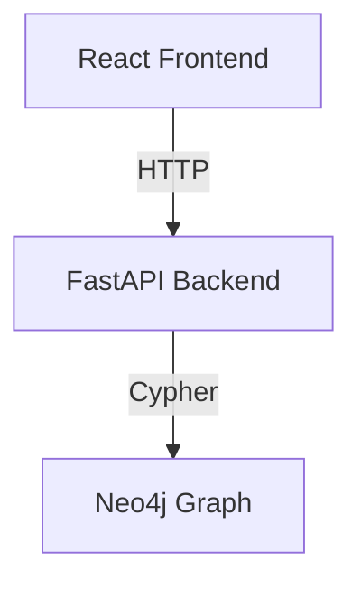
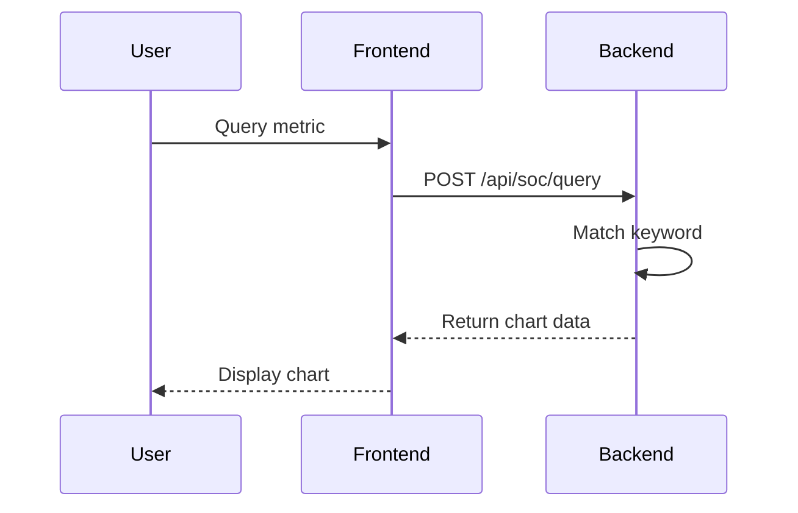
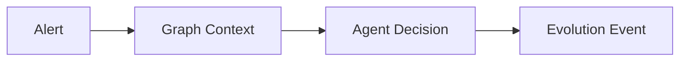

# Documentation Directory

This directory contains design specifications, technical documentation, and demo materials for the SOC Copilot Demo.

## Purpose

Place all design documents, specifications, and technical briefings here, including:

- **Build Specifications** - Detailed technical requirements and architecture
- **Design Documents** - System design, data models, API contracts
- **Demo Scripts** - Presentation narratives and talking points
- **Architecture Diagrams** - Visual representations of system components
- **Decision Records** - Architectural decision records (ADRs)
- **API Documentation** - Endpoint specifications and examples

## Typical Files

### Build Specifications
```
vc_demo_build_spec_ciso_v1.md      # Main build specification for CISO demo
invoice_comparison.md              # Comparison with invoice exception demo
architecture_overview.md           # High-level architecture documentation
```

### Demo Materials
```
demo_script_15min.md               # 15-minute demo script
demo_script_5min.md                # 5-minute elevator pitch version
soundbites.md                      # Key phrases and talking points
objection_handling.md              # Common questions and responses
```

### Design Documents
```
agent_design.md                    # Simple rule-based agent design
neo4j_schema.md                    # Graph database schema
two_loop_architecture.md           # Compounding intelligence design
eval_gates.md                      # Evaluation gate design
```

### Architecture Diagrams
```
diagrams/
  ├── system_architecture.png      # Overall system diagram
  ├── two_loop_flow.png            # Two-loop compounding visual
  ├── tab_flow.png                 # Tab-by-tab user journey
  └── data_flow.png                # Data flow between components
```

### API Documentation
```
api/
  ├── tab1_soc_analytics.md        # Tab 1 endpoints
  ├── tab2_runtime_evolution.md    # Tab 2 endpoints
  ├── tab3_alert_triage.md         # Tab 3 endpoints
  └── tab4_compounding.md          # Tab 4 endpoints
```

### Decision Records
```
adr/
  ├── 001-simple-agent-design.md   # Why rule-based vs LLM orchestration
  ├── 002-fixed-cypher-queries.md  # Why no dynamic query generation
  ├── 003-mock-bigquery-data.md    # Why mock data for Tab 1
  └── 004-nvl-graph-viz.md         # Graph visualization library choice
```

## Documentation Standards

### File Naming Conventions

**Use descriptive, hyphenated names:**
```
✓ Good:
  - vc-demo-build-spec-ciso-v1.md
  - 15-minute-demo-script.md
  - two-loop-architecture-design.md

✗ Bad:
  - doc1.md
  - notes.txt
  - temp_spec.md
```

**Include version numbers for specs:**
```
build-spec-v1.md
build-spec-v2.md
api-spec-2024-01-15.md
```

### Markdown Structure

Use this template for design documents:

```markdown
# Document Title

**Status:** Draft | Review | Approved
**Last Updated:** YYYY-MM-DD
**Author:** Name
**Reviewers:** Names

## Overview
Brief summary (2-3 sentences)

## Problem Statement
What problem does this solve?

## Proposed Solution
How do we solve it?

## Design Details
Technical details, diagrams, code examples

## Alternatives Considered
What other options were evaluated?

## Decision
What was decided and why?

## Implementation Plan
Step-by-step implementation approach

## Success Metrics
How do we measure success?

## References
Links to related docs, tickets, etc.
```

## Document Index

### Current Documents

This section should list all documents in this directory:

#### Build Specifications
- `vc_demo_build_spec_ciso_v1.md` - Main build spec with all 4 tabs

#### Demo Materials
- *(Add demo scripts here)*

#### Design Documents
- *(Add design docs here)*

#### Architecture Diagrams
- *(Add diagram files here)*

#### API Documentation
- *(Add API docs here)*

#### Decision Records
- *(Add ADRs here)*

### How to Add New Documents

1. **Create the document** using naming conventions above
2. **Add to index** in this README under appropriate section
3. **Link from related docs** if applicable
4. **Commit with descriptive message:**
   ```bash
   git add support/docs/your-new-doc.md
   git commit -m "docs: Add agent design specification"
   ```

## Demo Script Template

Create demo scripts using this structure:

```markdown
# [Demo Name] - [Duration]

## Audience
CISO | VC | Technical | Executive

## Goal
What should the audience understand/believe after this demo?

## Setup Required
- [ ] Backend running (port 8000)
- [ ] Frontend running (port 5173)
- [ ] Neo4j seeded with data
- [ ] Browser on Tab X

## Script

### Opening (Xmin)
**Say:** "..."
**Show:** [Tab 1 / Graph / etc]
**Result:** [What they see]

### Section 1 (Xmin)
**Say:** "..."
**Do:** [Click this, type that]
**Show:** [What appears]
**Soundbite:** "Key phrase here"

### Closing (Xmin)
**Say:** "..."
**Ask:** [Questions to engage]

## Backup Slides
- Slide 1: [Topic]
- Slide 2: [Topic]

## Q&A Preparation
**Q:** Common question?
**A:** Prepared answer

## Technical Notes
- If X breaks, do Y
- Fallback to Z if needed
```

## Architecture Diagram Guidelines

### Recommended Tools
- **Mermaid** - Text-based diagrams (embeddable in Markdown)
- **Draw.io** - Visual diagramming tool
- **Excalidraw** - Hand-drawn style diagrams
- **Lucidchart** - Professional diagrams

### Diagram Types

**System Architecture:**


**Sequence Diagram:**


**Data Flow:**


### Export Formats
- **PNG** - For presentations
- **SVG** - For web and scaling
- **PDF** - For print documentation

## API Documentation Template

Document APIs using this format:

```markdown
# API Endpoint Name

**Endpoint:** `POST /api/path/to/endpoint`
**Tab:** Tab 1 | Tab 2 | Tab 3 | Tab 4
**Purpose:** One-sentence description

## Request

**Headers:**
```json
{
  "Content-Type": "application/json"
}
```

**Body:**
```json
{
  "field": "value",
  "optional_field": "value"
}
```

**Parameters:**
- `field` (string, required) - Description
- `optional_field` (string, optional) - Description

## Response

**Success (200):**
```json
{
  "result": "data"
}
```

**Error (400):**
```json
{
  "detail": "Error message"
}
```

## Example

**Request:**
```bash
curl -X POST http://localhost:8000/api/endpoint \
  -H "Content-Type: application/json" \
  -d '{"field": "value"}'
```

**Response:**
```json
{
  "result": "success"
}
```

## Notes
- Special considerations
- Performance characteristics
- Security notes
```

## Design Decision Records (ADRs)

Use ADRs to document significant architectural decisions:

### ADR Template

```markdown
# ADR-XXX: [Decision Title]

**Status:** Proposed | Accepted | Deprecated | Superseded
**Date:** YYYY-MM-DD
**Deciders:** Names
**Technical Story:** Link to issue/ticket

## Context
What is the issue we're seeing that motivates this decision?

## Decision Drivers
- Driver 1
- Driver 2
- Driver 3

## Considered Options
- Option 1
- Option 2
- Option 3

## Decision Outcome

**Chosen option:** "Option X"

**Reasoning:**
- Reason 1
- Reason 2
- Reason 3

**Consequences:**
- Positive consequence 1
- Positive consequence 2
- Negative consequence 1 (trade-off)

## Pros and Cons of Options

### Option 1
- ✓ Pro 1
- ✓ Pro 2
- ✗ Con 1

### Option 2
- ✓ Pro 1
- ✗ Con 1
- ✗ Con 2

## Links
- [Related ADR](adr-related.md)
- [External reference](https://example.com)
```

### ADR Example

See: `adr/001-simple-agent-design.md` for a complete example.

## Version Control

### Commit Message Format

```
docs: Add [document name]
docs: Update [document name] with [change]
docs: Remove outdated [document name]
```

### Review Process

1. **Draft** - Author creates document
2. **Review** - Team reviews and comments
3. **Approved** - Update status to "Approved"
4. **Published** - Merge to main branch

## Related Documentation

- [Project README](../../README.md) - Main project overview
- [Project Structure](../../PROJECT_STRUCTURE.md) - Code organization
- [Project Complete](../../PROJECT_COMPLETE.md) - Implementation summary

---

**Maintainer:** Development Team
**Last Updated:** February 6, 2026
